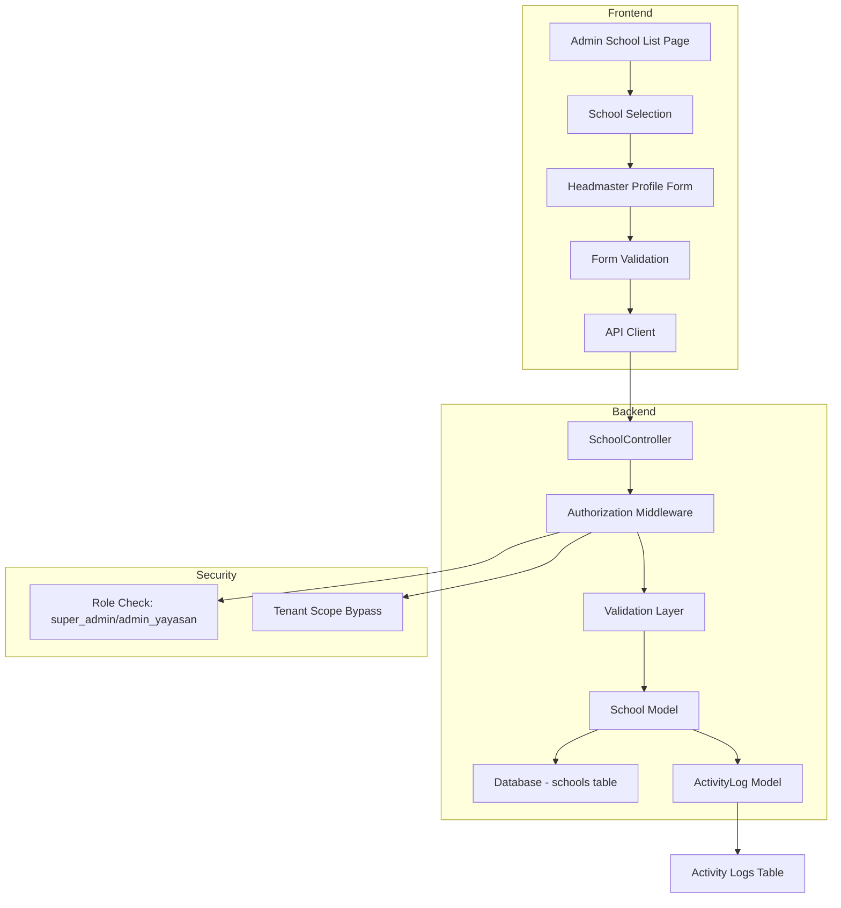

# Design Document: Admin Headmaster Period Update

## Overview

This feature enables super admin and admin yayasan users to view and update headmaster (kepala madrasah) profile information and tenure periods for any school in the system. The feature bridges a gap in the current system where administrative users can only approve formal SK submissions but cannot directly manage the headmaster profile data stored in the `schools` table.

### Problem Statement

Currently, the system has two separate data sources for headmaster information:
1. **Formal SK route** (`headmaster_tenures` table) - managed through SK approval workflow
2. **Manual profile route** (`schools` table) - only editable by operators for their own school

This creates a management gap where super admin and admin yayasan cannot directly update headmaster tenure data in the schools table, limiting their ability to maintain accurate records across the network.

### Solution Approach

Extend the existing school management functionality to allow admin users to:
- View headmaster profile information for any school
- Edit headmaster profile fields including tenure dates
- Maintain audit trails of all changes
- Enforce proper authorization and validation

The solution reuses existing backend infrastructure (`SchoolController::update`) and extends the frontend with admin-specific UI components.

## Architecture

### System Components



### Data Flow

1. **View Flow**: Admin user → School list → Select school → Fetch school data → Display form
2. **Update Flow**: Admin user → Edit form → Validate → API call → Authorization check → Update database → Log activity → Return updated data → Refresh UI

### Authorization Model

- **Super Admin**: Full access to all schools, bypass tenant scoping
- **Admin Yayasan**: Full access to all schools, bypass tenant scoping
- **Operator**: Restricted to their own school only (existing behavior preserved)

## Components and Interfaces

### Frontend Components

#### 1. AdminSchoolManagementPage (New)

**Location**: `src/features/schools/AdminSchoolManagementPage.tsx`

**Purpose**: Main page for admin users to search, filter, and select schools for headmaster profile management.

**Props**: None (uses auth context)

**State**:
```typescript
{
  searchTerm: string
  selectedSchool: School | null
  isEditMode: boolean
}
```

**Key Features**:
- School search/filter functionality
- School list display with pagination
- School selection handler
- Navigation to edit form

#### 2. HeadmasterProfileForm (New)

**Location**: `src/features/schools/components/HeadmasterProfileForm.tsx`

**Purpose**: Reusable form component for editing headmaster profile information.

**Props**:
```typescript
interface HeadmasterProfileFormProps {
  school: School
  onSuccess: () => void
  onCancel: () => void
  isAdminMode?: boolean
}
```

**Features**:
- Form fields for all headmaster profile data
- Date validation for tenure periods
- Inline error display
- Loading states
- Success/error notifications

#### 3. SchoolProfilePage (Enhanced)

**Location**: `src/features/schools/SchoolProfilePage.tsx` (existing)

**Changes**: Extract form logic into `HeadmasterProfileForm` component for reuse.

### Backend Components

#### 1. SchoolController (Enhanced)

**Location**: `backend/app/Http/Controllers/Api/SchoolController.php` (existing)

**Changes Required**:

**Method**: `update(Request $request, School $school)`

Current implementation already supports updating headmaster fields. Enhancement needed:

```php
public function update(Request $request, School $school): JsonResponse
{
    // Authorization check
    $user = $request->user();
    
    // Operators can only update their own school
    if ($user->role === 'operator' && $user->school_id !== $school->id) {
        return response()->json([
            'success' => false,
            'message' => 'Unauthorized: You can only update your own school'
        ], 403);
    }
    
    // Validate headmaster fields
    $validated = $request->validate([
        'kepala_madrasah' => 'nullable|string|max:255',
        'kepala_nim' => 'nullable|string|max:50',
        'kepala_nuptk' => 'nullable|string|max:50',
        'kepala_whatsapp' => 'nullable|string|max:20',
        'kepala_jabatan_mulai' => 'nullable|date',
        'kepala_jabatan_selesai' => 'nullable|date|after_or_equal:kepala_jabatan_mulai',
        // ... other school fields
    ]);
    
    // Update school
    $school->update($validated);
    
    // Log activity
    ActivityLog::create([
        'description' => "Memperbarui profil kepala madrasah: {$school->nama}",
        'event' => 'update_headmaster_profile',
        'log_name' => 'school',
        'subject_id' => $school->id,
        'subject_type' => School::class,
        'causer_id' => $user->id,
        'causer_type' => User::class,
        'school_id' => $school->id,
    ]);
    
    return response()->json([
        'success' => true,
        'message' => 'Profil kepala madrasah berhasil diperbarui',
        'data' => $school->fresh()
    ]);
}
```

**New Method**: `indexForAdmin(Request $request)` (Optional)

If we need a separate endpoint for admin school listing with different data:

```php
public function indexForAdmin(Request $request): JsonResponse
{
    // Only for admin users
    if (!in_array($request->user()->role, ['super_admin', 'admin_yayasan'])) {
        return response()->json(['error' => 'Unauthorized'], 403);
    }
    
    $query = School::query();
    
    // Search filter
    if ($request->filled('search')) {
        $query->where('nama', 'LIKE', "%{$request->search}%");
    }
    
    // Kecamatan filter
    if ($request->filled('kecamatan')) {
        $query->where('kecamatan', $request->kecamatan);
    }
    
    // Include headmaster info in results
    $schools = $query->select([
        'id', 'nama', 'kecamatan', 'kepala_madrasah',
        'kepala_jabatan_mulai', 'kepala_jabatan_selesai'
    ])
    ->orderBy('nama')
    ->paginate($request->input('per_page', 15));
    
    return response()->json($schools);
}
```

#### 2. Middleware Configuration

**Location**: `backend/routes/api.php`

**New Routes** (if needed):
```php
Route::middleware(['auth:sanctum', 'role:super_admin,admin_yayasan'])->group(function () {
    Route::get('/admin/schools', [SchoolController::class, 'indexForAdmin']);
    Route::put('/admin/schools/{school}', [SchoolController::class, 'update']);
});
```

**Note**: The existing `PUT /api/schools/{school}` endpoint can be reused if authorization logic is added to the controller method.

### API Interfaces

#### Get School List (Admin)

**Endpoint**: `GET /api/schools` or `GET /api/admin/schools`

**Authorization**: `super_admin`, `admin_yayasan`

**Query Parameters**:
- `search` (optional): School name search term
- `kecamatan` (optional): Filter by district
- `per_page` (optional): Pagination size (default: 15)
- `page` (optional): Page number

**Response**:
```json
{
  "data": [
    {
      "id": 1,
      "nama": "MI Miftahul Huda",
      "kecamatan": "Cilacap Tengah",
      "kepala_madrasah": "Ahmad Dahlan",
      "kepala_jabatan_mulai": "2020-01-01",
      "kepala_jabatan_selesai": "2024-12-31"
    }
  ],
  "meta": {
    "current_page": 1,
    "per_page": 15,
    "total": 45
  }
}
```

#### Get School Detail

**Endpoint**: `GET /api/schools/{id}`

**Authorization**: `super_admin`, `admin_yayasan`, `operator` (own school only)

**Response**:
```json
{
  "id": 1,
  "nama": "MI Miftahul Huda",
  "nsm": "111233445566",
  "npsn": "20123456",
  "alamat": "Jl. Masjid No. 45",
  "kecamatan": "Cilacap Tengah",
  "kepala_madrasah": "Ahmad Dahlan",
  "kepala_nim": "123456",
  "kepala_nuptk": "1234567890123456",
  "kepala_whatsapp": "081234567890",
  "kepala_jabatan_mulai": "2020-01-01",
  "kepala_jabatan_selesai": "2024-12-31",
  "created_at": "2024-01-01T00:00:00.000000Z",
  "updated_at": "2024-01-15T10:30:00.000000Z"
}
```

#### Update School Headmaster Profile

**Endpoint**: `PUT /api/schools/{id}`

**Authorization**: `super_admin`, `admin_yayasan`, `operator` (own school only)

**Request Body**:
```json
{
  "kepala_madrasah": "Ahmad Dahlan",
  "kepala_nim": "123456",
  "kepala_nuptk": "1234567890123456",
  "kepala_whatsapp": "081234567890",
  "kepala_jabatan_mulai": "2020-01-01",
  "kepala_jabatan_selesai": "2024-12-31"
}
```

**Validation Rules**:
- `kepala_madrasah`: nullable, string, max 255 characters
- `kepala_nim`: nullable, string, max 50 characters
- `kepala_nuptk`: nullable, string, max 50 characters
- `kepala_whatsapp`: nullable, string, max 20 characters
- `kepala_jabatan_mulai`: nullable, date format (YYYY-MM-DD)
- `kepala_jabatan_selesai`: nullable, date format (YYYY-MM-DD), must be after or equal to `kepala_jabatan_mulai`

**Success Response** (200):
```json
{
  "success": true,
  "message": "Profil kepala madrasah berhasil diperbarui",
  "data": {
    "id": 1,
    "nama": "MI Miftahul Huda",
    "kepala_madrasah": "Ahmad Dahlan",
    "kepala_jabatan_mulai": "2020-01-01",
    "kepala_jabatan_selesai": "2024-12-31",
    "updated_at": "2024-01-15T10:35:00.000000Z"
  }
}
```

**Error Response** (422 - Validation Error):
```json
{
  "success": false,
  "message": "Validation failed",
  "errors": {
    "kepala_jabatan_selesai": [
      "The kepala jabatan selesai must be a date after or equal to kepala jabatan mulai."
    ]
  }
}
```

**Error Response** (403 - Unauthorized):
```json
{
  "success": false,
  "message": "Unauthorized: You can only update your own school"
}
```

## Data Models

### School Model (Enhanced)

**Table**: `schools`

**Headmaster-Related Fields**:
```typescript
interface School {
  id: number
  nama: string
  nsm: string | null
  npsn: string | null
  alamat: string | null
  kecamatan: string | null
  
  // Headmaster profile fields
  kepala_madrasah: string | null          // Name without title
  kepala_nim: string | null               // Nomor Induk Ma'arif
  kepala_nuptk: string | null             // NUPTK number
  kepala_whatsapp: string | null          // WhatsApp contact
  kepala_jabatan_mulai: string | null     // Tenure start date (YYYY-MM-DD)
  kepala_jabatan_selesai: string | null   // Tenure end date (YYYY-MM-DD)
  
  created_at: string
  updated_at: string
}
```

**Validation Constraints**:
- `kepala_jabatan_selesai` must be >= `kepala_jabatan_mulai` when both are provided
- All headmaster fields are nullable (optional)
- Date fields must be valid date format

### ActivityLog Model

**Table**: `activity_logs`

**Fields for Headmaster Updates**:
```typescript
interface ActivityLog {
  id: number
  description: string              // "Memperbarui profil kepala madrasah: {school_name}"
  event: string                    // "update_headmaster_profile"
  log_name: string                 // "school"
  subject_id: number               // school.id
  subject_type: string             // "App\\Models\\School"
  causer_id: number                // user.id
  causer_type: string              // "App\\Models\\User"
  school_id: number                // school.id
  created_at: string
}
```

## Error Handling

### Frontend Error Handling

#### 1. Network Errors
```typescript
try {
  await schoolApi.update(schoolId, formData)
  toast.success("Profil kepala madrasah berhasil diperbarui")
} catch (error) {
  if (error.response?.status === 403) {
    toast.error("Anda tidak memiliki akses untuk mengubah data sekolah ini")
  } else if (error.response?.status === 422) {
    // Display validation errors inline
    setErrors(error.response.data.errors)
  } else {
    toast.error("Gagal memperbarui profil: " + (error.message || "Kesalahan jaringan"))
  }
}
```

#### 2. Validation Errors

Display inline with form fields:
```typescript
{errors.kepala_jabatan_selesai && (
  <p className="text-sm text-red-600 mt-1">
    {errors.kepala_jabatan_selesai[0]}
  </p>
)}
```

#### 3. Loading States

```typescript
{isLoading ? (
  <div className="flex items-center justify-center">
    <Loader2 className="h-8 w-8 animate-spin" />
    <span>Memuat data sekolah...</span>
  </div>
) : (
  <HeadmasterProfileForm school={school} />
)}
```

### Backend Error Handling

#### 1. Authorization Errors

```php
if ($user->role === 'operator' && $user->school_id !== $school->id) {
    return response()->json([
        'success' => false,
        'message' => 'Unauthorized: You can only update your own school'
    ], 403);
}
```

#### 2. Validation Errors

```php
$validated = $request->validate([
    'kepala_jabatan_mulai' => 'nullable|date',
    'kepala_jabatan_selesai' => 'nullable|date|after_or_equal:kepala_jabatan_mulai',
]);
// Laravel automatically returns 422 with validation errors
```

#### 3. Database Errors

```php
try {
    DB::transaction(function () use ($school, $validated, $user) {
        $school->update($validated);
        
        ActivityLog::create([
            'description' => "Memperbarui profil kepala madrasah: {$school->nama}",
            'event' => 'update_headmaster_profile',
            'log_name' => 'school',
            'subject_id' => $school->id,
            'subject_type' => School::class,
            'causer_id' => $user->id,
            'causer_type' => User::class,
            'school_id' => $school->id,
        ]);
    });
} catch (\Exception $e) {
    Log::error("Failed to update headmaster profile: " . $e->getMessage());
    return response()->json([
        'success' => false,
        'message' => 'Gagal memperbarui profil kepala madrasah'
    ], 500);
}
```

## Testing Strategy

### Unit Tests

#### Backend Unit Tests

**Location**: `backend/tests/Unit/Controllers/SchoolControllerTest.php`

**Test Cases**:

1. **Authorization Tests**
   - `test_super_admin_can_update_any_school_headmaster_profile()`
   - `test_admin_yayasan_can_update_any_school_headmaster_profile()`
   - `test_operator_can_only_update_own_school_headmaster_profile()`
   - `test_operator_cannot_update_other_school_headmaster_profile()`

2. **Validation Tests**
   - `test_validates_date_format_for_tenure_dates()`
   - `test_validates_end_date_after_start_date()`
   - `test_accepts_null_values_for_optional_fields()`
   - `test_validates_string_length_limits()`

3. **Data Integrity Tests**
   - `test_update_preserves_unchanged_fields()`
   - `test_update_returns_fresh_school_data()`
   - `test_concurrent_updates_handled_correctly()`

4. **Activity Logging Tests**
   - `test_creates_activity_log_on_successful_update()`
   - `test_activity_log_contains_correct_user_and_school_info()`
   - `test_no_activity_log_created_on_failed_update()`

#### Frontend Unit Tests

**Location**: `src/features/schools/components/HeadmasterProfileForm.test.tsx`

**Test Cases**:

1. **Rendering Tests**
   - `test_renders_all_headmaster_fields()`
   - `test_displays_loading_state_during_submission()`
   - `test_displays_success_message_after_update()`

2. **Validation Tests**
   - `test_displays_inline_validation_errors()`
   - `test_validates_end_date_after_start_date_on_client()`
   - `test_disables_submit_during_validation()`

3. **User Interaction Tests**
   - `test_calls_onSuccess_callback_after_successful_update()`
   - `test_calls_onCancel_callback_when_cancelled()`
   - `test_prevents_duplicate_submissions()`

### Integration Tests

**Location**: `backend/tests/Feature/HeadmasterProfileUpdateTest.php`

**Test Cases**:

1. **End-to-End Update Flow**
   - `test_admin_can_complete_full_update_workflow()`
   - `test_operator_can_update_own_school_profile()`
   - `test_update_flow_with_database_transaction()`

2. **API Integration Tests**
   - `test_get_school_list_returns_headmaster_info()`
   - `test_get_school_detail_includes_all_headmaster_fields()`
   - `test_update_endpoint_returns_updated_data()`

3. **Authorization Integration**
   - `test_middleware_blocks_unauthorized_users()`
   - `test_tenant_scoping_works_for_operators()`
   - `test_admin_bypasses_tenant_scoping()`

### E2E Tests (Playwright)

**Location**: `tests/e2e/admin-headmaster-update.spec.ts`

**Test Scenarios**:

1. **Admin User Journey**
   ```typescript
   test('admin can search and update headmaster profile', async ({ page }) => {
     // Login as super_admin
     await loginAs(page, 'super_admin')
     
     // Navigate to school management
     await page.goto('/dashboard/admin/schools')
     
     // Search for school
     await page.fill('[data-testid="school-search"]', 'MI Miftahul')
     await page.click('[data-testid="school-item-1"]')
     
     // Edit headmaster profile
     await page.fill('[name="kepala_madrasah"]', 'Ahmad Dahlan')
     await page.fill('[name="kepala_jabatan_mulai"]', '2020-01-01')
     await page.fill('[name="kepala_jabatan_selesai"]', '2024-12-31')
     
     // Submit form
     await page.click('[data-testid="submit-button"]')
     
     // Verify success message
     await expect(page.locator('.toast-success')).toContainText('berhasil diperbarui')
   })
   ```

2. **Validation Error Handling**
   ```typescript
   test('displays validation error for invalid date range', async ({ page }) => {
     await loginAs(page, 'super_admin')
     await page.goto('/dashboard/admin/schools/1/edit')
     
     // Enter invalid date range
     await page.fill('[name="kepala_jabatan_mulai"]', '2024-12-31')
     await page.fill('[name="kepala_jabatan_selesai"]', '2020-01-01')
     
     await page.click('[data-testid="submit-button"]')
     
     // Verify error message
     await expect(page.locator('.error-message')).toContainText('must be after')
   })
   ```

3. **Operator Restriction**
   ```typescript
   test('operator cannot access other schools', async ({ page }) => {
     await loginAs(page, 'operator')
     
     // Try to access another school's profile
     await page.goto('/dashboard/admin/schools/999/edit')
     
     // Should be redirected or see error
     await expect(page.locator('.error-message')).toContainText('tidak memiliki akses')
   })
   ```

### Manual Testing Checklist

- [ ] Super admin can view all schools in the list
- [ ] Admin yayasan can view all schools in the list
- [ ] Operator only sees their own school
- [ ] Search functionality filters schools correctly
- [ ] Kecamatan filter works as expected
- [ ] All headmaster fields display correctly
- [ ] Date picker works for tenure dates
- [ ] Form validation prevents invalid date ranges
- [ ] Success toast appears after successful update
- [ ] Error messages display for validation failures
- [ ] Loading spinner shows during API calls
- [ ] Submit button is disabled during submission
- [ ] Cancel button discards changes
- [ ] Activity log is created for each update
- [ ] Updated data reflects immediately in UI
- [ ] Concurrent updates don't cause data loss

## Implementation Plan

### Phase 1: Backend Enhancement (Priority: High)

1. **Update SchoolController**
   - Add authorization check in `update()` method
   - Enhance validation rules for headmaster fields
   - Add activity logging for headmaster profile updates
   - Add error handling and transaction support

2. **Add/Update Routes**
   - Ensure existing routes support admin access
   - Add middleware for role-based authorization
   - Test route authorization with different roles

3. **Write Backend Tests**
   - Unit tests for authorization logic
   - Unit tests for validation rules
   - Integration tests for update workflow
   - Activity logging tests

### Phase 2: Frontend Development (Priority: High)

1. **Create HeadmasterProfileForm Component**
   - Extract form logic from SchoolProfilePage
   - Add props for admin mode
   - Implement validation logic
   - Add loading and error states

2. **Create AdminSchoolManagementPage**
   - School list with search/filter
   - School selection handler
   - Integration with HeadmasterProfileForm
   - Pagination support

3. **Update Routing**
   - Add route for admin school management
   - Add role-based route guards
   - Update navigation menu for admin users

4. **Write Frontend Tests**
   - Component unit tests
   - User interaction tests
   - Validation tests

### Phase 3: Integration & Testing (Priority: Medium)

1. **E2E Tests**
   - Write Playwright test scenarios
   - Test all user roles
   - Test error scenarios

2. **Manual Testing**
   - Test with real data
   - Test on different browsers
   - Test mobile responsiveness

3. **Performance Testing**
   - Test with large school lists
   - Test concurrent updates
   - Optimize queries if needed

### Phase 4: Documentation & Deployment (Priority: Low)

1. **Documentation**
   - Update API documentation
   - Add user guide for admin users
   - Document new components

2. **Deployment**
   - Deploy to staging environment
   - User acceptance testing
   - Deploy to production

## Security Considerations

### Authentication & Authorization

1. **Role-Based Access Control**
   - Enforce role checks at both frontend and backend
   - Use Laravel middleware for route protection
   - Implement frontend route guards

2. **Tenant Isolation**
   - Operators must only access their own school
   - Admin users bypass tenant scoping
   - Validate school_id in all operations

3. **Token Security**
   - Use Laravel Sanctum for API authentication
   - Tokens stored securely in localStorage
   - Implement token refresh mechanism

### Data Validation

1. **Input Sanitization**
   - Validate all user inputs on backend
   - Sanitize strings to prevent XSS
   - Use parameterized queries (Eloquent ORM)

2. **Date Validation**
   - Validate date formats
   - Ensure logical date ranges
   - Handle timezone considerations

3. **SQL Injection Prevention**
   - Use Eloquent ORM (parameterized queries)
   - Avoid raw SQL queries
   - Validate all query parameters

### Audit Trail

1. **Activity Logging**
   - Log all headmaster profile updates
   - Include user, timestamp, and school info
   - Store logs in separate table

2. **Change Tracking**
   - Track what fields were changed
   - Store old and new values (optional)
   - Enable audit reports

## Performance Considerations

### Database Optimization

1. **Indexing**
   - Existing indexes on `schools.kecamatan`
   - Consider index on `kepala_jabatan_selesai` for expiry queries
   - Monitor query performance

2. **Query Optimization**
   - Use pagination for school lists
   - Select only needed fields
   - Avoid N+1 queries

3. **Caching Strategy**
   - Cache school list for admin users (5 minutes)
   - Invalidate cache on updates
   - Use Redis for distributed caching

### Frontend Optimization

1. **Code Splitting**
   - Lazy load admin pages
   - Split large components
   - Use React.lazy() for routes

2. **State Management**
   - Use React Query for server state
   - Implement optimistic updates
   - Cache API responses

3. **UI Performance**
   - Debounce search input
   - Virtualize long lists
   - Optimize re-renders

## Deployment Strategy

### Database Migration

No new migrations required. All headmaster fields already exist in the `schools` table via migration `2026_04_13_000003_add_kepala_profile_to_schools_table.php`.

### Environment Configuration

No new environment variables required. Uses existing configuration.

### Rollout Plan

1. **Staging Deployment**
   - Deploy to staging environment
   - Run automated tests
   - Perform manual testing

2. **User Acceptance Testing**
   - Test with super admin users
   - Test with admin yayasan users
   - Gather feedback

3. **Production Deployment**
   - Deploy during low-traffic window
   - Monitor error logs
   - Monitor performance metrics

4. **Post-Deployment**
   - Verify all functionality
   - Monitor activity logs
   - Collect user feedback

### Rollback Plan

If issues are detected:
1. Revert frontend deployment (no data loss)
2. Backend changes are backward compatible
3. No database rollback needed
4. Monitor activity logs for any data inconsistencies

## Future Enhancements

### Potential Improvements

1. **Bulk Update**
   - Allow admin to update multiple schools at once
   - Import headmaster data from Excel
   - Batch tenure period updates

2. **Tenure Expiry Notifications**
   - Automated email notifications for expiring tenures
   - Dashboard widget for upcoming expirations
   - Integration with existing expiry monitoring

3. **Headmaster History**
   - Track historical headmaster records
   - Display tenure timeline
   - Generate headmaster reports

4. **Advanced Search**
   - Filter by tenure status (active, expired, upcoming)
   - Search by headmaster name
   - Filter by multiple criteria

5. **Data Validation**
   - Cross-reference with formal SK data
   - Detect discrepancies between manual and SK data
   - Suggest data corrections

6. **Mobile Optimization**
   - Responsive design improvements
   - Touch-friendly UI
   - Offline support with PWA

## Conclusion

This design provides a comprehensive solution for enabling admin users to manage headmaster profile information across all schools in the system. The implementation leverages existing infrastructure, maintains security and data integrity, and provides a user-friendly interface for administrative tasks.

The feature addresses a critical gap in the current system while maintaining backward compatibility and following established patterns in the codebase. The phased implementation approach ensures thorough testing and smooth deployment.
