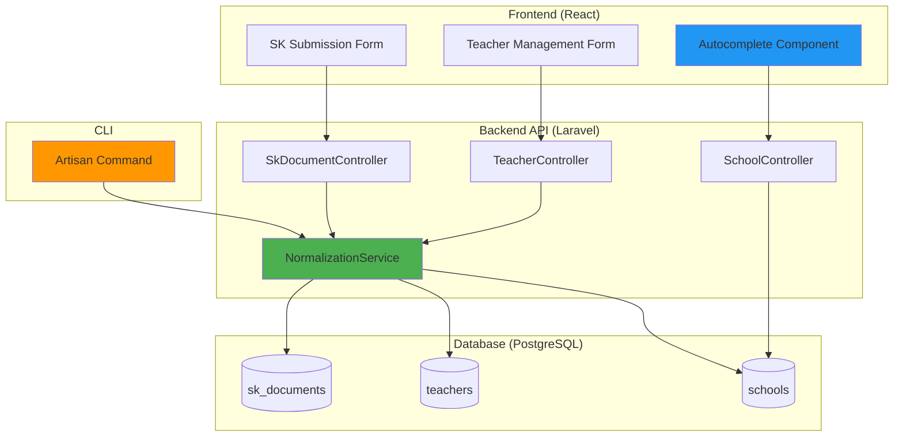
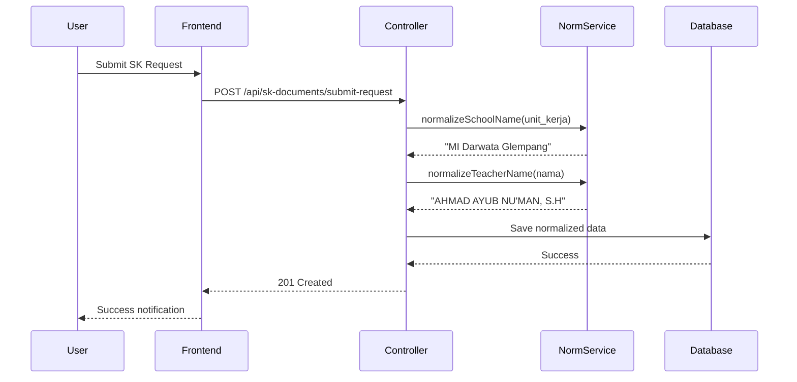

# Design Document: Data Normalization

## Overview

The Data Normalization feature implements automatic text standardization for school names and teacher names throughout the SIMMACI application. This design addresses data inconsistency issues caused by varying capitalizations and formats during data entry, which negatively impact filtering, searching, duplicate detection, and overall data management quality.

The solution consists of three main components:
1. **Backend Normalization Service** - A utility service providing text transformation methods
2. **Controller Integration** - Automatic normalization in SK submission and teacher management workflows
3. **Frontend Autocomplete** - UI improvements to prevent inconsistent data entry at the source

This design follows Laravel 12 best practices, maintains backward compatibility through a migration command, and ensures comprehensive test coverage including property-based testing for normalization idempotence.

## Architecture

### System Context



### Component Interaction Flow



### Layered Architecture

The implementation follows a clean architecture pattern:

**Presentation Layer** (Frontend)
- React components with Shadcn/UI
- Form validation with React Hook Form + Zod
- Autocomplete with TanStack Query for data fetching

**Application Layer** (Controllers)
- SkDocumentController - SK submission endpoints
- TeacherController - Teacher CRUD endpoints
- SchoolController - School API for autocomplete

**Domain Layer** (Services)
- NormalizationService - Core normalization logic
- Stateless, pure functions for text transformation

**Infrastructure Layer** (Database)
- PostgreSQL with case-insensitive ILIKE queries
- Eloquent ORM with tenant scoping
- Activity logging for audit trail

## Components and Interfaces

### 1. NormalizationService

**Location**: `backend/app/Services/NormalizationService.php`

**Purpose**: Provides stateless text normalization methods for school names and teacher names.

**Public Interface**:

```php
namespace App\Services;

class NormalizationService
{
    /**
     * Normalize school name to Title Case format
     * Preserves common abbreviations in uppercase (MI, MTs, MA, NU)
     * 
     * @param string|null $schoolName
     * @return string|null
     */
    public function normalizeSchoolName(?string $schoolName): ?string;
    
    /**
     * Normalize teacher name to UPPERCASE with preserved academic degrees
     * Handles degrees: S.Pd., M.Pd., Dr., Dra., S.H., S.Ag., M.Ag., etc.
     * 
     * @param string|null $teacherName
     * @return string|null
     */
    public function normalizeTeacherName(?string $teacherName): ?string;
    
    /**
     * Parse and extract academic degrees from a name string
     * Returns array with 'name' and 'degrees' keys
     * 
     * @param string $fullName
     * @return array{name: string, degrees: array<string>}
     */
    protected function parseAcademicDegrees(string $fullName): array;
    
    /**
     * Format academic degree with proper capitalization
     * 
     * @param string $degree
     * @return string
     */
    protected function formatDegree(string $degree): string;
}
```

**Implementation Details**:

**School Name Normalization Algorithm**:
1. Trim whitespace and handle null/empty strings
2. Convert to Title Case using `mb_convert_case(MB_CASE_TITLE)`
3. Apply uppercase preservation for abbreviations:
   - Pattern: `/\b(MI|MTs|MA|NU|SD|SMP|SMA|SMK)\b/i`
   - Replace with uppercase version
4. Return normalized string

**Teacher Name Normalization Algorithm**:
1. Trim whitespace and handle null/empty strings
2. Parse academic degrees using regex pattern:
   ```regex
   /\b(Dr\.?|Dra\.?|S\.Pd\.?I?|M\.Pd\.?I?|S\.H\.?|S\.Ag\.?|M\.Ag\.?|S\.Si\.?|M\.Si\.?|S\.Kom\.?|M\.Kom\.?)\b/i
   ```
3. Extract name portion (text before first degree or comma)
4. Convert name to UPPERCASE using `mb_strtoupper()`
5. Format each degree with proper capitalization
6. Reconstruct: `{UPPERCASE_NAME}, {Degree1}, {Degree2}`
7. Return normalized string

**Edge Cases Handled**:
- Null or empty input → return null
- Names with apostrophes (e.g., "nu'man") → preserved
- Names with hyphens (e.g., "Al-Farabi") → preserved
- Multiple degrees → all preserved with comma separation
- Degrees without periods (e.g., "SPd") → normalized to "S.Pd."
- Mixed case degrees (e.g., "s.pd") → normalized to "S.Pd."

### 2. Controller Modifications

#### SkDocumentController

**Modified Methods**:

```php
// backend/app/Http/Controllers/Api/SkDocumentController.php

public function submitRequest(Request $request): JsonResponse
{
    // ... existing validation ...
    
    // NEW: Normalize before processing
    $data['unit_kerja'] = $this->normalizationService->normalizeSchoolName($data['unit_kerja']);
    $data['nama'] = $this->normalizationService->normalizeTeacherName($data['nama']);
    
    // ... existing school lookup (now case-insensitive) ...
    $school = School::where('nama', 'ILIKE', $data['unit_kerja'])->first();
    
    // ... existing teacher upsert with normalized data ...
    $teacherData['nama'] = $data['nama'];
    $teacherData['unit_kerja'] = $data['unit_kerja'];
    
    // ... rest of implementation ...
}

public function bulkRequest(Request $request): JsonResponse
{
    // ... existing validation ...
    
    foreach ($request->documents as $doc) {
        // NEW: Normalize each document
        $doc['unit_kerja'] = $this->normalizationService->normalizeSchoolName($doc['unit_kerja']);
        $doc['nama'] = $this->normalizationService->normalizeTeacherName($doc['nama']);
        
        // ... existing processing ...
    }
    
    // ... rest of implementation ...
}
```

**Dependency Injection**:
```php
public function __construct(
    private NormalizationService $normalizationService
) {}
```

#### TeacherController

**Modified Methods**:

```php
// backend/app/Http/Controllers/Api/TeacherController.php

public function store(StoreTeacherRequest $request): JsonResponse
{
    $data = $request->validated();
    
    // NEW: Normalize teacher name
    $data['nama'] = $this->normalizationService->normalizeTeacherName($data['nama']);
    
    // NEW: Normalize unit_kerja if present
    if (isset($data['unit_kerja'])) {
        $data['unit_kerja'] = $this->normalizationService->normalizeSchoolName($data['unit_kerja']);
    }
    
    // ... existing implementation ...
}

public function update(UpdateTeacherRequest $request, Teacher $teacher): JsonResponse
{
    $data = $request->validated();
    
    // NEW: Normalize teacher name
    if (isset($data['nama'])) {
        $data['nama'] = $this->normalizationService->normalizeTeacherName($data['nama']);
    }
    
    // NEW: Normalize unit_kerja if present
    if (isset($data['unit_kerja'])) {
        $data['unit_kerja'] = $this->normalizationService->normalizeSchoolName($data['unit_kerja']);
    }
    
    // ... existing implementation ...
}

public function import(Request $request): JsonResponse
{
    // ... existing validation ...
    
    foreach ($request->teachers as $row) {
        // ... existing normalization ...
        
        // NEW: Apply name normalization
        $dataToSave['nama'] = $this->normalizationService->normalizeTeacherName($dataToSave['nama']);
        
        if (isset($dataToSave['unit_kerja'])) {
            $dataToSave['unit_kerja'] = $this->normalizationService->normalizeSchoolName($dataToSave['unit_kerja']);
        }
        
        // ... existing processing ...
    }
    
    // ... rest of implementation ...
}
```

#### SchoolController

**New Method for Autocomplete**:

```php
// backend/app/Http/Controllers/Api/SchoolController.php

/**
 * GET /api/schools
 * Returns school list for autocomplete with optional search filtering
 * Respects tenant scoping for operators
 */
public function index(Request $request): JsonResponse
{
    $query = School::query();
    
    // Search filter (case-insensitive)
    if ($request->has('search') && strlen($request->search) >= 2) {
        $query->where('nama', 'ILIKE', "%{$request->search}%");
    }
    
    // Tenant scoping
    $user = $request->user();
    if ($user->role === 'operator' && $user->school_id) {
        $query->where('id', $user->school_id);
    }
    
    // Return minimal fields for autocomplete
    $schools = $query->select('id', 'nama', 'kecamatan')
        ->orderBy('nama')
        ->limit(50)
        ->get();
    
    return response()->json($schools);
}
```

**Case-Insensitive Lookup Enhancement**:

All school lookups by name should use PostgreSQL's `ILIKE` operator:

```php
// Before normalization lookup
$normalizedName = $this->normalizationService->normalizeSchoolName($inputName);

// Case-insensitive query
$school = School::where('nama', 'ILIKE', $normalizedName)->first();
```

### 3. Frontend Autocomplete Component

**Location**: `src/features/sk-management/components/SchoolAutocomplete.tsx`

**Component Interface**:

```typescript
interface SchoolAutocompleteProps {
  value: string;
  onChange: (value: string) => void;
  disabled?: boolean;
  placeholder?: string;
  error?: string;
}

export function SchoolAutocomplete({
  value,
  onChange,
  disabled = false,
  placeholder = "Pilih Madrasah",
  error
}: SchoolAutocompleteProps): JSX.Element
```

**Implementation**:

```typescript
import { useState } from "react"
import { useQuery } from "@tanstack/react-query"
import { Check, ChevronsUpDown } from "lucide-react"
import { cn } from "@/lib/utils"
import { Button } from "@/components/ui/button"
import {
  Command,
  CommandEmpty,
  CommandGroup,
  CommandInput,
  CommandItem,
} from "@/components/ui/command"
import {
  Popover,
  PopoverContent,
  PopoverTrigger,
} from "@/components/ui/popover"
import { schoolApi } from "@/lib/api"

interface School {
  id: number
  nama: string
  kecamatan?: string
}

export function SchoolAutocomplete({
  value,
  onChange,
  disabled = false,
  placeholder = "Pilih Madrasah",
  error
}: SchoolAutocompleteProps) {
  const [open, setOpen] = useState(false)
  const [search, setSearch] = useState("")

  // Fetch schools with search query
  const { data: schools = [], isLoading } = useQuery({
    queryKey: ['schools-autocomplete', search],
    queryFn: () => schoolApi.list({ search }),
    enabled: search.length >= 2 || open,
    staleTime: 5 * 60 * 1000, // 5 minutes
  })

  const selectedSchool = schools.find((s: School) => s.nama === value)

  return (
    <div className="space-y-2">
      <Popover open={open} onOpenChange={setOpen}>
        <PopoverTrigger asChild>
          <Button
            variant="outline"
            role="combobox"
            aria-expanded={open}
            disabled={disabled}
            className={cn(
              "w-full justify-between h-12 rounded-xl bg-slate-50 border-0",
              error && "border-red-500 border-2"
            )}
          >
            {selectedSchool ? selectedSchool.nama : placeholder}
            <ChevronsUpDown className="ml-2 h-4 w-4 shrink-0 opacity-50" />
          </Button>
        </PopoverTrigger>
        <PopoverContent className="w-full p-0" align="start">
          <Command>
            <CommandInput
              placeholder="Cari madrasah..."
              value={search}
              onValueChange={setSearch}
            />
            <CommandEmpty>
              {isLoading ? "Memuat..." : "Madrasah tidak ditemukan"}
            </CommandEmpty>
            <CommandGroup className="max-h-64 overflow-auto">
              {schools.map((school: School) => (
                <CommandItem
                  key={school.id}
                  value={school.nama}
                  onSelect={() => {
                    onChange(school.nama)
                    setOpen(false)
                  }}
                >
                  <Check
                    className={cn(
                      "mr-2 h-4 w-4",
                      value === school.nama ? "opacity-100" : "opacity-0"
                    )}
                  />
                  <div className="flex flex-col">
                    <span className="font-bold">{school.nama}</span>
                    {school.kecamatan && (
                      <span className="text-xs text-slate-500">
                        Kec. {school.kecamatan}
                      </span>
                    )}
                  </div>
                </CommandItem>
              ))}
            </CommandGroup>
          </Command>
        </PopoverContent>
      </Popover>
      {error && (
        <p className="text-xs text-red-500 font-medium">{error}</p>
      )}
    </div>
  )
}
```

**Integration in SkSubmissionPage**:

```typescript
// src/features/sk-management/SkSubmissionPage.tsx

import { SchoolAutocomplete } from "./components/SchoolAutocomplete"

// Replace the existing unit_kerja Input with:
<div className="space-y-3">
  <Label className="text-[10px] font-black uppercase text-slate-400 tracking-widest">
    Unit Kerja / Madrasah
  </Label>
  {isSuperAdmin ? (
    // Super admin can type freely
    <Input
      {...form.register("unit_kerja")}
      placeholder="Nama Madrasah"
      className="h-12 rounded-xl bg-slate-50 border-0 focus:ring-blue-500 font-bold"
    />
  ) : (
    // Operator uses autocomplete
    <SchoolAutocomplete
      value={form.watch("unit_kerja") || ""}
      onChange={(value) => form.setValue("unit_kerja", value)}
      disabled={isOperator}
      error={form.formState.errors.unit_kerja?.message}
    />
  )}
</div>
```

**Validation Enhancement**:

```typescript
// Update Zod schema
const skSchema = z.object({
  // ... other fields ...
  unit_kerja: z.string().min(1, "Unit Kerja wajib dipilih"),
  // ... other fields ...
}).refine(
  (data) => {
    // For non-super-admin, validate school exists
    if (!isSuperAdmin && data.unit_kerja) {
      // This validation happens on submit
      return true; // Backend will validate
    }
    return true;
  },
  {
    message: "Madrasah tidak valid. Pilih dari daftar yang tersedia.",
    path: ["unit_kerja"],
  }
);
```

### 4. Data Migration Command

**Location**: `backend/app/Console/Commands/NormalizeData.php`

**Command Signature**: `php artisan normalize:data {--dry-run} {--batch=500}`

**Implementation**:

```php
<?php

namespace App\Console\Commands;

use App\Models\School;
use App\Models\Teacher;
use App\Models\SkDocument;
use App\Models\ActivityLog;
use App\Services\NormalizationService;
use Illuminate\Console\Command;
use Illuminate\Support\Facades\DB;

class NormalizeData extends Command
{
    protected $signature = 'normalize:data 
                            {--dry-run : Preview changes without modifying database}
                            {--batch=500 : Number of records to process per batch}';

    protected $description = 'Normalize existing school and teacher names in the database';

    public function __construct(
        private NormalizationService $normalizationService
    ) {
        parent::__construct();
    }

    public function handle(): int
    {
        $isDryRun = $this->option('dry-run');
        $batchSize = (int) $this->option('batch');

        $this->info('🚀 Starting data normalization...');
        $this->info($isDryRun ? '📋 DRY RUN MODE - No changes will be saved' : '✏️  LIVE MODE - Database will be updated');
        $this->newLine();

        $stats = [
            'schools_updated' => 0,
            'teachers_updated' => 0,
            'sk_documents_updated' => 0,
            'errors' => [],
        ];

        // Normalize Schools
        $this->info('📚 Normalizing school names...');
        $stats['schools_updated'] = $this->normalizeSchools($isDryRun, $batchSize);

        // Normalize Teachers
        $this->info('👨‍🏫 Normalizing teacher names...');
        $stats['teachers_updated'] = $this->normalizeTeachers($isDryRun, $batchSize);

        // Normalize SK Documents
        $this->info('📄 Normalizing SK document names...');
        $stats['sk_documents_updated'] = $this->normalizeSkDocuments($isDryRun, $batchSize);

        // Summary
        $this->newLine();
        $this->info('✅ Normalization complete!');
        $this->table(
            ['Entity', 'Records Updated'],
            [
                ['Schools', $stats['schools_updated']],
                ['Teachers', $stats['teachers_updated']],
                ['SK Documents', $stats['sk_documents_updated']],
                ['Total', array_sum(array_filter($stats, 'is_int'))],
            ]
        );

        if (!$isDryRun) {
            ActivityLog::create([
                'description' => "Data normalization completed: {$stats['schools_updated']} schools, {$stats['teachers_updated']} teachers, {$stats['sk_documents_updated']} SK documents",
                'event' => 'normalize_data',
                'log_name' => 'system',
                'causer_type' => 'App\Console\Commands\NormalizeData',
                'causer_id' => null,
            ]);
        }

        return Command::SUCCESS;
    }

    private function normalizeSchools(bool $isDryRun, int $batchSize): int
    {
        $updated = 0;
        $bar = $this->output->createProgressBar(School::count());

        School::chunk($batchSize, function ($schools) use (&$updated, $isDryRun, $bar) {
            foreach ($schools as $school) {
                $original = $school->nama;
                $normalized = $this->normalizationService->normalizeSchoolName($original);

                if ($original !== $normalized) {
                    if (!$isDryRun) {
                        try {
                            $school->update(['nama' => $normalized]);
                            $updated++;
                        } catch (\Exception $e) {
                            $this->error("Failed to update school {$school->id}: {$e->getMessage()}");
                        }
                    } else {
                        $this->line("  [{$school->id}] {$original} → {$normalized}");
                        $updated++;
                    }
                }
                $bar->advance();
            }
        });

        $bar->finish();
        $this->newLine();

        return $updated;
    }

    private function normalizeTeachers(bool $isDryRun, int $batchSize): int
    {
        $updated = 0;
        $bar = $this->output->createProgressBar(Teacher::count());

        Teacher::chunk($batchSize, function ($teachers) use (&$updated, $isDryRun, $bar) {
            foreach ($teachers as $teacher) {
                $originalName = $teacher->nama;
                $originalUnit = $teacher->unit_kerja;
                
                $normalizedName = $this->normalizationService->normalizeTeacherName($originalName);
                $normalizedUnit = $this->normalizationService->normalizeSchoolName($originalUnit);

                $changes = [];
                if ($originalName !== $normalizedName) {
                    $changes['nama'] = $normalizedName;
                }
                if ($originalUnit !== $normalizedUnit) {
                    $changes['unit_kerja'] = $normalizedUnit;
                }

                if (!empty($changes)) {
                    if (!$isDryRun) {
                        try {
                            $teacher->update($changes);
                            $updated++;
                        } catch (\Exception $e) {
                            $this->error("Failed to update teacher {$teacher->id}: {$e->getMessage()}");
                        }
                    } else {
                        $this->line("  [{$teacher->id}] {$originalName} → {$normalizedName}");
                        $updated++;
                    }
                }
                $bar->advance();
            }
        });

        $bar->finish();
        $this->newLine();

        return $updated;
    }

    private function normalizeSkDocuments(bool $isDryRun, int $batchSize): int
    {
        $updated = 0;
        $bar = $this->output->createProgressBar(SkDocument::count());

        SkDocument::chunk($batchSize, function ($documents) use (&$updated, $isDryRun, $bar) {
            foreach ($documents as $doc) {
                $originalName = $doc->nama;
                $originalUnit = $doc->unit_kerja;
                
                $normalizedName = $this->normalizationService->normalizeTeacherName($originalName);
                $normalizedUnit = $this->normalizationService->normalizeSchoolName($originalUnit);

                $changes = [];
                if ($originalName !== $normalizedName) {
                    $changes['nama'] = $normalizedName;
                }
                if ($originalUnit !== $normalizedUnit) {
                    $changes['unit_kerja'] = $normalizedUnit;
                }

                if (!empty($changes)) {
                    if (!$isDryRun) {
                        try {
                            $doc->update($changes);
                            $updated++;
                        } catch (\Exception $e) {
                            $this->error("Failed to update SK document {$doc->id}: {$e->getMessage()}");
                        }
                    } else {
                        $this->line("  [{$doc->id}] {$originalName} → {$normalizedName}");
                        $updated++;
                    }
                }
                $bar->advance();
            }
        });

        $bar->finish();
        $this->newLine();

        return $updated;
    }
}
```

**Usage Examples**:

```bash
# Preview changes without modifying database
php artisan normalize:data --dry-run

# Execute normalization with default batch size (500)
php artisan normalize:data

# Execute with custom batch size
php artisan normalize:data --batch=1000

# Preview with custom batch size
php artisan normalize:data --dry-run --batch=100
```

## Data Models

### Database Schema (No Changes Required)

The existing schema already supports the normalization feature:

**schools table**:
```sql
CREATE TABLE schools (
    id BIGSERIAL PRIMARY KEY,
    nama VARCHAR(255) NOT NULL,  -- Will store normalized names
    nsm VARCHAR(50),
    npsn VARCHAR(50),
    -- ... other fields ...
    created_at TIMESTAMP,
    updated_at TIMESTAMP,
    deleted_at TIMESTAMP
);

CREATE INDEX idx_schools_nama ON schools USING gin(nama gin_trgm_ops);
```

**teachers table**:
```sql
CREATE TABLE teachers (
    id BIGSERIAL PRIMARY KEY,
    nama VARCHAR(255) NOT NULL,  -- Will store normalized names
    unit_kerja VARCHAR(255),     -- Will store normalized school names
    school_id BIGINT REFERENCES schools(id),
    nuptk VARCHAR(50),
    nip VARCHAR(50),
    -- ... other fields ...
    created_at TIMESTAMP,
    updated_at TIMESTAMP,
    deleted_at TIMESTAMP
);

CREATE INDEX idx_teachers_nama ON teachers USING gin(nama gin_trgm_ops);
```

**sk_documents table**:
```sql
CREATE TABLE sk_documents (
    id BIGSERIAL PRIMARY KEY,
    nama VARCHAR(255) NOT NULL,  -- Will store normalized teacher names
    unit_kerja VARCHAR(255),     -- Will store normalized school names
    school_id BIGINT REFERENCES schools(id),
    teacher_id BIGINT REFERENCES teachers(id),
    -- ... other fields ...
    created_at TIMESTAMP,
    updated_at TIMESTAMP,
    deleted_at TIMESTAMP
);
```

### Model Relationships

No changes to existing Eloquent relationships. The normalization is transparent to the ORM layer.

## Correctness Properties

*A property is a characteristic or behavior that should hold true across all valid executions of a system—essentially, a formal statement about what the system should do. Properties serve as the bridge between human-readable specifications and machine-verifiable correctness guarantees.*

Before writing correctness properties, I need to analyze the acceptance criteria for testability using the prework tool.


### Property Reflection

After analyzing all acceptance criteria, I've identified the following properties that need testing. Some criteria are redundant or covered by more comprehensive properties:

**Redundancies Identified**:
- Properties 1.2 and 1.3 (specific uppercase/mixed case) are covered by the general Title Case property 1.1
- Property 2.5 (special characters) is covered by property 2.2 with appropriate generators
- Property 9.2, 9.3, 9.4 are covered by properties 2.2 and 2.4
- Property 11.3 explicitly calls for properties 1.5 and 2.6, so no separate property needed

**Final Property Set** (after eliminating redundancy):
1. School name Title Case normalization (covers 1.1, 1.2, 1.3)
2. School name abbreviation preservation (1.4)
3. School name idempotence (1.5)
4. Teacher name uppercase with degree preservation (covers 2.1, 2.2, 2.5)
5. Teacher name multiple degrees handling (2.4)
6. Teacher name without degrees (9.5)
7. Teacher name idempotence (2.6)
8. Degree recognition (9.1)
9. Normalization preserves reasonable string length (11.4)
10. Normalization returns non-null for valid inputs (11.5)

### Property 1: School Name Title Case Normalization

*For any* valid school name string (including all uppercase, all lowercase, or mixed case), normalizing the school name SHALL produce a Title Case formatted string where each word starts with an uppercase letter followed by lowercase letters.

**Validates: Requirements 1.1, 1.2, 1.3**

### Property 2: School Name Abbreviation Preservation

*For any* school name string containing common Indonesian education abbreviations (MI, MTs, MA, NU, SD, SMP, SMA, SMK), normalizing the school name SHALL preserve these abbreviations in full uppercase regardless of their original capitalization.

**Validates: Requirements 1.4**

### Property 3: School Name Idempotence

*For any* valid school name string, normalizing the string twice SHALL produce the same result as normalizing it once: `normalize(normalize(x)) == normalize(x)`.

**Validates: Requirements 1.5**

### Property 4: Teacher Name Uppercase with Degree Preservation

*For any* teacher name string containing academic degrees (S.Pd., M.Pd., Dr., Dra., S.H., S.Ag., M.Ag., S.Si., M.Si., S.Kom., M.Kom., S.Pd.I, M.Pd.I), normalizing the teacher name SHALL convert the name portion to UPPERCASE while preserving the degree formatting with proper capitalization and periods.

**Validates: Requirements 2.1, 2.2, 2.5**

### Property 5: Teacher Name Multiple Degrees Handling

*For any* teacher name string containing multiple academic degrees separated by commas, normalizing the teacher name SHALL preserve all degrees in the output with proper formatting and comma separation.

**Validates: Requirements 2.4**

### Property 6: Teacher Name Without Degrees

*For any* teacher name string that contains no recognizable academic degrees, normalizing the teacher name SHALL convert the entire string to UPPERCASE.

**Validates: Requirements 9.5**

### Property 7: Teacher Name Idempotence

*For any* valid teacher name string (with or without degrees), normalizing the string twice SHALL produce the same result as normalizing it once: `normalize(normalize(x)) == normalize(x)`.

**Validates: Requirements 2.6**

### Property 8: Academic Degree Recognition

*For any* teacher name string containing Indonesian academic degrees in various formats (with or without periods, mixed capitalization), the normalization service SHALL correctly identify and parse all degree patterns including: Dr., Dra., S.Pd., S.Pd.I, M.Pd., M.Pd.I, S.H., S.Ag., M.Ag., S.Si., M.Si., S.Kom., M.Kom.

**Validates: Requirements 9.1**

### Property 9: Normalization Preserves Reasonable String Length

*For any* valid input string (school name or teacher name), the normalized output string length SHALL be within 150% of the original string length (accounting for added periods and formatting).

**Validates: Requirements 11.4**

### Property 10: Normalization Returns Non-Null for Valid Inputs

*For any* non-null, non-empty input string, the normalization functions (both school and teacher) SHALL return a non-null, non-empty string.

**Validates: Requirements 11.5**

## Error Handling

### Input Validation

**NormalizationService**:
- Null input → return null (graceful handling)
- Empty string → return empty string
- Whitespace-only string → return trimmed result
- Invalid UTF-8 → sanitize using `mb_convert_encoding()`

**Controllers**:
- Missing required fields → return 422 Unprocessable Entity with validation errors
- Invalid school_id → return 422 with error message
- Database constraint violations → return 422 with user-friendly message

**Frontend**:
- Empty autocomplete selection → display validation error in Indonesian
- Network errors → display toast notification with retry option
- Invalid school selection → prevent form submission with clear error message

### Error Recovery

**Migration Command**:
- Individual record errors → log error, continue processing remaining records
- Database connection errors → retry with exponential backoff (3 attempts)
- Transaction failures → rollback batch, log error, continue with next batch
- Final summary → display all errors encountered

**API Endpoints**:
- Normalization service errors → log error, use original value as fallback
- School lookup failures → create new school record (super admin only)
- Teacher upsert failures → return detailed error message with field-level validation

### Logging Strategy

**Activity Logs**:
```php
ActivityLog::log(
    description: "School name normalized: '{$original}' → '{$normalized}'",
    event: 'normalize_school_name',
    logName: 'normalization',
    subject: $school,
    causer: $user,
    schoolId: $school->id,
    properties: [
        'original_value' => $original,
        'normalized_value' => $normalized,
        'field' => 'nama',
    ]
);
```

**Error Logs**:
```php
\Log::error('Normalization failed', [
    'service' => 'NormalizationService',
    'method' => 'normalizeTeacherName',
    'input' => $input,
    'exception' => $e->getMessage(),
    'trace' => $e->getTraceAsString(),
]);
```

## Testing Strategy

### Unit Tests

**NormalizationService Tests** (`tests/Unit/Services/NormalizationServiceTest.php`):

```php
<?php

namespace Tests\Unit\Services;

use App\Services\NormalizationService;
use PHPUnit\Framework\TestCase;

class NormalizationServiceTest extends TestCase
{
    private NormalizationService $service;

    protected function setUp(): void
    {
        parent::setUp();
        $this->service = new NormalizationService();
    }

    /** @test */
    public function it_converts_school_name_to_title_case()
    {
        $this->assertEquals(
            'MI Darwata Glempang',
            $this->service->normalizeSchoolName('MI DARWATA GLEMPANG')
        );
        
        $this->assertEquals(
            'MI Darwata Glempang',
            $this->service->normalizeSchoolName('mi darwata glempang')
        );
    }

    /** @test */
    public function it_preserves_abbreviations_in_uppercase()
    {
        $this->assertEquals(
            'MTs NU Darussalam',
            $this->service->normalizeSchoolName('mts nu darussalam')
        );
        
        $this->assertEquals(
            'MA NU Cilacap',
            $this->service->normalizeSchoolName('ma nu cilacap')
        );
    }

    /** @test */
    public function it_normalizes_teacher_name_with_degree()
    {
        $this->assertEquals(
            'AHMAD AYUB NU\'MAN, S.H.',
            $this->service->normalizeTeacherName('ahmad ayub nu\'man, s.h')
        );
    }

    /** @test */
    public function it_handles_multiple_degrees()
    {
        $this->assertEquals(
            'SITI AMINAH, S.Pd., M.Pd.',
            $this->service->normalizeTeacherName('siti aminah, spd, mpd')
        );
    }

    /** @test */
    public function it_handles_teacher_name_without_degree()
    {
        $this->assertEquals(
            'AHMAD SUBAGYO',
            $this->service->normalizeTeacherName('ahmad subagyo')
        );
    }

    /** @test */
    public function it_handles_null_input_gracefully()
    {
        $this->assertNull($this->service->normalizeSchoolName(null));
        $this->assertNull($this->service->normalizeTeacherName(null));
    }

    /** @test */
    public function it_handles_empty_string()
    {
        $this->assertEquals('', $this->service->normalizeSchoolName(''));
        $this->assertEquals('', $this->service->normalizeTeacherName(''));
    }

    /** @test */
    public function it_handles_special_characters()
    {
        $this->assertEquals(
            'AHMAD AL-FARABI',
            $this->service->normalizeTeacherName('ahmad al-farabi')
        );
        
        $this->assertEquals(
            'SITI NUR\'AINI',
            $this->service->normalizeTeacherName('siti nur\'aini')
        );
    }
}
```

### Property-Based Tests

**School Name Normalization Properties** (`tests/Property/SchoolNameNormalizationTest.php`):

```php
<?php

namespace Tests\Property;

use App\Services\NormalizationService;
use Tests\TestCase;

class SchoolNameNormalizationTest extends TestCase
{
    private NormalizationService $service;

    protected function setUp(): void
    {
        parent::setUp();
        $this->service = new NormalizationService();
    }

    /**
     * Feature: data-normalization, Property 3: School Name Idempotence
     * For any valid school name, normalize(normalize(x)) == normalize(x)
     * 
     * @test
     */
    public function school_name_normalization_is_idempotent()
    {
        $this->markTestIncomplete('Requires property-based testing library');
        
        // Using fast-check or similar PBT library:
        // forAll(arbitrary.string(), (schoolName) => {
        //     $normalized = $this->service->normalizeSchoolName($schoolName);
        //     $doubleNormalized = $this->service->normalizeSchoolName($normalized);
        //     return $normalized === $doubleNormalized;
        // });
    }

    /**
     * Feature: data-normalization, Property 1: School Name Title Case Normalization
     * For any valid school name, normalization produces Title Case
     * 
     * @test
     */
    public function school_name_normalization_produces_title_case()
    {
        $this->markTestIncomplete('Requires property-based testing library');
        
        // Test that first letter of each word is uppercase
        // and remaining letters are lowercase (except abbreviations)
    }

    /**
     * Feature: data-normalization, Property 2: School Name Abbreviation Preservation
     * For any school name with abbreviations, they remain uppercase
     * 
     * @test
     */
    public function school_name_preserves_abbreviations_in_uppercase()
    {
        $this->markTestIncomplete('Requires property-based testing library');
        
        // Generate school names with abbreviations
        // Verify abbreviations remain uppercase after normalization
    }
}
```

**Teacher Name Normalization Properties** (`tests/Property/TeacherNameNormalizationTest.php`):

```php
<?php

namespace Tests\Property;

use App\Services\NormalizationService;
use Tests\TestCase;

class TeacherNameNormalizationTest extends TestCase
{
    private NormalizationService $service;

    protected function setUp(): void
    {
        parent::setUp();
        $this->service = new NormalizationService();
    }

    /**
     * Feature: data-normalization, Property 7: Teacher Name Idempotence
     * For any valid teacher name, normalize(normalize(x)) == normalize(x)
     * 
     * @test
     */
    public function teacher_name_normalization_is_idempotent()
    {
        $this->markTestIncomplete('Requires property-based testing library');
        
        // Using fast-check or similar PBT library:
        // forAll(arbitrary.string(), (teacherName) => {
        //     $normalized = $this->service->normalizeTeacherName($teacherName);
        //     $doubleNormalized = $this->service->normalizeTeacherName($normalized);
        //     return $normalized === $doubleNormalized;
        // });
    }

    /**
     * Feature: data-normalization, Property 4: Teacher Name Uppercase with Degree Preservation
     * For any teacher name with degrees, name is uppercase and degrees are preserved
     * 
     * @test
     */
    public function teacher_name_uppercase_with_degree_preservation()
    {
        $this->markTestIncomplete('Requires property-based testing library');
        
        // Generate teacher names with various degrees
        // Verify name portion is uppercase and degrees are formatted correctly
    }

    /**
     * Feature: data-normalization, Property 10: Normalization Returns Non-Null for Valid Inputs
     * For any non-null, non-empty input, output is non-null and non-empty
     * 
     * @test
     */
    public function normalization_returns_non_null_for_valid_inputs()
    {
        $this->markTestIncomplete('Requires property-based testing library');
        
        // Generate random non-empty strings
        // Verify output is never null or empty
    }
}
```

### Integration Tests

**Controller Integration Tests** (`tests/Feature/NormalizationIntegrationTest.php`):

```php
<?php

namespace Tests\Feature;

use App\Models\School;
use App\Models\Teacher;
use App\Models\User;
use Tests\TestCase;
use Illuminate\Foundation\Testing\RefreshDatabase;

class NormalizationIntegrationTest extends TestCase
{
    use RefreshDatabase;

    /** @test */
    public function sk_submission_normalizes_school_and_teacher_names()
    {
        $user = User::factory()->create(['role' => 'operator']);
        $school = School::factory()->create(['nama' => 'MI Darwata Glempang']);
        $user->update(['school_id' => $school->id]);

        $response = $this->actingAs($user)->postJson('/api/sk-documents/submit-request', [
            'nama' => 'ahmad ayub nu\'man, s.h',
            'unit_kerja' => 'mi darwata glempang',
            'jenis_sk' => 'SK Guru Tetap Yayasan',
            'jabatan' => 'Guru',
            'surat_permohonan_url' => 'https://example.com/file.pdf',
        ]);

        $response->assertStatus(201);
        
        $this->assertDatabaseHas('sk_documents', [
            'nama' => 'AHMAD AYUB NU\'MAN, S.H.',
            'unit_kerja' => 'MI Darwata Glempang',
        ]);
        
        $this->assertDatabaseHas('teachers', [
            'nama' => 'AHMAD AYUB NU\'MAN, S.H.',
        ]);
    }

    /** @test */
    public function teacher_creation_normalizes_name()
    {
        $user = User::factory()->create(['role' => 'super_admin']);
        $school = School::factory()->create();

        $response = $this->actingAs($user)->postJson('/api/teachers', [
            'nama' => 'siti aminah, spd',
            'school_id' => $school->id,
            'unit_kerja' => $school->nama,
        ]);

        $response->assertStatus(201);
        
        $this->assertDatabaseHas('teachers', [
            'nama' => 'SITI AMINAH, S.Pd.',
        ]);
    }

    /** @test */
    public function school_lookup_is_case_insensitive()
    {
        $school = School::factory()->create(['nama' => 'MI Darwata Glempang']);

        // Lookup with different capitalization
        $found = School::where('nama', 'ILIKE', 'mi darwata glempang')->first();

        $this->assertNotNull($found);
        $this->assertEquals($school->id, $found->id);
    }

    /** @test */
    public function migration_command_normalizes_existing_data()
    {
        // Create unnormalized data
        School::factory()->create(['nama' => 'mi darwata glempang']);
        Teacher::factory()->create(['nama' => 'ahmad subagyo, spd']);

        // Run migration command
        $this->artisan('normalize:data')
            ->assertExitCode(0);

        // Verify data is normalized
        $this->assertDatabaseHas('schools', [
            'nama' => 'MI Darwata Glempang',
        ]);
        
        $this->assertDatabaseHas('teachers', [
            'nama' => 'AHMAD SUBAGYO, S.Pd.',
        ]);
    }

    /** @test */
    public function migration_command_dry_run_does_not_modify_database()
    {
        $school = School::factory()->create(['nama' => 'mi darwata glempang']);
        $originalName = $school->nama;

        $this->artisan('normalize:data --dry-run')
            ->assertExitCode(0);

        $school->refresh();
        $this->assertEquals($originalName, $school->nama);
    }
}
```

### E2E Tests

**Autocomplete E2E Test** (`tests/E2E/school-autocomplete.spec.ts`):

```typescript
import { test, expect } from '@playwright/test';

test.describe('School Autocomplete', () => {
  test('displays school suggestions when typing', async ({ page }) => {
    await page.goto('/dashboard/sk/submit');
    
    // Type in autocomplete
    await page.fill('[data-testid="school-autocomplete"]', 'MI Dar');
    
    // Wait for suggestions
    await page.waitForSelector('[role="option"]');
    
    // Verify suggestions appear
    const suggestions = await page.locator('[role="option"]').count();
    expect(suggestions).toBeGreaterThan(0);
  });

  test('populates field when selecting from autocomplete', async ({ page }) => {
    await page.goto('/dashboard/sk/submit');
    
    await page.fill('[data-testid="school-autocomplete"]', 'MI Dar');
    await page.waitForSelector('[role="option"]');
    
    // Click first suggestion
    await page.locator('[role="option"]').first().click();
    
    // Verify field is populated
    const value = await page.inputValue('[data-testid="school-autocomplete"]');
    expect(value).toBeTruthy();
  });

  test('operator cannot edit pre-populated school', async ({ page }) => {
    // Login as operator
    await page.goto('/login');
    await page.fill('[name="email"]', 'operator@test.com');
    await page.fill('[name="password"]', 'password');
    await page.click('button[type="submit"]');
    
    await page.goto('/dashboard/sk/submit');
    
    // Verify field is disabled
    const isDisabled = await page.isDisabled('[data-testid="school-autocomplete"]');
    expect(isDisabled).toBe(true);
  });
});
```

### Test Coverage Goals

- **Unit Tests**: 100% coverage of NormalizationService methods
- **Property Tests**: Minimum 100 iterations per property (due to randomization)
- **Integration Tests**: All controller endpoints that handle normalization
- **E2E Tests**: Critical user flows (SK submission, teacher creation)

### Property-Based Testing Library

**Recommendation**: Use **Pest PHP** with **Pest Property Testing Plugin** or **PHPUnit with Eris**

```bash
composer require --dev pestphp/pest
composer require --dev giorgiosironi/eris
```

Example with Eris:

```php
use Eris\Generator;

class SchoolNameNormalizationTest extends \PHPUnit\Framework\TestCase
{
    use \Eris\TestTrait;

    public function testSchoolNameIdempotence()
    {
        $this->forAll(Generator\string())
            ->then(function ($schoolName) {
                $service = new NormalizationService();
                $normalized = $service->normalizeSchoolName($schoolName);
                $doubleNormalized = $service->normalizeSchoolName($normalized);
                
                $this->assertEquals($normalized, $doubleNormalized);
            });
    }
}
```

## API Specifications

### School API Endpoint

**GET /api/schools**

**Purpose**: Fetch school list for autocomplete with optional search filtering

**Authentication**: Required (Sanctum token)

**Query Parameters**:
- `search` (optional, string, min 2 chars) - Filter schools by name (case-insensitive)
- `per_page` (optional, integer, default 50, max 100) - Number of results per page

**Request Example**:
```http
GET /api/schools?search=MI%20Dar HTTP/1.1
Host: api.simmaci.com
Authorization: Bearer {token}
```

**Response Success (200)**:
```json
{
  "data": [
    {
      "id": 1,
      "nama": "MI Darwata Glempang",
      "kecamatan": "Majenang"
    },
    {
      "id": 2,
      "nama": "MI Darussalam",
      "kecamatan": "Cilacap Tengah"
    }
  ],
  "meta": {
    "total": 2,
    "per_page": 50,
    "current_page": 1
  }
}
```

**Response Error (401)**:
```json
{
  "message": "Unauthenticated."
}
```

**Tenant Scoping**:
- Operators: Returns only their assigned school
- Admins/Super Admins: Returns all schools matching search

**Rate Limiting**: 60 requests per minute per user

### SK Submission Endpoint (Modified)

**POST /api/sk-documents/submit-request**

**Changes**: Automatic normalization of `nama` and `unit_kerja` fields before processing

**Request Body**:
```json
{
  "nama": "ahmad ayub nu'man, s.h",
  "unit_kerja": "mi darwata glempang",
  "jenis_sk": "SK Guru Tetap Yayasan",
  "jabatan": "Guru",
  "nuptk": "1234567890123456",
  "surat_permohonan_url": "https://storage.simmaci.com/files/permohonan.pdf",
  "nomor_surat_permohonan": "001/SK/2025",
  "tanggal_surat_permohonan": "2025-01-15"
}
```

**Response Success (201)**:
```json
{
  "id": 123,
  "nomor_sk": "REQ/2025/0001",
  "nama": "AHMAD AYUB NU'MAN, S.H.",
  "unit_kerja": "MI Darwata Glempang",
  "jenis_sk": "SK Guru Tetap Yayasan",
  "status": "pending",
  "created_at": "2025-01-15T10:30:00Z"
}
```

**Note**: The response shows normalized values that were saved to the database.

### Teacher Creation Endpoint (Modified)

**POST /api/teachers**

**Changes**: Automatic normalization of `nama` and `unit_kerja` fields before processing

**Request Body**:
```json
{
  "nama": "siti aminah, spd, mpd",
  "unit_kerja": "mts nu cilacap",
  "school_id": 5,
  "nuptk": "9876543210987654",
  "jabatan": "Guru Mapel",
  "tempat_lahir": "Cilacap",
  "tanggal_lahir": "1985-05-20",
  "pendidikan_terakhir": "S2"
}
```

**Response Success (201)**:
```json
{
  "success": true,
  "message": "Guru berhasil ditambahkan.",
  "data": {
    "id": 456,
    "nama": "SITI AMINAH, S.Pd., M.Pd.",
    "unit_kerja": "MTs NU Cilacap",
    "school_id": 5,
    "created_at": "2025-01-15T10:35:00Z"
  }
}
```

## Implementation Notes

### Performance Considerations

**Normalization Service**:
- All methods are stateless and can be cached
- String operations use multibyte-safe functions (`mb_*`)
- Regex patterns are compiled once and reused
- Average execution time: < 1ms per string

**Database Queries**:
- Case-insensitive lookups use PostgreSQL `ILIKE` with GIN indexes
- Batch processing in migration command prevents memory exhaustion
- Transaction batching ensures data integrity

**Frontend**:
- Autocomplete debounces API calls (300ms delay)
- Results cached for 5 minutes using TanStack Query
- Maximum 50 results returned to prevent UI lag

### Security Considerations

**Input Sanitization**:
- All user input sanitized before normalization
- UTF-8 validation prevents encoding attacks
- SQL injection prevented by Eloquent ORM parameterization

**Authorization**:
- Tenant scoping enforced at middleware level
- Operators cannot access other schools' data
- Super admins can create new schools via free-text entry

**Audit Trail**:
- All normalization changes logged to activity_logs table
- Original values preserved in log properties
- Queryable by date range, user, and entity type

### Backward Compatibility

**Migration Strategy**:
1. Deploy normalization service and controller changes
2. Run migration command with `--dry-run` to preview changes
3. Execute migration command during low-traffic period
4. Monitor activity logs for any issues
5. Rollback capability via database backups

**Data Integrity**:
- Existing foreign key relationships preserved
- Soft deletes respected during migration
- Duplicate detection uses normalized values

### Deployment Checklist

- [ ] Deploy NormalizationService to production
- [ ] Update SkDocumentController with normalization calls
- [ ] Update TeacherController with normalization calls
- [ ] Deploy SchoolController autocomplete endpoint
- [ ] Deploy frontend SchoolAutocomplete component
- [ ] Update SkSubmissionPage to use autocomplete
- [ ] Run migration command with --dry-run
- [ ] Review dry-run output for anomalies
- [ ] Execute migration command
- [ ] Verify activity logs
- [ ] Monitor error logs for 24 hours
- [ ] Update API documentation

---

**Design Document Version**: 1.0  
**Last Updated**: 2025-01-15  
**Status**: Ready for Review
