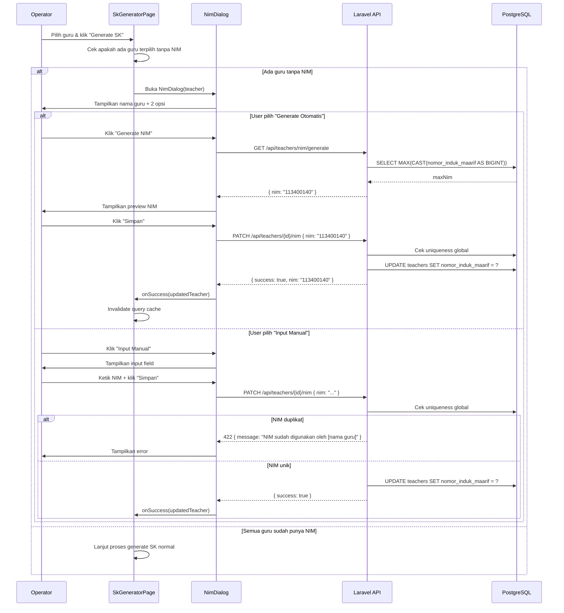

# Design Document: Generate/Input NIM di SK Generator

## Overview

Fitur ini menambahkan kemampuan untuk mengelola NIM (Nomor Induk Mengajar / `nomor_induk_maarif`) guru langsung dari halaman SK Generator. Ketika operator memilih guru yang belum memiliki NIM untuk di-generate SK-nya, sebuah dialog modal akan muncul dengan dua opsi: generate NIM otomatis (sequential dari MAX global) atau input NIM manual.

### Konteks Teknis Penting

- Kolom NIM di database adalah `nomor_induk_maarif` pada tabel `teachers` (bukan kolom `nim` terpisah)
- Backend sudah memiliki method `generateNim` di `TeacherController` dengan format `1134XXXXX` (prefix `1134` = kode Cilacap + 5 digit sequence) — format ini **dipertahankan** dan digunakan oleh fitur baru
- `UniqueForTenant` rule saat ini scope per-tenant untuk operator; NIM harus divalidasi secara **global** (lintas semua tenant)
- `HasTenantScope` trait auto-apply `where school_id = ?` — query NIM global harus menggunakan `withoutTenantScope()`
- Frontend sudah memiliki `teacherApi.generateNim` di `src/lib/api.ts` (menggunakan `POST`) — perlu disesuaikan

### Keputusan Desain

1. **Endpoint generate sebagai preview** — `GET /api/teachers/nim/generate` hanya menghitung NIM berikutnya tanpa menyimpan, sehingga user bisa review sebelum commit. Penyimpanan dilakukan via `PATCH /api/teachers/{id}/nim`.
2. **Validasi global di backend** — NIM divalidasi lintas semua tenant menggunakan `withoutTenantScope()`, bukan `UniqueForTenant` yang scope per-tenant.
3. **Kolom yang digunakan** — tetap menggunakan `nomor_induk_maarif` (tidak menambah kolom baru) untuk backward compatibility dengan SK template yang sudah ada.
4. **Dialog muncul saat generate, bukan saat load** — dialog hanya muncul ketika user klik tombol "Generate SK" dan ada guru terpilih yang tidak punya NIM, bukan saat halaman load.

---

## Architecture

```
┌─────────────────────────────────────────────────────────────────┐
│                     SK Generator Page                           │
│                                                                 │
│  ┌─────────────────┐    ┌──────────────────────────────────┐   │
│  │  Teacher Table  │    │       NimDialog Component        │   │
│  │  (existing)     │───▶│  - Teacher info display          │   │
│  │                 │    │  - Mode: 'select' | 'generate'   │   │
│  └─────────────────┘    │           | 'manual'             │   │
│                         │  - Preview NIM sebelum simpan    │   │
│                         └──────────────┬─────────────────┘    │
└──────────────────────────────────────┬─┘                       │
                                       │                         │
                    ┌──────────────────▼──────────────────┐      │
                    │           src/lib/api.ts             │      │
                    │  teacherApi.previewNim()             │      │
                    │  teacherApi.updateNim()              │      │
                    └──────────────────┬──────────────────┘      │
                                       │                         │
                    ┌──────────────────▼──────────────────┐      │
                    │         Laravel API Backend          │      │
                    │                                      │      │
                    │  GET  /api/teachers/nim/generate     │      │
                    │  PATCH /api/teachers/{id}/nim        │      │
                    └──────────────────┬──────────────────┘      │
                                       │                         │
                    ┌──────────────────▼──────────────────┐      │
                    │           PostgreSQL                  │      │
                    │  teachers.nomor_induk_maarif         │      │
                    │  (global uniqueness, no tenant scope)│      │
                    └─────────────────────────────────────┘      │
```

### Flow Diagram



---

## Components and Interfaces

### Backend

#### 1. `GET /api/teachers/nim/generate`

Preview NIM berikutnya yang akan di-generate. **Tidak menyimpan apapun.**

**Authorization:** `auth:sanctum` + `middleware:tenant`

**Response:**
```json
{
  "success": true,
  "message": "Berhasil.",
  "data": {
    "nim": "113400140",
    "current_max": "113400139"
  }
}
```

**Logic:**
```php
// Format: 1134XXXXX — prefix "1134" (kode Cilacap) + 5 digit sequence
$lastNim = Teacher::withoutTenantScope()
    ->where('nomor_induk_maarif', 'like', '1134%')
    ->whereRaw("LENGTH(nomor_induk_maarif) = 9")
    ->whereRaw("nomor_induk_maarif ~ '^[0-9]+$'")
    ->orderByRaw("CAST(nomor_induk_maarif AS BIGINT) DESC")
    ->value('nomor_induk_maarif');

if ($lastNim) {
    $lastSeq = (int) substr($lastNim, 4); // ambil 5 digit terakhir
    $newSeq  = $lastSeq + 1;
} else {
    $newSeq = 1;
}

$nextNim = '1134' . str_pad($newSeq, 5, '0', STR_PAD_LEFT);

// Ensure uniqueness (handle gaps)
while (Teacher::withoutTenantScope()->where('nomor_induk_maarif', $nextNim)->exists()) {
    $newSeq++;
    $nextNim = '1134' . str_pad($newSeq, 5, '0', STR_PAD_LEFT);
}
```

#### 2. `PATCH /api/teachers/{id}/nim`

Simpan NIM ke teacher record. Validasi global uniqueness.

**Authorization:** `auth:sanctum` + `middleware:tenant`

**Request Body:**
```json
{
  "nim": "113400140"
}
```

**Validation Rules:**
- `nim`: `required|string|regex:/^\d+$/` — hanya angka murni
- Global uniqueness check: `Teacher::withoutTenantScope()->where('nomor_induk_maarif', $nim)->where('id', '!=', $teacher->id)->exists()`

**Response (success):**
```json
{
  "success": true,
  "message": "NIM berhasil disimpan.",
  "data": {
    "id": 42,
    "nama": "Ahmad Fauzi",
    "nomor_induk_maarif": "113400140"
  }
}
```

**Response (duplicate):**
```json
{
  "success": false,
  "message": "NIM sudah digunakan oleh guru lain.",
  "errors": {
    "nim": ["NIM 113400140 sudah digunakan oleh Ahmad Fauzi (MI Nurul Huda)."]
  }
}
```

#### 3. `UpdateNimRequest` (Form Request)

File: `backend/app/Http/Requests/Teacher/UpdateNimRequest.php`

```php
public function rules(): array
{
    return [
        'nim' => ['required', 'string', 'regex:/^\d+$/'],
    ];
}
```

Catatan: Validasi uniqueness global dilakukan di controller/service (bukan via `UniqueForTenant` rule) karena harus lintas semua tenant.

#### 4. `TeacherController` — method baru

- `previewNim(Request $request): JsonResponse` — handle `GET /api/teachers/nim/generate`
- `updateNim(UpdateNimRequest $request, Teacher $teacher): JsonResponse` — handle `PATCH /api/teachers/{id}/nim`

Method `generateNim` yang lama (format `1134XXXXX`) akan dipertahankan untuk backward compatibility tapi tidak digunakan oleh fitur baru ini.

### Frontend

#### 1. `NimDialog` Component

File: `src/features/sk-management/components/NimDialog.tsx`

**Props:**
```typescript
interface NimDialogProps {
  teacher: TeacherCandidate;
  open: boolean;
  onSuccess: (updatedTeacher: TeacherCandidate) => void;
  onCancel: () => void;
}
```

**Internal State:**
```typescript
type DialogMode = 'select' | 'generate' | 'manual';

const [mode, setMode] = useState<DialogMode>('select');
const [previewNim, setPreviewNim] = useState<string>('');
const [manualNim, setManualNim] = useState<string>('');
```

**Sub-views berdasarkan mode:**
- `select`: Tampilkan info guru + dua tombol ("Generate Otomatis" / "Input Manual")
- `generate`: Tampilkan preview NIM + tombol "Simpan" / "Kembali"
- `manual`: Tampilkan input field + tombol "Simpan" / "Kembali"

#### 2. Integrasi di `SkGeneratorPage`

Tambahkan state dan logic berikut di `SkGeneratorPage`:

```typescript
const [nimDialogTeacher, setNimDialogTeacher] = useState<TeacherCandidate | null>(null);
const [pendingGenerateAfterNim, setPendingGenerateAfterNim] = useState(false);
```

Modifikasi `handleGenerate`:
1. Sebelum memulai generate, cek apakah ada guru terpilih yang `nomor_induk_maarif` kosong
2. Jika ada, buka `NimDialog` untuk guru pertama yang tidak punya NIM
3. Setelah NIM disimpan (`onSuccess`), invalidate query cache dan lanjutkan generate

#### 3. API Client — `src/lib/api.ts`

Tambahkan/update method di `teacherApi`:

```typescript
export const teacherApi = {
  // ... existing methods ...
  
  // Preview NIM berikutnya (tidak menyimpan)
  previewNim: () =>
    apiClient.get('/teachers/nim/generate').then((r) => r.data),
  
  // Simpan NIM ke teacher record
  updateNim: (teacherId: number, nim: string) =>
    apiClient.patch(`/teachers/${teacherId}/nim`, { nim }).then((r) => r.data),
};
```

---

## Data Models

### Teacher Model (existing, no schema change)

Kolom yang relevan (sudah ada):
```
teachers
├── id                    bigint PK
├── nomor_induk_maarif    varchar(255) nullable  ← NIM disimpan di sini
├── nama                  varchar(255)
├── school_id             bigint FK → schools.id
├── deleted_at            timestamp nullable (SoftDeletes)
└── ...
```

Tidak ada perubahan schema. `nomor_induk_maarif` sudah ada dan digunakan oleh SK template via placeholder `{NIM}` dan `{NOMOR INDUK MAARIF}`.

### ActivityLog Entry (saat NIM disimpan)

```json
{
  "description": "Update NIM guru: Ahmad Fauzi → 113400140",
  "event": "update_nim",
  "log_name": "master",
  "subject_id": 42,
  "subject_type": "App\\Models\\Teacher",
  "causer_id": 7,
  "causer_type": "App\\Models\\User",
  "school_id": 3,
  "properties": {
    "old_nim": null,
    "new_nim": "113400140"
  }
}
```

### TypeScript Types

```typescript
// Tambahkan ke TeacherCandidate interface yang sudah ada
interface TeacherCandidate {
  // ... existing fields ...
  nomor_induk_maarif?: string;  // NIM — sudah ada via spread dari teacher object
}

// Response dari previewNim
interface NimPreviewResponse {
  nim: string;
  current_max: string | null;
}

// Response dari updateNim
interface UpdateNimResponse {
  id: number;
  nama: string;
  nomor_induk_maarif: string;
}
```

---

## Correctness Properties

*A property is a characteristic or behavior that should hold true across all valid executions of a system — essentially, a formal statement about what the system should do. Properties serve as the bridge between human-readable specifications and machine-verifiable correctness guarantees.*

### Property 1: NIM yang di-generate selalu mengikuti sequence `1134XXXXX`

*For any* set of existing NIMs berformat `1134XXXXX` di database, NIM yang di-generate oleh `GET /api/teachers/nim/generate` harus selalu berupa `1134` + (sequence terbesar + 1, zero-padded 5 digit). Jika belum ada NIM berformat ini, NIM pertama harus `"113400001"`.

**Validates: Requirements 2.2, 7.4, 11.3**

### Property 2: NIM yang disimpan dapat diambil kembali (round-trip)

*For any* NIM numerik yang valid dan unik, setelah `PATCH /api/teachers/{id}/nim` berhasil, `GET /api/teachers/{id}` harus mengembalikan `nomor_induk_maarif` yang sama persis dengan NIM yang disimpan.

**Validates: Requirements 5.1**

### Property 3: Uniqueness global — tidak ada dua teacher dengan NIM yang sama

*For any* dua teacher yang berbeda (dari tenant manapun), mereka tidak boleh memiliki nilai `nomor_induk_maarif` yang sama. Upaya menyimpan NIM yang sudah dimiliki teacher lain harus selalu menghasilkan response 422.

**Validates: Requirements 4.1, 4.3, 11.1**

### Property 4: Format NIM — `1134` + 5 digit sequence dengan leading zeros

*For any* NIM yang di-generate secara otomatis, string tersebut harus: (a) panjang tepat 9 karakter, (b) diawali dengan `"1134"`, (c) diikuti tepat 5 digit angka dengan zero-padding (contoh: `"113400001"`, `"113400139"`).

**Validates: Requirements 7.1, 7.6**

### Property 5: Validasi format menolak semua input non-numerik

*For any* string yang mengandung setidaknya satu karakter non-digit (huruf, spasi, tanda baca, karakter khusus), `PATCH /api/teachers/{id}/nim` harus mengembalikan response 422 dengan pesan error validasi.

**Validates: Requirements 7.2**

### Property 6: Dialog menampilkan data guru yang benar

*For any* teacher object yang dikirim ke `NimDialog`, komponen harus selalu merender `nama` dan `unit_kerja` dari teacher tersebut di dalam dialog — tidak boleh menampilkan data teacher lain atau data kosong.

**Validates: Requirements 1.4**

---

## Error Handling

### Backend Error Cases

| Kondisi | HTTP Status | Response |
|---------|-------------|----------|
| NIM mengandung non-angka | 422 | `{ errors: { nim: ["NIM harus berupa angka."] } }` |
| NIM sudah digunakan teacher lain | 422 | `{ message: "NIM sudah digunakan oleh guru lain.", errors: { nim: ["NIM X sudah digunakan oleh [nama] ([sekolah])."] } }` |
| Teacher tidak ditemukan | 404 | `{ message: "Data guru tidak ditemukan." }` |
| Teacher dari tenant lain (operator) | 403 | `{ message: "Unauthorized." }` |
| Database error saat save | 500 | `{ message: "Terjadi kesalahan server. Silakan coba lagi." }` |

### Frontend Error Handling

- **Error generate NIM**: Toast error + tombol "Coba Lagi" di dalam dialog
- **Error duplikasi NIM**: Inline error message di bawah input field (bukan toast)
- **Error format NIM**: Inline validation sebelum submit (client-side) + server-side validation sebagai fallback
- **Error jaringan**: Toast error dengan pesan "Gagal terhubung ke server"

### Retry Strategy

Dialog mempertahankan state saat error — user tidak perlu memulai dari awal. Tombol "Simpan" kembali aktif setelah error sehingga user bisa langsung retry atau mengubah input.

---

## Testing Strategy

### Unit Tests (Backend — PHPUnit)

1. **`TeacherController::previewNim`**
   - Returns correct next NIM when teachers with NIMs exist
   - Returns "1" when no teachers have NIMs
   - Ignores non-numeric `nomor_induk_maarif` values when calculating max
   - Uses global scope (not tenant-scoped)

2. **`TeacherController::updateNim`**
   - Saves valid numeric NIM successfully
   - Returns 422 for non-numeric NIM
   - Returns 422 for duplicate NIM (same tenant)
   - Returns 422 for duplicate NIM (different tenant) — global check
   - Creates ActivityLog entry on success
   - Returns 403 when operator tries to update teacher from different school

3. **`UpdateNimRequest` validation**
   - Accepts pure numeric strings
   - Rejects strings with letters
   - Rejects strings with special characters
   - Rejects empty string

### Property-Based Tests (Backend — PHPUnit + custom generators)

Menggunakan PHPUnit dengan data providers untuk mensimulasikan property-based testing:

**Property 1 — MAX + 1:**
```php
/** @dataProvider nimDataProvider */
public function test_generated_nim_is_max_plus_one(array $existingNims, string $expectedNext): void
{
    // Seed teachers with given NIMs
    // Call GET /api/teachers/nim/generate
    // Assert response nim === expectedNext
}

public static function nimDataProvider(): array
{
    return [
        'empty database' => [[], '113400001'],
        'single nim' => [['113400001'], '113400002'],
        'multiple nims' => [['113400001', '113400050', '113400139'], '113400140'],
        'large sequence' => [['113499999'], '113400001'],  // overflow — edge case
        'non-sequential nims' => [['113400001', '113400999', '113400500'], '113401000'],
    ];
}
```

**Property 3 — Global uniqueness:**
```php
/** @dataProvider duplicateNimProvider */
public function test_duplicate_nim_rejected_globally(int $schoolIdA, int $schoolIdB): void
{
    // Create teacher A in school A with NIM "12345"
    // Attempt to save NIM "12345" to teacher B in school B
    // Assert 422 response
}
```

**Property 5 — Format validation:**
```php
/** @dataProvider invalidNimFormatProvider */
public function test_non_numeric_nim_rejected(string $invalidNim): void
{
    // Attempt PATCH /api/teachers/{id}/nim with invalid NIM
    // Assert 422 response
}

public static function invalidNimFormatProvider(): array
{
    return [
        ['abc'], ['12a3'], ['12.3'], ['12 3'], ['12-3'],
        [' 123'], ['123 '], [''], ['0x1F'], ['١٢٣'], // Arabic numerals
    ];
}
```

### Frontend Tests (Vitest + React Testing Library)

1. **`NimDialog` component**
   - Renders teacher name and unit_kerja correctly (Property 6)
   - Shows two option buttons in 'select' mode
   - Transitions to 'generate' mode on "Generate Otomatis" click
   - Transitions to 'manual' mode on "Input Manual" click
   - Shows preview NIM after successful generate API call
   - Shows inline error on duplicate NIM response
   - Calls `onCancel` when cancel button clicked (no API calls made)
   - Calls `onSuccess` with updated teacher after successful save

2. **`SkGeneratorPage` integration**
   - Does NOT show NimDialog when all selected teachers have NIMs
   - Shows NimDialog when a selected teacher has no NIM
   - Invalidates TanStack Query cache after NIM saved

### Property-Based Tests (Frontend — fast-check)

```typescript
import * as fc from 'fast-check';

// Property 6: Dialog selalu menampilkan data teacher yang benar
test('NimDialog renders correct teacher data for any teacher', () => {
  fc.assert(
    fc.property(
      fc.record({
        id: fc.integer({ min: 1 }),
        nama: fc.string({ minLength: 1, maxLength: 100 }),
        unit_kerja: fc.string({ minLength: 1, maxLength: 100 }),
        nomor_induk_maarif: fc.constant(undefined),
      }),
      (teacher) => {
        const { getByText } = render(
          <NimDialog teacher={teacher} open={true} onSuccess={vi.fn()} onCancel={vi.fn()} />
        );
        expect(getByText(teacher.nama)).toBeInTheDocument();
        expect(getByText(teacher.unit_kerja)).toBeInTheDocument();
      }
    )
  );
});

// Property 5: Frontend validation menolak semua input non-numerik
test('manual NIM input rejects non-numeric strings', () => {
  fc.assert(
    fc.property(
      fc.string().filter(s => /[^0-9]/.test(s) && s.length > 0),
      (invalidNim) => {
        // Render dialog in manual mode, type invalid NIM, click save
        // Verify error message shown, API not called
      }
    )
  );
});
```

**Library:** `fast-check` (sudah tersedia di ekosistem Vite/Vitest)
**Minimum iterations:** 100 per property test
**Tag format:** `// Feature: nim-generator-sk, Property {N}: {property_text}`
