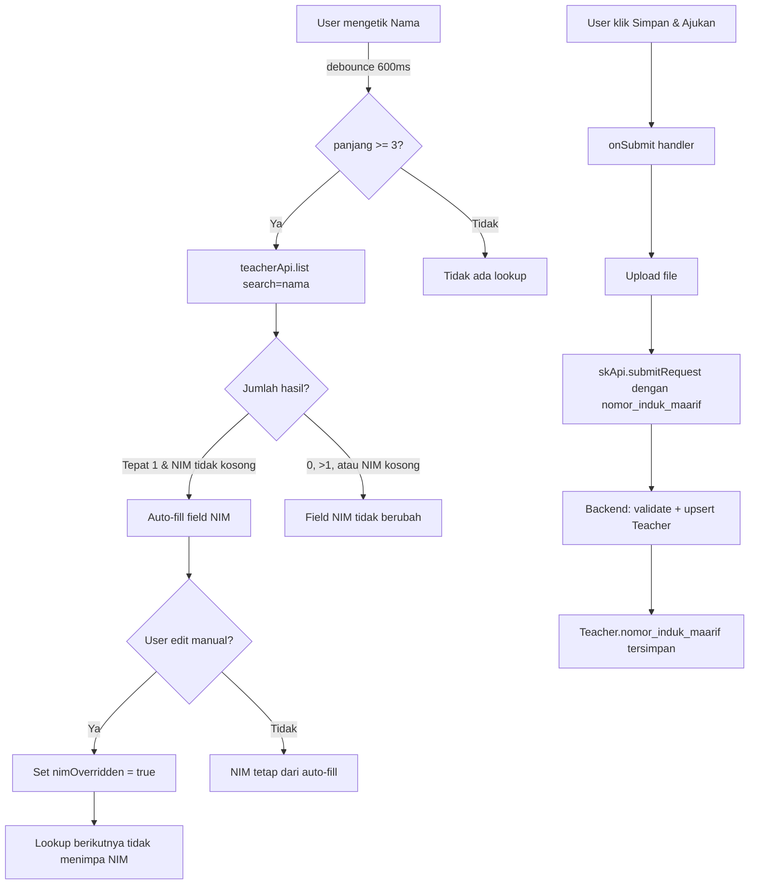

# Design Document: NIM pada Pengajuan SK

## Overview

Fitur ini memodifikasi halaman `SkSubmissionPage.tsx` untuk menambahkan field **NIM (Nomor Induk Maarif)** dan menghapus field **NIY/NUPTK** dan **Jabatan** dari formulir pengajuan SK individual. NIM diisi secara otomatis (auto-fill) berdasarkan hasil pencarian guru ketika user mengetik nama, dengan debounce 600ms. User dapat mengoverride nilai NIM secara manual. Nilai NIM dikirim ke backend sebagai `nomor_induk_maarif` saat form disubmit.

Perubahan backend minimal: `SkDocumentController::submitRequest()` perlu menerima dan meneruskan field `nomor_induk_maarif` ke Teacher record. Field ini sudah ada di model `Teacher` dan sudah masuk dalam `$fillable`.

## Architecture



### Komponen yang Diubah

| Komponen | Perubahan |
|---|---|
| `SkSubmissionPage.tsx` | Hapus field `nuptk`/`jabatan`, tambah field `nim`, tambah debounce lookup, tambah override flag, kirim `nomor_induk_maarif` di payload |
| `SkDocumentController::submitRequest()` | Tambah `nomor_induk_maarif` ke validation rules dan `$teacherData` |

### Komponen yang Tidak Diubah

- `teacherApi.list()` — sudah mendukung parameter `search`, tidak perlu modifikasi
- `Teacher` model — `nomor_induk_maarif` sudah ada di `$fillable`
- `SkDocument` model — tidak menyimpan NIM secara langsung (disimpan di Teacher)
- `VerifySkPage.tsx` — hanya menambah tampilan NIM jika data tersedia (perubahan additive)

## Components and Interfaces

### Frontend: `SkSubmissionPage.tsx`

#### Perubahan pada Zod Schema

```typescript
// Hapus: nuptk, jabatan
// Tambah: nim
const skSchema = z.object({
  // ... field lain tetap ...
  nim: z
    .string()
    .regex(/^\d*$/, "NIM hanya boleh berisi angka")
    .max(20, "NIM maksimal 20 karakter")
    .optional(),
})
```

#### Perubahan pada Type `SkFormValues`

```typescript
type SkFormValues = {
  jenisSk: string
  jenisPengajuan: "new" | "renew"
  nama: string
  nim?: string           // BARU — menggantikan nuptk
  // nuptk dihapus
  // jabatan dihapus
  unit_kerja: string
  keterangan?: string
  tempat_lahir: string
  tanggal_lahir: string
  pendidikan_terakhir: string
  tmt: string
  status_kepegawaian?: string
  nomor_surat_permohonan?: string
  tanggal_surat_permohonan?: string
}
```

#### State Baru untuk Auto-fill

```typescript
// Flag: apakah user sudah override NIM secara manual
const [nimOverridden, setNimOverridden] = useState(false)

// Debounced nama untuk trigger lookup
const namaValue = form.watch("nama")
const [debouncedNama, setDebouncedNama] = useState("")

useEffect(() => {
  const timer = setTimeout(() => {
    if (namaValue && namaValue.length >= 3) {
      setDebouncedNama(namaValue)
    }
  }, 600)
  return () => clearTimeout(timer)
}, [namaValue])
```

#### Query untuk Teacher Lookup

```typescript
const { isFetching: isLookingUpNim } = useQuery({
  queryKey: ['teacher-nim-lookup', debouncedNama],
  queryFn: () => teacherApi.list({ search: debouncedNama }),
  enabled: !!debouncedNama && debouncedNama.length >= 3,
  onSuccess: (data) => {
    if (nimOverridden) return  // jangan timpa jika user sudah override
    const teachers = data?.data ?? data ?? []
    if (teachers.length === 1 && teachers[0].nomor_induk_maarif) {
      form.setValue("nim", teachers[0].nomor_induk_maarif)
    }
  }
})
```

> **Catatan implementasi**: TanStack Query v5 tidak mendukung `onSuccess` di `useQuery`. Gunakan `useEffect` yang watch `data` dari query sebagai gantinya (lihat bagian Data Models untuk detail).

#### Handler Override Manual

```typescript
// Pada input NIM, tambahkan onChange handler:
onChange={(e) => {
  form.setValue("nim", e.target.value)
  setNimOverridden(true)  // tandai bahwa user sudah override
}}
```

#### Perubahan pada `onSubmit`

```typescript
await createRequestMutation.mutateAsync({
  nama: data.nama,
  // nuptk dihapus
  nip: data.nip || undefined,
  nomor_induk_maarif: data.nim || undefined,  // BARU
  jenis_sk: data.jenisSk,
  unit_kerja: unitKerja,
  // jabatan dihapus dari payload
  tmt: data.tmt || undefined,
  tempat_lahir: data.tempat_lahir || undefined,
  tanggal_lahir: data.tanggal_lahir || undefined,
  pendidikan_terakhir: data.pendidikan_terakhir || undefined,
  surat_permohonan_url: fileUrl,
  nomor_surat_permohonan: data.nomor_surat_permohonan || undefined,
  tanggal_surat_permohonan: data.tanggal_surat_permohonan || undefined,
  status_kepegawaian: data.status_kepegawaian || (data.jenisSk?.includes("GTY") ? "GTY" : "GTT")
})
```

### Backend: `SkDocumentController::submitRequest()`

Tambahkan satu baris pada validation rules:

```php
$data = $request->validate([
    // ... rules yang sudah ada ...
    'nomor_induk_maarif' => 'nullable|string|max:20',  // BARU
]);
```

Tambahkan kondisi pada `$teacherData`:

```php
if (!empty($data['nomor_induk_maarif'])) {
    $teacherData['nomor_induk_maarif'] = $data['nomor_induk_maarif'];
}
```

### Frontend: `VerifySkPage.tsx` (Opsional — Requirement 6)

Tambahkan tampilan NIM pada bagian detail SK, setelah field Nama Guru:

```tsx
{skData.teacher?.nomor_induk_maarif && (
  <div className="flex items-start gap-4">
    <div className="h-10 w-10 rounded-xl bg-slate-50 flex items-center justify-center shrink-0">
      <Hash className="w-5 h-5 text-slate-400" />
    </div>
    <div>
      <p className="text-[10px] font-black text-slate-400 uppercase tracking-widest mb-1 leading-none">
        NIM (Nomor Induk Maarif)
      </p>
      <p className="font-mono text-sm font-bold text-slate-700">
        {skData.teacher.nomor_induk_maarif}
      </p>
    </div>
  </div>
)}
```

Ini memerlukan `SkVerificationController` untuk menyertakan relasi `teacher` dalam response, atau menambahkan field `nomor_induk_maarif` langsung ke response payload.

## Data Models

### Teacher (existing — tidak ada perubahan schema)

Field `nomor_induk_maarif` sudah ada di model dan `$fillable`. Tidak perlu migrasi baru.

```php
// Teacher.$fillable (sudah ada):
'nomor_induk_maarif',
```

### SkDocument (existing — tidak ada perubahan)

NIM tidak disimpan di `sk_documents`. Ia disimpan di `teachers.nomor_induk_maarif` dan diakses via relasi `teacher`.

### State Management di Frontend

```typescript
// State yang dikelola di SkSubmissionPage
interface NimAutoFillState {
  nimOverridden: boolean    // true jika user sudah edit manual
  debouncedNama: string     // nama setelah debounce 600ms
}
```

### TanStack Query v5 — Pattern yang Benar

Karena TanStack Query v5 menghapus `onSuccess` dari `useQuery`, gunakan `useEffect`:

```typescript
const { data: teacherLookupData, isFetching: isLookingUpNim } = useQuery({
  queryKey: ['teacher-nim-lookup', debouncedNama],
  queryFn: () => teacherApi.list({ search: debouncedNama }),
  enabled: !!debouncedNama && debouncedNama.length >= 3,
  staleTime: 30_000,
})

useEffect(() => {
  if (!teacherLookupData || nimOverridden) return
  const teachers = teacherLookupData?.data ?? teacherLookupData ?? []
  if (Array.isArray(teachers) && teachers.length === 1 && teachers[0].nomor_induk_maarif) {
    form.setValue("nim", teachers[0].nomor_induk_maarif)
  }
}, [teacherLookupData, nimOverridden])
```

### Payload ke Backend

```typescript
// Payload yang dikirim ke POST /api/sk-documents/submit-request
{
  nama: string,
  nip?: string,
  nomor_induk_maarif?: string,  // BARU — undefined jika NIM kosong
  jenis_sk: string,
  unit_kerja: string,
  // jabatan dihapus
  tmt?: string,
  tempat_lahir?: string,
  tanggal_lahir?: string,
  pendidikan_terakhir?: string,
  surat_permohonan_url: string,
  nomor_surat_permohonan?: string,
  tanggal_surat_permohonan?: string,
  status_kepegawaian?: string,
}
```

## Correctness Properties

*A property is a characteristic or behavior that should hold true across all valid executions of a system — essentially, a formal statement about what the system should do. Properties serve as the bridge between human-readable specifications and machine-verifiable correctness guarantees.*

### Property 1: Validasi NIM — hanya angka

*For any* string yang mengandung setidaknya satu karakter non-numerik (huruf, spasi, simbol), Zod schema untuk field `nim` SHALL mengembalikan error dengan pesan "NIM hanya boleh berisi angka".

**Validates: Requirements 5.1**

---

### Property 2: Validasi NIM — panjang maksimal

*For any* string numerik dengan panjang lebih dari 20 karakter, Zod schema untuk field `nim` SHALL mengembalikan error dengan pesan "NIM maksimal 20 karakter".

**Validates: Requirements 5.2, 1.4**

---

### Property 3: Auto-fill NIM dari hasil lookup tunggal

*For any* teacher record dengan `nomor_induk_maarif` tidak kosong, ketika `teacherApi.list` mengembalikan tepat satu hasil yang merupakan teacher tersebut, field NIM pada form SHALL terisi dengan nilai `nomor_induk_maarif` dari teacher tersebut — dan ketika lookup mengembalikan nol atau lebih dari satu hasil, field NIM SHALL tidak berubah dari nilai sebelumnya.

**Validates: Requirements 2.2, 2.3, 2.4**

---

### Property 4: Override manual mengunci auto-fill

*For any* nilai NIM yang diketik user secara manual (setelah atau tanpa auto-fill sebelumnya), lookup Teacher berikutnya SHALL tidak menimpa nilai yang sudah diketik user tersebut.

**Validates: Requirements 3.2, 3.3**

---

### Property 5: Payload submit menyertakan NIM dengan benar

*For any* nilai NIM yang valid (numerik, panjang 1–20 karakter), ketika form disubmit, payload yang dikirim ke `skApi.submitRequest` SHALL mengandung field `nomor_induk_maarif` dengan nilai string yang sama persis. Ketika field NIM kosong, payload SHALL tidak menyertakan field `nomor_induk_maarif` (atau mengirimnya sebagai `undefined`).

**Validates: Requirements 4.1, 4.2, 4.3**

---

### Property 6: Backend menyimpan NIM ke Teacher record

*For any* nilai `nomor_induk_maarif` yang valid (string numerik, panjang <= 20) yang dikirim ke `POST /api/sk-documents/submit-request`, setelah request berhasil, record Teacher yang terkait dengan pengajuan tersebut SHALL memiliki `nomor_induk_maarif` yang sama dengan nilai yang dikirim.

**Validates: Requirements 4.4, 4.5**

## Error Handling

### Frontend

| Skenario | Penanganan |
|---|---|
| Teacher lookup gagal (network error) | Query error diabaikan secara silent — field NIM tetap kosong, user bisa isi manual. Tidak perlu toast error karena lookup bersifat opsional. |
| Teacher lookup timeout | Sama seperti di atas — `isLookingUpNim` kembali ke `false`, loading indicator hilang. |
| Submit dengan NIM non-numerik | Zod validation mencegah submit, pesan error ditampilkan inline di bawah field NIM. |
| Submit dengan NIM > 20 karakter | Sama seperti di atas. |
| Backend menolak `nomor_induk_maarif` | Error dari `createRequestMutation.onError` ditampilkan via `toast.error`. |

### Backend

| Skenario | Penanganan |
|---|---|
| `nomor_induk_maarif` tidak dikirim | Field nullable — tidak ada error, Teacher record tidak diupdate untuk field ini. |
| `nomor_induk_maarif` dikirim sebagai string kosong | Kondisi `!empty($data['nomor_induk_maarif'])` false — tidak diupdate ke Teacher. |
| `nomor_induk_maarif` melebihi 20 karakter | Laravel validation rule `max:20` mengembalikan 422 dengan pesan validasi. |

## Testing Strategy

### Unit Tests (Frontend — Vitest)

Fokus pada logika yang bisa diisolasi:

1. **Zod schema validation** — test langsung terhadap schema object:
   - NIM kosong → valid (opsional)
   - NIM numerik 1–20 karakter → valid
   - NIM dengan huruf → error "NIM hanya boleh berisi angka"
   - NIM numerik > 20 karakter → error "NIM maksimal 20 karakter"

2. **Auto-fill logic** — test dengan mock `teacherApi.list`:
   - 1 hasil dengan NIM → field terisi
   - 0 hasil → field tidak berubah
   - >1 hasil → field tidak berubah
   - 1 hasil tanpa NIM → field tidak berubah

3. **Override lock** — test bahwa `nimOverridden = true` mencegah auto-fill menimpa nilai manual

4. **Payload construction** — test bahwa `onSubmit` menyertakan `nomor_induk_maarif` dengan benar

### Property-Based Tests (Frontend — Vitest + fast-check)

Library: **fast-check** (sudah umum di ekosistem TypeScript/Vitest)

Konfigurasi: minimum 100 iterasi per property test.

```typescript
// Tag format: Feature: nim-pengajuan-sk, Property {N}: {property_text}
```

**Property 1 & 2** — Zod schema validation:
```typescript
// Feature: nim-pengajuan-sk, Property 1: Validasi NIM — hanya angka
fc.assert(fc.property(
  fc.string().filter(s => /[^0-9]/.test(s) && s.length > 0),
  (nonNumeric) => {
    const result = nimSchema.safeParse(nonNumeric)
    return !result.success && result.error.issues[0].message === "NIM hanya boleh berisi angka"
  }
), { numRuns: 100 })

// Feature: nim-pengajuan-sk, Property 2: Validasi NIM — panjang maksimal
fc.assert(fc.property(
  fc.stringOf(fc.constantFrom('0','1','2','3','4','5','6','7','8','9'), { minLength: 21 }),
  (longNumeric) => {
    const result = nimSchema.safeParse(longNumeric)
    return !result.success && result.error.issues[0].message === "NIM maksimal 20 karakter"
  }
), { numRuns: 100 })
```

**Property 3** — Auto-fill behavior:
```typescript
// Feature: nim-pengajuan-sk, Property 3: Auto-fill NIM dari hasil lookup tunggal
fc.assert(fc.property(
  fc.record({
    nomor_induk_maarif: fc.stringOf(fc.constantFrom('0','1','2','3','4','5','6','7','8','9'), { minLength: 1, maxLength: 20 }),
    nama: fc.string({ minLength: 3 }),
  }),
  (teacher) => {
    // Mock teacherApi.list return [teacher]
    // Trigger lookup, verifikasi form.getValues("nim") === teacher.nomor_induk_maarif
  }
), { numRuns: 100 })
```

**Property 4** — Override lock:
```typescript
// Feature: nim-pengajuan-sk, Property 4: Override manual mengunci auto-fill
fc.assert(fc.property(
  fc.tuple(
    fc.stringOf(fc.constantFrom('0','1','2','3','4','5','6','7','8','9'), { minLength: 1, maxLength: 20 }),
    fc.stringOf(fc.constantFrom('0','1','2','3','4','5','6','7','8','9'), { minLength: 1, maxLength: 20 }),
  ),
  ([autoFillValue, manualValue]) => {
    // Set nimOverridden = true dengan manual value
    // Trigger lookup yang return autoFillValue
    // Verifikasi form.getValues("nim") === manualValue
  }
), { numRuns: 100 })
```

**Property 5** — Payload construction:
```typescript
// Feature: nim-pengajuan-sk, Property 5: Payload submit menyertakan NIM dengan benar
fc.assert(fc.property(
  fc.stringOf(fc.constantFrom('0','1','2','3','4','5','6','7','8','9'), { minLength: 1, maxLength: 20 }),
  (nim) => {
    // Set form.nim = nim, capture payload dari mock skApi.submitRequest
    // Verifikasi payload.nomor_induk_maarif === nim
  }
), { numRuns: 100 })
```

### Unit Tests (Backend — PHPUnit)

1. **Validation rules** — `nomor_induk_maarif` nullable, max 20 karakter
2. **Teacher upsert** — NIM tersimpan ke Teacher record ketika dikirim
3. **Teacher upsert** — NIM tidak diupdate ketika tidak dikirim (field tidak ada di payload)

### Integration Tests

- Submit form lengkap dengan NIM → verifikasi Teacher record di database memiliki NIM yang benar
- Submit form tanpa NIM → verifikasi Teacher record tidak memiliki NIM yang tidak diinginkan

### Catatan: Field yang Dihapus

Field `nuptk` (NIY/NUPTK) dan `jabatan` dihapus dari form. Backend `submitRequest` tetap menerima `nuptk` dan `jabatan` sebagai nullable (tidak perlu dihapus dari validation rules backend untuk backward compatibility dengan bulk import yang mungkin masih mengirim field ini).
