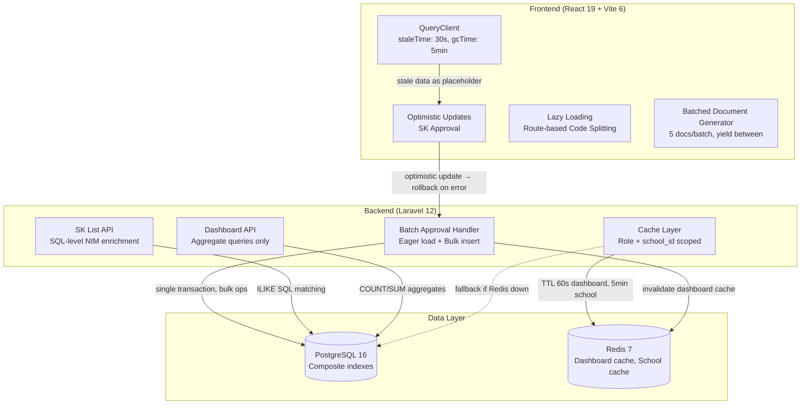

# Design Document: Performance Optimization

## Overview

This design addresses the primary performance bottlenecks in the SIMMACI application, focusing on the SK batch approval workflow (the most user-reported pain point), database query efficiency, frontend data fetching patterns, and caching strategies. The optimization spans the full stack: Laravel backend query patterns, PostgreSQL indexing, Redis caching, and React Query client configuration with optimistic updates.

The approach prioritizes:
1. **Eliminating N+1 queries** in the batch approval handler and SK list endpoint
2. **Reducing redundant data transfer** via payload optimization and targeted cache invalidation
3. **Improving perceived performance** via optimistic updates, placeholder data, and lazy loading
4. **Reducing database load** via Redis caching for frequently accessed dashboard data

## Architecture



## Components and Interfaces

### Backend Components

#### 1. Optimized Batch Approval Handler (`SkDocumentController::batchUpdateStatus`)

**Current issues:**
- Loads each SK document individually in a loop (`SkDocument::find($id)`)
- Creates notifications one-by-one via `Notification::create()` in loop
- Creates approval history records one-by-one
- No batch size limit validation
- No partial failure handling (one failure stops all)

**Optimized approach:**
```php
// Pseudocode for optimized handler
public function batchUpdateStatus(Request $request): JsonResponse
{
    // 1. Validate batch size ≤ 50
    $request->validate([
        'ids' => 'required|array|max:50',
        'ids.*' => 'integer',
        'status' => 'required|in:approved,rejected',
    ]);

    // 2. Eager-load all documents + teacher in ONE query
    $documents = SkDocument::with('teacher')
        ->whereIn('id', $request->ids)
        ->get();

    // 3. Process in transaction with partial failure tracking
    $succeeded = [];
    $failed = [];

    DB::transaction(function () use ($documents, $request, &$succeeded, &$failed) {
        foreach ($documents as $sk) {
            try {
                // process individual SK logic
                $succeeded[] = $sk;
            } catch (\Throwable $e) {
                $failed[] = ['id' => $sk->id, 'reason' => $e->getMessage()];
            }
        }

        // 4. Bulk insert notifications
        Notification::insert($notificationRecords);

        // 5. Bulk insert approval histories
        ApprovalHistory::insert($historyRecords);

        // 6. Bulk update SK documents
        SkDocument::whereIn('id', $succeededIds)
            ->update(['status' => $request->status]);
    });

    // 7. Invalidate dashboard cache for affected schools
    $schoolIds = $documents->pluck('school_id')->unique();
    foreach ($schoolIds as $schoolId) {
        Cache::tags(["dashboard:school:{$schoolId}"])->flush();
    }

    return response()->json([
        'count' => count($succeeded),
        'failed' => $failed,
    ]);
}
```

#### 2. Optimized SK List API (`SkDocumentController::index`)

**Current issues:**
- NIM enrichment loads all teachers with NIM into PHP memory, then filters with `mb_strtolower` in a collection closure
- No field selection (returns all model attributes)

**Optimized approach:**
- Use SQL `ILIKE` or `LOWER()` for case-insensitive name matching directly in the query
- Use `->select()` to return only required fields
- Add `created_at DESC` index for sort optimization

```php
// SQL-level NIM enrichment (replaces PHP collection filtering)
$enrichedItems = DB::select("
    SELECT sd.id, t.nomor_induk_maarif
    FROM sk_documents sd
    LEFT JOIN teachers t ON LOWER(TRIM(t.nama)) = LOWER(TRIM(sd.nama))
        AND t.school_id = sd.school_id
        AND t.nomor_induk_maarif IS NOT NULL
        AND t.nomor_induk_maarif != ''
    WHERE sd.id IN (?)
        AND (sd.teacher_id IS NULL OR ...)
", [$missingNimIds]);
```

#### 3. Dashboard Cache Service

A dedicated service layer managing Redis-backed caching for dashboard endpoints:

```php
class DashboardCacheService
{
    private const DASHBOARD_TTL = 60;      // seconds
    private const SCHOOL_TTL = 300;        // 5 minutes

    public function getStats(User $user): array
    {
        $cacheKey = $this->buildKey('stats', $user);
        return Cache::remember($cacheKey, self::DASHBOARD_TTL, fn() => $this->computeStats($user));
    }

    public function invalidateForSchool(int $schoolId): void
    {
        // Invalidate all dashboard cache variants for this school
        Cache::forget("dashboard:stats:operator:{$schoolId}");
        Cache::forget("dashboard:stats:admin_yayasan:all");
        Cache::forget("dashboard:stats:super_admin:all");
        // ... other dashboard endpoints
    }

    private function buildKey(string $endpoint, User $user): string
    {
        $scope = $user->role === 'operator' ? $user->school_id : 'all';
        return "dashboard:{$endpoint}:{$user->role}:{$scope}";
    }
}
```

#### 4. Database Index Migration

New composite indexes to add (beyond existing ones):

| Table | Columns | Purpose |
|-------|---------|---------|
| `approval_histories` | `(document_id, document_type)` | Filter by document reference |
| `sk_documents` | `(school_id, created_at DESC)` | Tenant-scoped reverse chronological listing |

Already existing (from `2026_04_15_000001_add_performance_indexes.php`):
- `sk_documents(school_id, status)` ✓
- `notifications(user_id, is_read)` ✓
- `teachers(school_id, is_active)` ✓
- `activity_logs(school_id, id)` ✓

### Frontend Components

#### 5. QueryClient Configuration

```typescript
const queryClient = new QueryClient({
  defaultOptions: {
    queries: {
      staleTime: 30 * 1000,       // 30 seconds
      gcTime: 5 * 60 * 1000,      // 5 minutes
      refetchOnWindowFocus: false,
      retry: 1,
    },
  },
});
```

#### 6. Optimistic Update Hook for SK Approval

```typescript
// useSkApproval.ts
function useSkBatchApproval() {
  const queryClient = useQueryClient();

  return useMutation({
    mutationFn: (payload: BatchApprovalPayload) =>
      apiClient.patch('/api/sk-documents/batch-status', payload),

    onMutate: async (payload) => {
      // Cancel outgoing refetches
      await queryClient.cancelQueries({ queryKey: ['sk-documents'] });

      // Snapshot previous value
      const previous = queryClient.getQueryData(['sk-documents']);

      // Optimistically update cache
      queryClient.setQueryData(['sk-documents'], (old) =>
        updateSkStatus(old, payload.ids, payload.status)
      );

      return { previous };
    },

    onError: (_err, _payload, context) => {
      // Rollback on error
      queryClient.setQueryData(['sk-documents'], context?.previous);
      toast.error('Gagal memproses persetujuan SK');
    },

    onSuccess: (response) => {
      // Replace optimistic data with server truth
      queryClient.invalidateQueries({ queryKey: ['sk-documents'] });
      queryClient.invalidateQueries({ queryKey: ['dashboard'] });
    },
  });
}
```

#### 7. Batched Document Generator

```typescript
// generateSkDocuments.ts
async function generateSkBatched(
  teachers: Teacher[],
  options: GenerateOptions,
  onProgress: (completed: number, total: number) => void,
  signal: AbortSignal
): Promise<GenerateResult> {
  const BATCH_SIZE = 5;
  const SYNC_CONCURRENCY = 10;
  const results: GeneratedDoc[] = [];
  const failures: FailedDoc[] = [];

  for (let i = 0; i < teachers.length; i += BATCH_SIZE) {
    if (signal.aborted) break;

    const batch = teachers.slice(i, i + BATCH_SIZE);

    for (const teacher of batch) {
      try {
        const doc = await generateSingleDoc(teacher, options);
        results.push(doc);
      } catch (err) {
        failures.push({ teacher, error: err.message });
      }
    }

    onProgress(results.length + failures.length, teachers.length);

    // Yield to browser event loop
    await new Promise(resolve => requestAnimationFrame(resolve));
  }

  // Sync to backend in batches of 10 concurrent requests
  const syncResults = await syncInBatches(results, SYNC_CONCURRENCY);

  return { generated: results, failures, syncFailures: syncResults.failures };
}
```

#### 8. Lazy Loading with Error Boundary

All route components already use `React.lazy()` (confirmed in current `App.tsx`). Additional changes:
- Move heavy libraries (JSZip, PizZip, Docxtemplater, QRCode) to dynamic imports within `SkGeneratorPage`
- Replace the spinner `PageLoader` with CSS skeleton placeholders
- Add chunk error boundary with retry capability

## Data Models

### Cache Key Schema

```
dashboard:stats:{role}:{school_id|all}          TTL: 60s
dashboard:school-stats:{role}:{school_id}       TTL: 60s
dashboard:charts:{role}:{school_id|all}         TTL: 60s
dashboard:sk-statistics:{role}:{school_id|all}  TTL: 60s
dashboard:sk-trend:{role}:{school_id|all}       TTL: 60s
dashboard:school-breakdown:{role}               TTL: 60s
school:{school_id}                              TTL: 300s (5 min)
school:names:all                                TTL: 300s (5 min)
```

### Batch Approval Response Shape

```typescript
interface BatchApprovalResponse {
  count: number;           // successfully processed
  failed: {
    id: number;
    reason: string;
  }[];
}
```

### Optimized SK List Response Shape

```typescript
interface SkListItem {
  id: number;
  nomor_sk: string;
  nama: string;
  jenis_sk: string;
  status: string;
  unit_kerja: string;
  created_at: string;
  teacher: {
    nomor_induk_maarif: string | null;
  } | null;
}

interface SkListResponse {
  data: SkListItem[];
  total: number;
  per_page: number;       // default 25, max 100
  current_page: number;
}
```

### Frontend Query Keys

```typescript
// Standardized query keys for targeted invalidation
const SK_QUERY_KEYS = {
  all: ['sk-documents'] as const,
  list: (filters: SkFilters) => ['sk-documents', 'list', filters] as const,
  detail: (id: number) => ['sk-documents', 'detail', id] as const,
  candidates: (search: string, page: number) => ['sk-candidates-generator', search, page] as const,
  templates: ['sk-templates'] as const,
  revisions: ['sk-revisions'] as const,
  pending: ['sk-pending'] as const,
};

const DASHBOARD_QUERY_KEYS = {
  stats: ['dashboard', 'stats'] as const,
  schoolStats: ['dashboard', 'school-stats'] as const,
  charts: ['dashboard', 'charts'] as const,
};
```

## Correctness Properties

*A property is a characteristic or behavior that should hold true across all valid executions of a system — essentially, a formal statement about what the system should do. Properties serve as the bridge between human-readable specifications and machine-verifiable correctness guarantees.*

### Property 1: Eager loading prevents N+1 queries

*For any* batch of N SK documents (1 ≤ N ≤ 50), the batch approval handler SHALL load all documents and their teacher relationships using a constant number of SELECT queries (at most 2: one for documents, one for teachers), regardless of N.

**Validates: Requirements 1.2**

### Property 2: Bulk insert for batch write operations

*For any* batch of N SK documents being approved/rejected, the number of INSERT statements for notifications and approval history records SHALL each be exactly 1 (bulk insert), not N individual inserts.

**Validates: Requirements 1.3, 1.4**

### Property 3: Partial failure resilience in batch approval

*For any* batch containing V valid and I invalid SK documents (where V + I ≤ 50), the batch approval handler SHALL successfully process exactly V documents and return exactly I failure entries with their IDs and reasons, without aborting the entire batch.

**Validates: Requirements 1.6**

### Property 4: NIM enrichment correctness via SQL

*For any* SK document whose teacher record lacks a `nomor_induk_maarif`, if a teacher with a case-insensitively matching name exists in the same school and has a non-empty NIM, the SK list response SHALL include that teacher's NIM value in the `teacher.nomor_induk_maarif` field.

**Validates: Requirements 2.2**

### Property 5: Targeted query invalidation

*For any* successful mutation on an SK-related endpoint, the frontend SHALL invalidate only query keys prefixed with SK-related keys (sk-documents, sk-templates, sk-candidates-generator, sk-revisions, sk-pending) and dashboard keys, leaving all other cached queries (meetings, wa-blast, attendance, etc.) untouched.

**Validates: Requirements 3.3**

### Property 6: Dashboard cache serves within TTL

*For any* dashboard endpoint called twice within 60 seconds with the same user context (role + school_id), the second call SHALL be served from Redis cache without executing any database queries.

**Validates: Requirements 4.2**

### Property 7: Cache invalidation on SK status change

*For any* SK document whose status changes (via single update or batch approval), all dashboard cache entries scoped to the affected school_id SHALL be invalidated within 1 second of the status change.

**Validates: Requirements 4.3**

### Property 8: Cache tenant isolation

*For any* two users with different (role, school_id) combinations, their dashboard cache keys SHALL be distinct, and a cache read by user A SHALL never return data that was cached by user B with a different scope.

**Validates: Requirements 4.6**

### Property 9: Response payload contains only allowed fields

*For any* SK document returned by the list endpoint, the response object SHALL contain exactly the fields: id, nomor_sk, nama, jenis_sk, status, unit_kerja, created_at, and teacher.nomor_induk_maarif — and SHALL NOT contain any of: jabatan, file_url, surat_permohonan_url, qr_code, revision_status, revision_reason, revision_data, archived_at, archived_by, archive_reason, nomor_permohonan, tanggal_permohonan, rejection_reason, ijazah_url.

**Validates: Requirements 7.1, 7.2**

### Property 10: Pagination metadata invariant

*For any* paginated SK list response, the response SHALL include `total` (integer ≥ 0), `per_page` (integer between 1 and 100, default 25), and `current_page` (integer ≥ 1) fields, and the data array length SHALL be ≤ per_page.

**Validates: Requirements 7.4**

### Property 11: Optimistic update rollback on failure

*For any* SK approval action that fails on the server (HTTP error or network failure), the frontend query cache SHALL revert to the exact state it held before the optimistic update was applied.

**Validates: Requirements 8.3**

### Property 12: Cache reconciliation with server response

*For any* successful batch approval, the frontend query cache entries for the affected SK documents SHALL be replaced with the server response data, ensuring local state matches confirmed server state exactly.

**Validates: Requirements 8.4**

### Property 13: Duplicate mutation prevention

*For any* SK item with an in-flight approval mutation, triggering another approval action for the same item SHALL not send an additional server request.

**Validates: Requirements 8.5**

### Property 14: Document generation partial failure resilience

*For any* set of N teachers where M teachers fail document generation (0 ≤ M ≤ N), exactly N - M documents SHALL be successfully generated, and the failure summary SHALL list exactly M entries with teacher name and error reason.

**Validates: Requirements 6.4**

### Property 15: Batched progress reporting

*For any* document generation of N teachers where N > 5, the progress callback SHALL be invoked ⌈N/5⌉ times, with the completed count monotonically increasing by at most 5 per invocation.

**Validates: Requirements 6.1**

### Property 16: School name cache prevents N queries

*For any* set of N activity log entries referencing M distinct school_ids, the dashboard handler SHALL execute at most 1 database query to resolve all school names (via cache population), not M individual `School::find()` calls.

**Validates: Requirements 10.2**

## Error Handling

### Backend Error Handling

| Scenario | Behavior |
|----------|----------|
| Batch size > 50 | Return 422 with validation error message |
| Individual SK fails in batch | Skip, continue processing, include in `failed` array |
| Database transaction failure | Rollback all changes, return 500 |
| Redis unavailable | Fall back to database cache driver transparently |
| SK list query > 500ms | Complete request normally, log slow query via `DB::listen()` |
| Invalid SK state for approval | Include in `failed` array with reason "Status tidak valid untuk persetujuan" |

### Frontend Error Handling

| Scenario | Behavior |
|----------|----------|
| Optimistic update server failure | Revert cache, show Sonner toast with error message for 5s |
| Chunk/dynamic import failure | Show error boundary with "Gagal memuat halaman" + retry button |
| Document generation failure (single) | Continue processing, show summary at end |
| API sync failure | Retain failed payloads, show count, provide retry action |
| Background refetch failure | Keep displaying stale data, retry on next interval |
| Network timeout (>10s) | Show timeout error, allow manual retry |

### Redis Fallback Strategy

```php
// config/cache.php
'stores' => [
    'redis' => [
        'driver' => 'redis',
        'connection' => 'cache',
    ],
    'database' => [
        'driver' => 'database',
        'table' => 'cache',
    ],
],

// DashboardCacheService - transparent fallback
try {
    return Cache::store('redis')->remember($key, $ttl, $callback);
} catch (ConnectionException $e) {
    Log::warning('Redis unavailable, falling back to database cache', ['error' => $e->getMessage()]);
    return Cache::store('database')->remember($key, $ttl, $callback);
}
```

## Testing Strategy

### Property-Based Tests (using Pest + Faker for backend, vitest + fast-check for frontend)

**Backend (Pest PHP):**
- Property 1-4, 9-10, 16: Test batch approval query efficiency, NIM enrichment, response shape, pagination
- Each test runs minimum 100 iterations with randomized batch sizes, document states, and filter combinations
- Use `DB::getQueryLog()` to assert query counts
- Tag format: `/** Feature: performance-optimization, Property {N}: {title} */`

**Frontend (vitest + fast-check):**
- Property 5, 11-13, 15: Test cache invalidation scope, optimistic rollback, deduplication, progress batching
- Use `@tanstack/react-query` test utilities with mock query clients
- Each test runs minimum 100 iterations
- Tag format: `// Feature: performance-optimization, Property {N}: {title}`

### Unit Tests (Example-Based)

- Batch approval with exactly 50 items (boundary)
- Batch approval with 51 items (rejection)
- Redis fallback when connection refused
- Dashboard cache key generation for each role
- SK list response field filtering
- Optimistic update UI state (buttons disabled during in-flight)
- Skeleton placeholder rendering during lazy load
- Cancel button stops generation after current batch

### Integration Tests

- Full batch approval flow with database assertions
- Dashboard endpoint response time under load (< 2s)
- SK list endpoint with 10,000 records (< 500ms p95)
- Index usage verification via `EXPLAIN ANALYZE`
- Redis cache hit/miss verification
- End-to-end optimistic update → server confirm → cache reconciliation

### Performance Benchmarks

- Batch approval: 50 documents < 3 seconds
- SK list with filters: < 500ms at p95 for 10,000 docs/tenant
- Dashboard stats: < 2 seconds for super_admin (all schools)
- Initial bundle size: < 250 KB gzipped
- Migration execution: < 30 seconds per index on 1M rows

### Test Configuration

- **Backend PBT library**: Pest PHP with custom data providers generating randomized inputs
- **Frontend PBT library**: `fast-check` with vitest
- **Minimum iterations**: 100 per property test
- **Tag format**: `Feature: performance-optimization, Property {N}: {property_text}`
