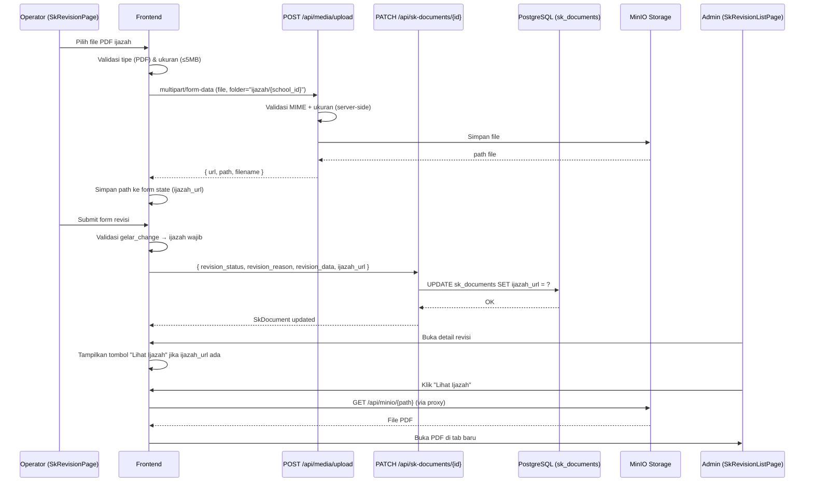

# Design Document: Upload Scan PDF Ijazah pada Revisi SK

## Overview

Fitur ini menambahkan kemampuan upload scan PDF ijazah pada alur pengajuan revisi SK. Operator sekolah dapat melampirkan file ijazah sebagai bukti pendukung perubahan gelar akademik. Admin yayasan dapat melihat dan mengunduh file tersebut saat meninjau pengajuan revisi.

Implementasi memanfaatkan infrastruktur yang sudah ada:
- Endpoint upload: `POST /api/media/upload` (FileUploadController)
- Proxy akses file: `GET /api/minio/{path}` (MinioProxyController)
- Update dokumen: `PATCH /api/sk-documents/{id}` (SkDocumentController)

Perubahan utama yang diperlukan:
1. Migrasi database: tambah kolom `ijazah_url` pada tabel `sk_documents`
2. Backend: validasi file ijazah di FileUploadController + validasi field `ijazah_url` di SkDocumentController
3. Frontend: komponen `IjazahUpload` baru + integrasi ke `SkRevisionPage` dan `SkRevisionListPage`

---

## Architecture



---

## Components and Interfaces

### Frontend

#### Komponen Baru: `IjazahUploadField`

Lokasi: `src/features/sk-management/components/IjazahUploadField.tsx`

```typescript
interface IjazahUploadFieldProps {
  value: string | null;           // path file yang sudah diupload
  onChange: (path: string | null) => void;
  isGelarChange: boolean;         // apakah ada perubahan gelar
  isPendidikanChange: boolean;    // apakah pendidikan_terakhir berubah
  schoolId: number | null;        // untuk path folder tenant
  disabled?: boolean;
}
```

State internal komponen:
- `uploadState: 'idle' | 'uploading' | 'success' | 'error'`
- `fileName: string | null` — nama file asli untuk ditampilkan
- `errorMessage: string | null`

Logika komponen:
1. Tampilkan input file (accept=".pdf")
2. Saat file dipilih: validasi tipe + ukuran di client
3. Jika valid: upload ke `POST /api/media/upload` dengan `folder = "ijazah/{schoolId}"`
4. Saat upload berhasil: panggil `onChange(response.path)`, tampilkan nama file
5. Tombol hapus: panggil `onChange(null)`, reset ke idle

#### Utilitas Baru: `detectGelarChange`

Lokasi: `src/features/sk-management/utils/detectGelarChange.ts`

```typescript
const GELAR_PATTERN = /\b(S\.Pd|M\.Pd|S\.Ag|M\.Ag|S\.T|S\.Kom|S\.E|S\.H|S\.Sos|M\.M|M\.Si|Dr\.|Prof\.)\b/i;

export function hasGelar(nama: string): boolean;
export function detectGelarChange(
  currentNama: string,
  originalNama: string,
  currentPendidikan: string,
  originalPendidikan: string
): { isGelarChange: boolean; isPendidikanChange: boolean };
```

#### Modifikasi: `SkRevisionPage`

Tambahan pada form state:
```typescript
const [ijazahUrl, setIjazahUrl] = useState<string | null>(null);
```

Tambahan pada `handleSubmit`:
- Cek `isGelarChange` → jika true dan `ijazahUrl` null → tampilkan error, blokir submit
- Sertakan `ijazah_url: ijazahUrl` dalam payload jika tidak null

Tambahan pada JSX: render `<IjazahUploadField>` di bawah field `pendidikan_terakhir`.

#### Modifikasi: `SkRevisionListPage`

Pada dialog preview (`isPreviewOpen`), tambahkan section "Dokumen Pendukung":
- Jika `selectedItem.ijazah_url` ada: tampilkan tombol "Lihat Ijazah" yang membuka `/api/minio/{path}` di tab baru
- Jika tidak ada: tampilkan teks "Tidak ada ijazah dilampirkan."

### Backend

#### Modifikasi: `FileUploadController`

Tambahkan validasi kondisional untuk folder `ijazah`:

```php
// Jika folder adalah ijazah, validasi MIME harus PDF
if ($request->folder && str_starts_with($request->folder, 'ijazah')) {
    $request->validate([
        'file' => 'required|file|mimes:pdf|max:5120',
    ]);
} else {
    $request->validate([
        'file' => 'required|file|max:10240',
    ]);
}
```

#### Modifikasi: `SkDocumentController::update()`

Tambahkan `ijazah_url` ke dalam daftar field yang diizinkan di `$request->only([...])`:

```php
$skDocument->update($request->only([
    'nomor_sk', 'jenis_sk', 'teacher_id', 'nama', 'jabatan',
    'unit_kerja', 'tanggal_penetapan', 'status', 'file_url', 'qr_code',
    'revision_status', 'revision_reason', 'revision_data',
    'ijazah_url', // ← tambahan baru
]));
```

Tambahkan validasi untuk `ijazah_url` (opsional, string, maks 500 karakter):

```php
$request->validate([
    'ijazah_url' => 'nullable|string|max:500',
]);
```

Catatan: Karena `update()` menggunakan `$request->only()`, field `ijazah_url` hanya diupdate jika disertakan dalam payload. Jika tidak ada dalam payload, nilai yang tersimpan di database tidak berubah — ini memenuhi Requirement 3.4 secara otomatis.

#### Modifikasi: `SkDocument` Model

Tambahkan `ijazah_url` ke `$fillable`:

```php
protected $fillable = [
    // ... kolom yang sudah ada ...
    'ijazah_url', // ← tambahan baru
];
```

---

## Data Models

### Migrasi Database

File: `backend/database/migrations/{timestamp}_add_ijazah_url_to_sk_documents_table.php`

```php
public function up(): void
{
    Schema::table('sk_documents', function (Blueprint $table) {
        $table->string('ijazah_url', 500)->nullable()->after('revision_data');
    });
}

public function down(): void
{
    Schema::table('sk_documents', function (Blueprint $table) {
        $table->dropColumn('ijazah_url');
    });
}
```

### Struktur Penyimpanan File

Path file di MinIO: `ijazah/{school_id}/{random_40_chars}.pdf`

Contoh: `ijazah/42/a3f8b2c1d4e5f6a7b8c9d0e1f2a3b4c5d6e7f8a9.pdf`

Akses via proxy: `GET /api/minio/ijazah/{school_id}/{filename}.pdf`

### Payload API

**Upload file (sudah ada, tidak berubah):**
```
POST /api/media/upload
Content-Type: multipart/form-data

file: <binary PDF>
folder: "ijazah/42"
```

Response:
```json
{
  "url": "https://...",
  "path": "ijazah/42/a3f8b2c1....pdf",
  "disk": "s3",
  "filename": "ijazah_spd_budi.pdf"
}
```

**Update SK Document (modifikasi):**
```
PATCH /api/sk-documents/{id}
Content-Type: application/json

{
  "revision_status": "revision_pending",
  "revision_reason": "Perubahan gelar S.Pd",
  "revision_data": { ... },
  "ijazah_url": "ijazah/42/a3f8b2c1....pdf"
}
```

---

## Correctness Properties

*A property adalah karakteristik atau perilaku yang harus berlaku benar di semua eksekusi sistem yang valid — pada dasarnya, pernyataan formal tentang apa yang seharusnya dilakukan sistem. Properties berfungsi sebagai jembatan antara spesifikasi yang dapat dibaca manusia dan jaminan kebenaran yang dapat diverifikasi mesin.*

### Property 1: Validasi tipe file PDF bersifat universal

*Untuk semua* file dengan tipe MIME selain `application/pdf`, fungsi validasi frontend harus menolak file tersebut dan mengembalikan pesan error yang sesuai. Sebaliknya, untuk file dengan tipe MIME `application/pdf`, validasi harus berhasil.

**Validates: Requirements 1.2, 1.3**

### Property 2: Validasi ukuran file bersifat universal

*Untuk semua* file dengan ukuran lebih dari 5.120 KB, fungsi validasi frontend harus menolak file tersebut. Untuk file dengan ukuran ≤ 5.120 KB, validasi ukuran harus berhasil.

**Validates: Requirements 1.4**

### Property 3: Hapus file mereset state form

*Untuk semua* state form yang memiliki `ijazah_url` tidak null, setelah pengguna menghapus file melalui tombol hapus, nilai `ijazah_url` dalam state form harus menjadi null dan komponen upload harus kembali ke kondisi idle.

**Validates: Requirements 1.8**

### Property 4: Deteksi gelar akademik bersifat universal

*Untuk semua* string nama yang mengandung salah satu pola gelar akademik (`S.Pd`, `M.Pd`, `S.Ag`, `M.Ag`, `S.T`, `S.Kom`, `S.E`, `S.H`, `S.Sos`, `M.M`, `M.Si`, `Dr.`, `Prof.`), fungsi `hasGelar` harus mengembalikan `true`. Untuk string yang tidak mengandung pola tersebut, harus mengembalikan `false`.

**Validates: Requirements 2.2**

### Property 5: Validasi wajib ijazah saat gelar berubah

*Untuk semua* kondisi di mana `isGelarChange` atau `isPendidikanChange` bernilai `true` dan `ijazahUrl` bernilai `null`, fungsi validasi form harus mengembalikan error dan mencegah pengiriman form.

*Untuk semua* kondisi di mana `isGelarChange` dan `isPendidikanChange` keduanya `false`, form harus dapat dikirim meskipun `ijazahUrl` bernilai `null`.

**Validates: Requirements 2.3, 2.4**

### Property 6: Payload selalu menyertakan ijazah_url jika ada

*Untuk semua* nilai `ijazah_url` yang valid (string tidak kosong), payload yang dikirim ke `PATCH /api/sk-documents/{id}` harus selalu menyertakan field `ijazah_url` dengan nilai tersebut.

**Validates: Requirements 3.1**

### Property 7: Penyimpanan ijazah_url adalah round-trip

*Untuk semua* string `ijazah_url` yang valid (panjang ≤ 500 karakter), setelah disimpan ke `SkDocument` melalui `PATCH /api/sk-documents/{id}`, nilai yang dibaca kembali dari database harus identik dengan nilai yang disimpan.

**Validates: Requirements 3.2**

### Property 8: Update tanpa ijazah_url tidak mengubah nilai tersimpan

*Untuk semua* `SkDocument` yang memiliki `ijazah_url` tersimpan, ketika dilakukan update melalui `PATCH /api/sk-documents/{id}` tanpa menyertakan field `ijazah_url` dalam payload, nilai `ijazah_url` di database harus tetap tidak berubah.

**Validates: Requirements 3.4**

### Property 9: Tampilan tombol ijazah konsisten dengan keberadaan data

*Untuk semua* `SkDocument` dengan `ijazah_url` tidak null dan tidak kosong, panel detail revisi harus menampilkan tombol "Lihat Ijazah". *Untuk semua* `SkDocument` dengan `ijazah_url` null atau kosong, panel harus menampilkan teks "Tidak ada ijazah dilampirkan."

**Validates: Requirements 4.1, 4.3**

### Property 10: Approval/rejection tidak mengubah ijazah_url

*Untuk semua* `SkDocument` dengan `ijazah_url` tersimpan, setelah proses approve atau reject revisi, nilai `ijazah_url` harus tetap sama dengan nilai sebelum proses tersebut.

**Validates: Requirements 4.5**

### Property 11: Validasi backend PDF bersifat universal

*Untuk semua* request ke `POST /api/media/upload` dengan `folder` yang diawali `"ijazah"` dan file dengan tipe MIME bukan `application/pdf`, server harus mengembalikan HTTP 422. Untuk file PDF yang valid dengan ukuran ≤ 5.120 KB, server harus mengembalikan HTTP 200.

**Validates: Requirements 6.1, 6.2, 6.3, 6.4**

### Property 12: Validasi panjang ijazah_url di backend

*Untuk semua* string `ijazah_url` dengan panjang lebih dari 500 karakter, `PATCH /api/sk-documents/{id}` harus mengembalikan HTTP 422. Untuk string dengan panjang ≤ 500 karakter, validasi harus berhasil.

**Validates: Requirements 6.5, 6.6**

### Property 13: Migration tidak merusak kolom yang ada

*Untuk semua* kolom yang ada di tabel `sk_documents` sebelum migration dijalankan, setelah migration `up()` dijalankan, tipe data dan nilai kolom-kolom tersebut harus tetap tidak berubah. Hal yang sama berlaku setelah `down()` dijalankan.

**Validates: Requirements 7.2, 7.4**

---

## Error Handling

### Frontend

| Kondisi | Pesan yang Ditampilkan | Aksi |
|---|---|---|
| File bukan PDF | "File harus berformat PDF." | Tolak file, reset input |
| File > 5 MB | "Ukuran file maksimal 5 MB." | Tolak file, reset input |
| Upload gagal (network/server) | "Gagal mengunggah file. Silakan coba lagi." | Tampilkan error, izinkan retry |
| Submit tanpa ijazah saat gelar berubah | "Scan ijazah wajib dilampirkan untuk perubahan gelar." | Blokir submit, fokus ke komponen upload |

### Backend

| Kondisi | HTTP Status | Pesan |
|---|---|---|
| File bukan PDF (folder ijazah) | 422 | "File ijazah harus berformat PDF." |
| File > 5 MB | 422 | "Ukuran file ijazah maksimal 5 MB." |
| `ijazah_url` > 500 karakter | 422 | "The ijazah url may not be greater than 500 characters." |
| Request tanpa autentikasi | 401 | (default Sanctum) |
| Role tidak diizinkan | 403 | (default CheckRole middleware) |

---

## Testing Strategy

### Unit Tests (Frontend)

Menggunakan Vitest + React Testing Library.

**`detectGelarChange.test.ts`**
- Test fungsi `hasGelar` dengan berbagai string nama
- Test fungsi `detectGelarChange` dengan kombinasi nilai lama/baru

**`IjazahUploadField.test.tsx`**
- Test validasi tipe file (PDF vs non-PDF)
- Test validasi ukuran file (≤5MB vs >5MB)
- Test state setelah upload berhasil (nama file ditampilkan)
- Test state setelah hapus file (kembali ke idle)

### Unit Tests (Backend)

Menggunakan PHPUnit.

**`FileUploadControllerTest.php`**
- Test upload PDF valid ke folder ijazah → 200
- Test upload non-PDF ke folder ijazah → 422
- Test upload file > 5MB ke folder ijazah → 422
- Test upload ke folder lain (bukan ijazah) → validasi normal (max 10MB)

**`SkDocumentControllerTest.php`**
- Test update dengan `ijazah_url` valid → tersimpan
- Test update tanpa `ijazah_url` → nilai lama tidak berubah
- Test update dengan `ijazah_url` > 500 karakter → 422

**`AddIjazahUrlMigrationTest.php`**
- Test kolom `ijazah_url` ada setelah migration
- Test kolom lain tidak berubah setelah migration
- Test kolom `ijazah_url` hilang setelah rollback

### Property-Based Tests

Menggunakan **fast-check** (TypeScript/JavaScript) untuk frontend dan **PHPUnit + custom generators** untuk backend.

Setiap property test dikonfigurasi dengan minimum **100 iterasi**.

Tag format: `Feature: sk-ijazah-upload, Property {N}: {deskripsi}`

**Property 1 & 2 — Validasi file (frontend)**
```typescript
// Feature: sk-ijazah-upload, Property 1: Validasi tipe file PDF bersifat universal
// Feature: sk-ijazah-upload, Property 2: Validasi ukuran file bersifat universal
fc.assert(fc.property(
  fc.record({ type: fc.string(), size: fc.integer({ min: 0, max: 20 * 1024 * 1024 }) }),
  ({ type, size }) => {
    const result = validateIjazahFile({ type, size });
    if (type !== 'application/pdf') expect(result.valid).toBe(false);
    if (size > 5 * 1024 * 1024) expect(result.valid).toBe(false);
    if (type === 'application/pdf' && size <= 5 * 1024 * 1024) expect(result.valid).toBe(true);
  }
), { numRuns: 100 });
```

**Property 4 — Deteksi gelar (frontend)**
```typescript
// Feature: sk-ijazah-upload, Property 4: Deteksi gelar akademik bersifat universal
fc.assert(fc.property(
  fc.constantFrom('S.Pd', 'M.Pd', 'S.Ag', 'M.Ag', 'S.T', 'S.Kom', 'S.E', 'S.H', 'S.Sos', 'M.M', 'M.Si', 'Dr.', 'Prof.'),
  fc.string(),
  (gelar, prefix) => {
    expect(hasGelar(`${prefix} ${gelar}`)).toBe(true);
  }
), { numRuns: 100 });
```

**Property 7 — Round-trip ijazah_url (backend)**
```php
// Feature: sk-ijazah-upload, Property 7: Penyimpanan ijazah_url adalah round-trip
// Menggunakan generator string acak dengan panjang 1-500 karakter
foreach (range(1, 100) as $_) {
    $path = Str::random(rand(10, 500));
    $skDoc->update(['ijazah_url' => $path]);
    $this->assertEquals($path, $skDoc->fresh()->ijazah_url);
}
```

**Property 8 — Update tanpa ijazah_url tidak mengubah nilai (backend)**
```php
// Feature: sk-ijazah-upload, Property 8: Update tanpa ijazah_url tidak mengubah nilai tersimpan
foreach (range(1, 100) as $_) {
    $originalPath = 'ijazah/' . Str::random(40) . '.pdf';
    $skDoc->update(['ijazah_url' => $originalPath]);
    $skDoc->update(['revision_reason' => Str::random(20)]); // update tanpa ijazah_url
    $this->assertEquals($originalPath, $skDoc->fresh()->ijazah_url);
}
```

**Property 11 — Validasi backend PDF (backend)**
```php
// Feature: sk-ijazah-upload, Property 11: Validasi backend PDF bersifat universal
$nonPdfMimes = ['image/jpeg', 'image/png', 'application/msword', 'text/plain', 'application/zip'];
foreach (range(1, 100) as $i) {
    $mime = $nonPdfMimes[$i % count($nonPdfMimes)];
    $response = $this->postJson('/api/media/upload', [
        'file' => UploadedFile::fake()->create('test.jpg', 100, $mime),
        'folder' => 'ijazah/1',
    ]);
    $response->assertStatus(422);
}
```

**Property 12 — Validasi panjang ijazah_url (backend)**
```php
// Feature: sk-ijazah-upload, Property 12: Validasi panjang ijazah_url di backend
foreach (range(1, 100) as $_) {
    $length = rand(501, 1000);
    $response = $this->patchJson("/api/sk-documents/{$skDoc->id}", [
        'ijazah_url' => Str::random($length),
    ]);
    $response->assertStatus(422);
}
```

### Integration Tests

- Upload file PDF ke MinIO dan verifikasi path mengandung `ijazah/{school_id}/`
- Akses file via `GET /api/minio/{path}` dan verifikasi response berisi konten PDF
- Verifikasi request tanpa auth ke upload endpoint mengembalikan 401
