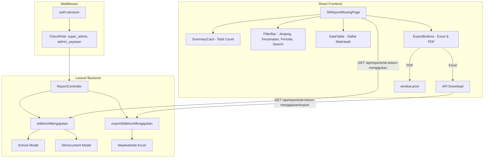

# Design Document: SK Report — Madrasah Belum Mengajukan

## Overview

Fitur ini menambahkan halaman laporan yang menampilkan daftar madrasah berstatus jam'iyyah yang belum mengajukan SK dalam periode tertentu. Fitur ini terintegrasi dengan halaman laporan SK per madrasah yang sudah ada (`SkReportGroupedPage`) sebagai tab tambahan.

Komponen utama:
1. **Backend API** — endpoint baru di `ReportController` yang melakukan query LEFT JOIN antara `schools` dan `sk_documents`, memfilter sekolah jam'iyyah tanpa pengajuan SK
2. **Excel Export** — endpoint terpisah menggunakan Maatwebsite Excel untuk menghasilkan file .xlsx
3. **PDF Export** — menggunakan pendekatan browser print (window.print()) dengan layout cetak khusus landscape, mengikuti pola yang sudah ada di `SkReportGroupedPage`
4. **Frontend Page** — halaman React baru dengan tabel, filter, pencarian, dan tombol export
5. **Navigasi** — tab "Belum Mengajukan" pada halaman laporan SK yang sudah ada

Arsitektur mengikuti pola existing: controller langsung di `ReportController` (tanpa service layer terpisah karena logikanya straightforward), React + TanStack Query di frontend, dan Maatwebsite Excel untuk export.

## Architecture



### Design Decisions

1. **Extend existing `ReportController`** — Fitur ini merupakan bagian dari modul laporan yang sudah ada. Menambahkan method baru di `ReportController` lebih konsisten daripada membuat controller terpisah, mengikuti pola `skReport` dan `skPerSekolah`.

2. **LEFT JOIN + WHERE NULL pattern** — Untuk menentukan "belum mengajukan", menggunakan LEFT JOIN antara `schools` dan `sk_documents` lalu filter `WHERE sk_documents.id IS NULL`. Ini lebih efisien daripada subquery NOT EXISTS untuk dataset besar karena PostgreSQL optimizer menangani LEFT JOIN dengan baik.

3. **PDF via browser print** — Mengikuti pola yang sudah ada di `SkReportGroupedPage` dimana PDF dihasilkan melalui `window.print()` dengan CSS `@media print`. Ini menghindari kebutuhan library PDF tambahan di backend dan memberikan kontrol layout yang baik.

4. **Excel via backend Maatwebsite** — Export Excel tetap di backend karena perlu akses langsung ke database dan format file yang proper (.xlsx), mengikuti pola di `StudentStatisticsController`.

5. **Role restriction: super_admin & admin_yayasan only** — Operator tidak memerlukan laporan ini karena mereka hanya mengelola sekolah sendiri. Laporan ini untuk oversight level yayasan.

6. **Case-insensitive jam'iyyah matching** — Field `status_jamiyyah` memiliki variasi penulisan (`Jam'iyyah`, `jam'iyyah`). Query menggunakan `ILIKE` untuk menangani variasi ini, mengikuti pola di `DashboardCacheService`.

7. **Integrasi sebagai route terpisah dengan link navigasi** — Daripada menambahkan tab di halaman existing (yang akan memerlukan refactor besar), fitur ini menjadi halaman terpisah dengan link navigasi dari halaman laporan SK yang sudah ada. Ini lebih modular dan tidak mengganggu kode existing.

## Components and Interfaces

### Backend Components

#### 1. ReportController (extended methods)

```php
// Ditambahkan ke App\Http\Controllers\Api\ReportController

/**
 * GET /api/reports/sk-belum-mengajukan
 * 
 * Returns list of jam'iyyah schools that have NOT submitted SK documents.
 * Restricted to super_admin and admin_yayasan roles.
 *
 * Query params:
 *   jenjang    — filter by jenjang (RA, MI, MTs, MA)
 *   kecamatan  — filter by kecamatan
 *   search     — search by nama or NPSN (case-insensitive)
 *   start_date — period start (only SK submissions within this range count)
 *   end_date   — period end
 */
public function skBelumMengajukan(Request $request): JsonResponse;

/**
 * GET /api/reports/sk-belum-mengajukan/export
 * 
 * Generates Excel file of jam'iyyah schools without SK submissions.
 * Same filters as skBelumMengajukan apply.
 */
public function exportSkBelumMengajukan(Request $request): BinaryFileResponse|JsonResponse;
```

#### 2. API Routes

```php
// routes/api.php — inside the existing reports prefix group
Route::prefix('reports')->group(function () {
    // ... existing routes ...
    Route::get('sk-belum-mengajukan',        [ReportController::class, 'skBelumMengajukan']);
    Route::get('sk-belum-mengajukan/export', [ReportController::class, 'exportSkBelumMengajukan']);
});
```

#### 3. Middleware & Authorization

```php
// Authorization check inside controller methods (inline, not middleware)
// Following the pattern used in batchUpdateStatus in SkDocumentController
if (!in_array($request->user()->role, ['super_admin', 'admin_yayasan'])) {
    return response()->json([
        'message' => 'Akses ditolak. Hanya super admin dan admin yayasan yang dapat mengakses laporan ini.',
    ], 403);
}
```

### Frontend Components

#### 4. File Structure

```
src/features/reports/
├── SkReportMissingPage.tsx          # Main page component
├── SkReportGroupedPage.tsx          # Existing — add navigation link
├── SkReportPageSimple.tsx           # Existing — add navigation link
└── ... (existing files)
```

#### 5. SkReportMissingPage Component

```typescript
// src/features/reports/SkReportMissingPage.tsx

interface MissingSchoolItem {
  id: number;
  nama: string;
  npsn: string | null;
  jenjang: string | null;
  kecamatan: string | null;
  kepala_madrasah: string | null;
  telepon: string | null;
}

interface SkBelumMengajukanResponse {
  total: number;
  kecamatan_list: string[];
  data: MissingSchoolItem[];
}
```

#### 6. API Service Extension

```typescript
// Added to reportApi in src/lib/api.ts

skBelumMengajukan: (params?: {
  jenjang?: string;
  kecamatan?: string;
  search?: string;
  start_date?: string;
  end_date?: string;
}) => apiClient.get('/reports/sk-belum-mengajukan', { params }).then((r) => r.data),

exportSkBelumMengajukan: (params?: {
  jenjang?: string;
  kecamatan?: string;
  search?: string;
  start_date?: string;
  end_date?: string;
}) => apiClient.get('/reports/sk-belum-mengajukan/export', { 
  params, 
  responseType: 'blob' 
}).then((r) => r.data),
```

#### 7. Route Registration

```typescript
// src/App.tsx — add new route
<Route path="reports/sk-belum-mengajukan" element={
  <ErrorBoundary fallback={<div className="p-6 text-center text-red-500">Failed to load report.</div>}>
    <SkReportMissingPage />
  </ErrorBoundary>
} />
```

#### 8. Navigation Link

```typescript
// src/components/layout/AppShell.tsx — add to navigation items
{ label: "Laporan Belum Mengajukan SK", href: "/dashboard/reports/sk-belum-mengajukan", icon: FileBarChart }
```

## Data Models

### Database Schema (existing tables, no migrations needed)

```
schools
├── id (PK)
├── nama (varchar)
├── npsn (varchar, nullable, unique)
├── jenjang (varchar, nullable) — "RA", "MI", "MTs", "MA"
├── kecamatan (varchar, nullable)
├── kepala_madrasah (varchar, nullable)
├── telepon (varchar, nullable)
├── kepala_whatsapp (varchar, nullable)
├── status_jamiyyah (varchar, nullable) — "Jam'iyyah", "Jama'ah", "Afiliasi", etc.
├── deleted_at (timestamp, nullable)
└── ... (other fields)

sk_documents
├── id (PK)
├── school_id (FK → schools.id, nullable)
├── nomor_sk (varchar)
├── nama (varchar)
├── jenis_sk (varchar)
├── status (varchar) — "draft", "pending", "approved", "rejected", "active"
├── created_at (timestamp)
├── deleted_at (timestamp, nullable)
└── ... (other fields)
```

### SQL Query Pattern

```sql
-- Core query: Jam'iyyah schools without SK submissions in period
SELECT 
  s.id,
  s.nama,
  s.npsn,
  s.jenjang,
  s.kecamatan,
  s.kepala_madrasah,
  s.telepon
FROM schools s
LEFT JOIN sk_documents sk 
  ON sk.school_id = s.id
  AND sk.deleted_at IS NULL
  AND sk.created_at >= :start_date   -- optional period filter
  AND sk.created_at <= :end_date     -- optional period filter
WHERE s.status_jamiyyah ILIKE '%jam''iyyah%'
  AND s.deleted_at IS NULL
  AND sk.id IS NULL                  -- no matching SK documents
ORDER BY s.nama ASC;
```

### API Response Shape

**GET /api/reports/sk-belum-mengajukan**
```json
{
  "total": 42,
  "kecamatan_list": ["Cilacap Selatan", "Cilacap Tengah", "Majenang", "..."],
  "data": [
    {
      "id": 1,
      "nama": "MI Nurul Huda",
      "npsn": "60710001",
      "jenjang": "MI",
      "kecamatan": "Cilacap Selatan",
      "kepala_madrasah": "Ahmad Fauzi, S.Pd.I",
      "telepon": "08123456789"
    }
  ]
}
```

**GET /api/reports/sk-belum-mengajukan/export**
- Returns: Binary file (.xlsx)
- Content-Type: `application/vnd.openxmlformats-officedocument.spreadsheetml.sheet`
- Content-Disposition: `attachment; filename="Laporan_Belum_Mengajukan_SK_2025-01-15.xlsx"`

### Excel File Structure

| No | Nama Madrasah | NPSN | Jenjang | Kecamatan | Kepala Madrasah | Nomor Telepon |
|----|---------------|------|---------|-----------|-----------------|---------------|
| 1  | MI Nurul Huda | 60710001 | MI | Cilacap Selatan | Ahmad Fauzi, S.Pd.I | 08123456789 |
| 2  | MTs Al-Ikhlas | 60710005 | MTs | Majenang | Budi Santoso, M.Pd | 08145678901 |

Header rows (before data):
- Row 1: "Laporan Madrasah Belum Mengajukan SK"
- Row 2: "LP Ma'arif NU Cilacap"
- Row 3: "Tanggal Cetak: {date}" + "Filter: {active filters}"

## Correctness Properties

*A property is a characteristic or behavior that should hold true across all valid executions of a system — essentially, a formal statement about what the system should do. Properties serve as the bridge between human-readable specifications and machine-verifiable correctness guarantees.*

### Property 1: Core Query Correctness — Only Jam'iyyah Schools Without SK Appear

*For any* set of schools with various `status_jamiyyah` values and various SK document submissions, the report endpoint SHALL return only schools where `status_jamiyyah` matches "Jam'iyyah" (case-insensitive) AND the school has no `sk_documents` records, and the reported `total` SHALL equal the count of items in the `data` array.

**Validates: Requirements 1.1, 1.3**

### Property 2: Filter Correctness — Jenjang and Kecamatan Filters Narrow Results

*For any* jenjang filter value and any kecamatan filter value applied to the report, all items in the result SHALL match the selected jenjang (case-insensitive) and/or the selected kecamatan exactly, and no qualifying school matching the filter criteria SHALL be excluded from the result.

**Validates: Requirements 2.1, 2.2**

### Property 3: Search Correctness — Case-Insensitive Partial Match on Nama/NPSN

*For any* search keyword, all items in the result SHALL have either their `nama` or `npsn` field containing the keyword as a substring (case-insensitive comparison), and no qualifying school whose nama or NPSN contains the keyword SHALL be excluded.

**Validates: Requirements 2.3**

### Property 4: Period-Based Determination — Date Range Defines "Belum Mengajukan"

*For any* date range (start_date, end_date) and any set of schools with SK documents created at various dates, a school SHALL appear in the report if and only if it has no SK documents with `created_at` within the specified date range, regardless of SK documents outside that range.

**Validates: Requirements 2.4**

## Error Handling

### Backend Error Handling

| Scenario | HTTP Status | Response |
|----------|-------------|----------|
| Unauthenticated request | 401 | `{ message: "Unauthenticated." }` |
| Operator role attempts access | 403 | `{ message: "Akses ditolak. Hanya super admin dan admin yayasan yang dapat mengakses laporan ini." }` |
| Invalid date format | 422 | `{ message: "Format tanggal tidak valid." }` |
| Excel generation failure | 500 | `{ message: "Gagal menghasilkan file Excel. Silakan coba lagi." }` |
| Database/server error | 500 | `{ message: "Terjadi kesalahan server." }` |

### Frontend Error Handling

| Scenario | Behavior |
|----------|----------|
| API returns 403 | Redirect to dashboard with toast "Akses ditolak" |
| API returns error | Display error state with retry button |
| API timeout | Display timeout message with retry button |
| Excel download fails | Show toast notification via Sonner with error message |
| Empty data (0 schools) | Display empty state message "Semua madrasah jam'iyyah sudah mengajukan SK" |
| Network disconnected | Display network error with retry button |

## Testing Strategy

### Property-Based Tests (Backend — PHPUnit with Faker data providers)

Property-based testing is appropriate for this feature because:
- The core query logic (filtering jam'iyyah schools without SK) is a pure data transformation with a large input space
- Filter correctness is a universal invariant across all possible filter combinations
- Search behavior should hold for any keyword against any dataset
- Period-based determination is a universal property across all date combinations

**Library**: PHPUnit with custom data providers using `Faker` to generate diverse inputs across 100+ iterations.

**Configuration**:
- Minimum 100 iterations per property test
- Each test tagged with: `Feature: sk-report-missing-submissions, Property {N}: {description}`

### Unit Tests (Backend — PHPUnit)

- Authorization: operator gets 403, super_admin gets 200, admin_yayasan gets 200
- Response structure: verify all required fields present
- Empty state: no jam'iyyah schools → empty result with total 0
- Edge cases: schools with NULL status_jamiyyah excluded, soft-deleted schools excluded
- Excel export: verify file is generated with correct column structure
- Excel export with filters: verify filtered data matches

### Unit Tests (Frontend — Vitest)

- `SkReportMissingPage` — renders table with correct columns
- Filter interactions — selecting jenjang/kecamatan triggers refetch
- Search debounce — typing triggers search after delay
- Export button — triggers download
- Empty state — shows appropriate message when no data
- Loading state — shows skeleton/spinner
- Error state — shows error with retry button

### Integration Tests (Backend — PHPUnit)

- Full request lifecycle: auth → controller → database → response
- Filter combinations: jenjang + kecamatan + search + period
- Excel export with real data: verify file structure and content
- Performance: response time under 2 seconds with realistic dataset

### E2E Tests (Playwright)

- Navigate to report page → verify table loads
- Apply jenjang filter → verify results update
- Apply search → verify results filter
- Download Excel → verify file downloads
- Print/PDF → verify print layout renders
- Operator access → verify redirect/403
