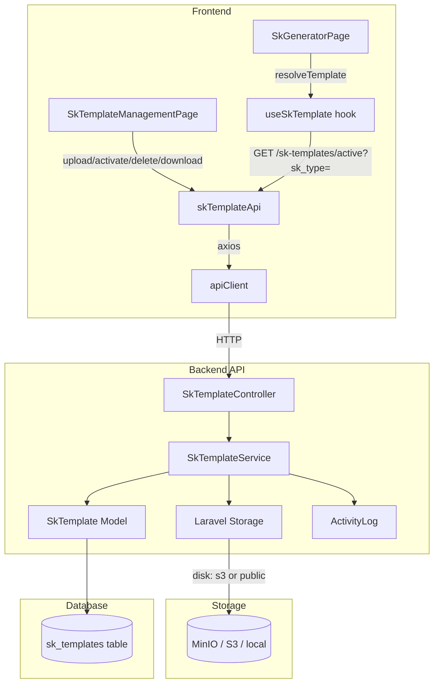

# Design Document: SK Template Upload

## Overview

This feature replaces the hardcoded, build-time-bundled SK template files with a dynamic template management system. A `super_admin` can upload `.docx` template files per SK type through a dedicated UI page. The backend stores files in Laravel Storage (local or S3/MinIO) and tracks metadata in a new `sk_templates` database table. The SK Generator is updated to resolve templates from the API at generation time, falling back to the bundled static file when no active uploaded template exists.

The design follows all existing SIMMACI conventions: `ApiResponse` trait for response shape, `ActivityLog::log()` for audit trails, `SoftDeletes` on the model, `auth:sanctum` + `role:super_admin` middleware for access control, and TanStack Query + React Hook Form + Zod on the frontend.

---

## Architecture



**Key design decisions:**

1. **No tenant isolation on `sk_templates`** — Templates are global resources managed only by `super_admin`. The table has no `school_id` and does not use `HasTenantScope`. All schools share the same active template per SK type.
2. **Separate download endpoint** — The list endpoint never exposes raw storage paths. A dedicated `GET /sk-templates/{id}/download` endpoint returns a temporary signed URL (S3) or a proxied response (local disk), keeping storage internals hidden.
3. **`SkTemplateService` for business logic** — The activation swap (set one active, deactivate others of same type) and the fallback resolution logic live in a service class, keeping the controller thin.
4. **Frontend template resolution hook** — `useSkTemplate(skType)` encapsulates the API call + in-memory cache + static fallback, so `SkGeneratorPage` only calls one hook per SK type.
5. **Storage disk** — Reuses the existing disk selection logic from `FileUploadController`: S3 when `AWS_ACCESS_KEY_ID` is set, otherwise `public`. Files stored under `sk-templates/{uuid}.docx`.

---

## Components and Interfaces

### Backend

#### `SkTemplateController`

```
GET    /api/sk-templates                    → index()
POST   /api/sk-templates                    → store()       [super_admin]
POST   /api/sk-templates/{id}/activate      → activate()    [super_admin]
DELETE /api/sk-templates/{id}               → destroy()     [super_admin]
GET    /api/sk-templates/{id}/download      → download()    [super_admin]
GET    /api/sk-templates/active             → active()      (auth only, used by generator)
```

All responses use the `ApiResponse` trait shape: `{ success, message, data }`.

#### `SkTemplateService`

```php
interface SkTemplateServiceInterface {
    public function store(UploadedFile $file, string $skType, User $uploader): SkTemplate;
    public function activate(SkTemplate $template, User $activator): SkTemplate;
    public function delete(SkTemplate $template, User $deleter): void;
    public function getDownloadUrl(SkTemplate $template): string;
    public function resolveActiveTemplate(string $skType): ?SkTemplate;
}
```

#### `StoreSkTemplateRequest`

```php
rules: [
    'file'    => 'required|file|mimes:docx|max:10240',
    'sk_type' => 'required|string|in:gty,gtt,kamad,tendik',
]
```

#### `SkTemplate` Model

Traits: `SoftDeletes`, `ApiResponse` (on controller, not model).  
No `HasTenantScope` — global resource.  
No `AuditLogTrait` — activity logging is done explicitly in the service to include richer context.

### Frontend

#### `skTemplateApi` (addition to `src/lib/api.ts`)

```typescript
export const skTemplateApi = {
  list: (params?: { sk_type?: string }) =>
    apiClient.get('/sk-templates', { params }).then(r => r.data),
  upload: (file: File, skType: string) => {
    const fd = new FormData()
    fd.append('file', file)
    fd.append('sk_type', skType)
    return apiClient.post('/sk-templates', fd, {
      headers: { 'Content-Type': 'multipart/form-data' }
    }).then(r => r.data)
  },
  activate: (id: number) =>
    apiClient.post(`/sk-templates/${id}/activate`).then(r => r.data),
  delete: (id: number) =>
    apiClient.delete(`/sk-templates/${id}`).then(r => r.data),
  downloadUrl: (id: number) =>
    apiClient.get(`/sk-templates/${id}/download`).then(r => r.data),
  getActive: (skType: string) =>
    apiClient.get('/sk-templates/active', { params: { sk_type: skType } }).then(r => r.data),
}
```

#### `useSkTemplate` hook

```typescript
// src/features/sk-management/hooks/useSkTemplate.ts
function useSkTemplate(skType: string): {
  templateUrl: string | null;   // resolved URL (uploaded or static fallback)
  isLoading: boolean;
  error: string | null;
}
```

Internally uses TanStack Query with `queryKey: ['sk-template-active', skType]`. On success, returns the `file_url` from the active template. On 404 or null, returns the static fallback path (`/templates/sk-{skType}-template.docx`). The TanStack Query cache acts as the in-memory cache for the generation session.

#### `SkTemplateManagementPage`

```
src/features/sk-management/SkTemplateManagementPage.tsx
```

Route: `/dashboard/sk-templates` (super_admin only, guarded by `ProtectedLayout` role check).

UI structure:
- Page header with title
- Upload form card (React Hook Form + Zod): file picker + sk_type select + submit button
- Templates list grouped by sk_type (4 sections: GTY, GTT, Kamad, Tendik)
- Each template row: filename, uploader, date, active badge, Activate / Download / Delete actions

---

## Data Models

### `sk_templates` table

```sql
CREATE TABLE sk_templates (
    id              BIGSERIAL PRIMARY KEY,
    sk_type         VARCHAR(20)  NOT NULL,          -- gty | gtt | kamad | tendik
    original_filename VARCHAR(255) NOT NULL,
    file_path       VARCHAR(500) NOT NULL,           -- storage path, never exposed in list
    disk            VARCHAR(20)  NOT NULL DEFAULT 'public',
    is_active       BOOLEAN      NOT NULL DEFAULT FALSE,
    uploaded_by     VARCHAR(255) NOT NULL,           -- email of uploader
    created_at      TIMESTAMP,
    updated_at      TIMESTAMP,
    deleted_at      TIMESTAMP,                       -- SoftDeletes

    INDEX idx_sk_templates_sk_type (sk_type),
    INDEX idx_sk_templates_is_active (is_active),
    INDEX idx_sk_templates_sk_type_active (sk_type, is_active)
);
```

### `SkTemplate` Eloquent Model

```php
class SkTemplate extends Model {
    use SoftDeletes;

    protected $fillable = [
        'sk_type', 'original_filename', 'file_path',
        'disk', 'is_active', 'uploaded_by',
    ];

    protected function casts(): array {
        return ['is_active' => 'boolean'];
    }

    // Scope: only active templates
    public function scopeActive($query) {
        return $query->where('is_active', true);
    }

    // Scope: filter by sk_type
    public function scopeForType($query, string $skType) {
        return $query->where('sk_type', $skType);
    }
}
```

### API Response Shape for `SkTemplate`

The list and single-record responses expose these fields (file_path is intentionally excluded):

```json
{
  "id": 1,
  "sk_type": "gty",
  "original_filename": "sk-gty-v2.docx",
  "is_active": true,
  "uploaded_by": "admin@maarif.id",
  "created_at": "2026-07-01T10:00:00Z",
  "updated_at": "2026-07-01T10:00:00Z"
}
```

The download endpoint returns:

```json
{
  "success": true,
  "message": "Berhasil.",
  "data": { "url": "https://..." }
}
```

The active-template endpoint (used by the generator) returns the same shape as a single record but also includes `file_url` (a temporary URL) so the frontend can fetch the file directly:

```json
{
  "id": 1,
  "sk_type": "gty",
  "original_filename": "sk-gty-v2.docx",
  "is_active": true,
  "uploaded_by": "admin@maarif.id",
  "file_url": "https://minio.example.com/sk-templates/abc123.docx?X-Amz-Expires=3600...",
  "created_at": "2026-07-01T10:00:00Z"
}
```

### Zod Schema (Frontend)

```typescript
const uploadFormSchema = z.object({
  file: z
    .instanceof(File)
    .refine(f => f.name.endsWith('.docx'), 'File harus berformat .docx')
    .refine(f => f.size <= 10 * 1024 * 1024, 'Ukuran file maksimal 10 MB'),
  sk_type: z.enum(['gty', 'gtt', 'kamad', 'tendik'], {
    required_error: 'Pilih jenis SK',
  }),
})
```

---

## Correctness Properties

*A property is a characteristic or behavior that should hold true across all valid executions of a system — essentially, a formal statement about what the system should do. Properties serve as the bridge between human-readable specifications and machine-verifiable correctness guarantees.*

### Property 1: Upload creates a persisted record with correct fields

*For any* valid `.docx` file and any valid `sk_type` value (`gty`, `gtt`, `kamad`, `tendik`), uploading the file SHALL result in a record in the Template_Repository where `sk_type` matches the submitted value, `original_filename` matches the uploaded file's name, and `uploaded_by` matches the authenticated user's email.

**Validates: Requirements 1.1, 1.6**

---

### Property 2: Invalid file type is always rejected

*For any* file whose extension or MIME type is not `.docx`, the upload endpoint SHALL return a 422 response and no record SHALL be created in the Template_Repository.

**Validates: Requirements 1.2**

---

### Property 3: Invalid sk_type is always rejected

*For any* string value for `sk_type` that is not in the set `{gty, gtt, kamad, tendik}`, the upload endpoint SHALL return a 422 response and no record SHALL be created in the Template_Repository.

**Validates: Requirements 1.4**

---

### Property 4: Upload always produces an activity log entry

*For any* successful template upload, an `ActivityLog` record SHALL exist with `event = 'upload_sk_template'`, `causer_id` matching the uploader, and `properties` containing the `sk_type`.

**Validates: Requirements 1.5**

---

### Property 5: At most one active template per sk_type (activation invariant)

*For any* sequence of activate operations on templates of the same `sk_type`, after each activation exactly one template for that `sk_type` SHALL have `is_active = true` — the most recently activated one — and all others SHALL have `is_active = false`.

**Validates: Requirements 3.1, 3.5**

---

### Property 6: Activation always produces an activity log entry

*For any* successful template activation, an `ActivityLog` record SHALL exist with `event = 'activate_sk_template'`, `causer_id` matching the activating user, and `properties` containing the template `id` and `sk_type`.

**Validates: Requirements 3.2**

---

### Property 7: Deleting an active template clears active status

*For any* template that is currently active (`is_active = true`), after it is deleted, no template for that `sk_type` SHALL have `is_active = true`.

**Validates: Requirements 4.2**

---

### Property 8: Deletion always produces an activity log entry

*For any* successful template deletion, an `ActivityLog` record SHALL exist with `event = 'delete_sk_template'`, `causer_id` matching the deleting user, and `properties` containing the template `id` and `sk_type`.

**Validates: Requirements 4.3**

---

### Property 9: List ordering invariant

*For any* set of templates in the repository, the list endpoint SHALL return them ordered by `sk_type` ascending and `created_at` descending, regardless of insertion order.

**Validates: Requirements 2.1**

---

### Property 10: List filtering by sk_type

*For any* `sk_type` filter value, every record returned by the list endpoint SHALL have `sk_type` equal to the filter value, and no record with a different `sk_type` SHALL appear in the results.

**Validates: Requirements 2.2**

---

### Property 11: Non-super_admin users are always denied write access

*For any* authenticated user whose role is not `super_admin`, any request to a write endpoint (upload, activate, delete, download) SHALL return a 403 response.

**Validates: Requirements 8.2, 8.3**

---

### Property 12: Template resolution uses active uploaded template when available

*For any* `sk_type` that has an active template in the Template_Repository, the `useSkTemplate` hook SHALL resolve to that template's `file_url` and SHALL NOT use the static fallback path.

**Validates: Requirements 6.1**

---

### Property 13: Template resolution falls back to static file when no active template exists

*For any* `sk_type` that has no active template in the Template_Repository, the `useSkTemplate` hook SHALL resolve to the corresponding static bundled template path (`/templates/sk-{skType}-template.docx`).

**Validates: Requirements 6.2**

---

### Property 14: Template resolution is cached within a generation session

*For any* `sk_type` resolved more than once within the same TanStack Query cache lifetime, the underlying HTTP request to `/sk-templates/active` SHALL be made at most once (subsequent calls use the cached result).

**Validates: Requirements 6.4**

---

### Property 15: Client-side validation rejects invalid files before API call

*For any* file submitted to the upload form that is not `.docx` or exceeds 10 MB, the Zod schema validation SHALL produce an inline error and no HTTP request to the upload endpoint SHALL be made.

**Validates: Requirements 7.7**

---

### Property 16: List response never exposes raw storage paths

*For any* list response from the Template_Manager, the response body SHALL NOT contain the `file_path` field (the internal storage path), ensuring storage internals are not leaked to clients.

**Validates: Requirements 8.4**

---

## Error Handling

| Scenario | HTTP Status | Response |
|---|---|---|
| Unauthenticated request | 401 | `{ success: false, message: 'Unauthorized.' }` |
| Non-super_admin on write endpoint | 403 | `{ success: false, message: 'Forbidden: ...' }` |
| File is not `.docx` | 422 | `{ success: false, message: 'Data tidak valid.', errors: { file: [...] } }` |
| File exceeds 10 MB | 422 | `{ success: false, message: 'Data tidak valid.', errors: { file: [...] } }` |
| Invalid `sk_type` | 422 | `{ success: false, message: 'Data tidak valid.', errors: { sk_type: [...] } }` |
| Template record not found | 404 | `{ success: false, message: 'Template tidak ditemukan.' }` |
| File missing from storage on download | 404 | `{ success: false, message: 'File template tidak ditemukan di storage.' }` |
| Storage write failure | 500 | `{ success: false, message: 'Gagal menyimpan file. Silakan coba lagi.' }` |
| Generator fetch failure (frontend) | — | Toast error: `"Gagal mengunduh template {skType}. Periksa koneksi atau hubungi administrator."` |

**Frontend error handling in `useSkTemplate`:**
- On HTTP 404 from `/sk-templates/active`: silently fall back to static template, no error shown.
- On HTTP 5xx or network error: surface error via `error` return value; `SkGeneratorPage` shows a toast and disables the generate button.

---

## Testing Strategy

### Unit Tests (PHPUnit)

Focus on `SkTemplateService` business logic in isolation using mocked Storage and mocked `ActivityLog`:

- `store()`: verify record creation, correct field mapping, activity log call
- `activate()`: verify the single-active invariant across multiple templates of the same type
- `delete()`: verify soft-delete, active-status clearing when deleting active template, activity log call
- `getDownloadUrl()`: verify signed URL generation for S3 disk, direct URL for public disk, 404 when file missing
- `resolveActiveTemplate()`: verify returns active template or null

Focus on `StoreSkTemplateRequest` validation rules:
- Accepts valid `.docx` files up to 10 MB with valid `sk_type`
- Rejects non-docx MIME types, files over 10 MB, invalid `sk_type` values

### Property-Based Tests (PHPUnit + `eris/eris` or manual generators)

Property-based testing is applicable here because the core business logic (activation invariant, filtering, ordering, access control) involves universal properties that hold across a wide range of inputs.

Use `eris/eris` for PHP property-based testing. Each property test runs a minimum of 100 iterations.

**Tag format: `Feature: sk-template-upload, Property {N}: {property_text}`**

- **Property 1** — Generate random valid `(file, sk_type)` pairs, call `store()`, assert record fields match inputs.
- **Property 2** — Generate random files with non-docx extensions, assert upload returns 422 and no record is created.
- **Property 3** — Generate random strings not in `{gty, gtt, kamad, tendik}`, assert upload returns 422.
- **Property 4** — For any successful upload, assert `ActivityLog` record exists with correct event and causer.
- **Property 5** — Generate random sequences of activations on templates of the same `sk_type`, assert exactly one is active after each step.
- **Property 6** — For any activation, assert `ActivityLog` record exists with correct event.
- **Property 7** — For any active template, after deletion, assert no active template exists for that `sk_type`.
- **Property 8** — For any deletion, assert `ActivityLog` record exists with correct event.
- **Property 9** — Insert templates in random order, assert list is ordered by `sk_type` asc, `created_at` desc.
- **Property 10** — For any `sk_type` filter, assert all returned records match that `sk_type`.
- **Property 11** — For any non-super_admin role, assert write endpoints return 403.
- **Property 16** — For any list response, assert `file_path` is not present in any item.

### Frontend Tests (Vitest + React Testing Library)

- `uploadFormSchema` Zod validation: test with generated invalid files (non-docx, oversized) — **Properties 2, 15**
- `useSkTemplate` hook: mock `skTemplateApi.getActive`, verify URL resolution and fallback — **Properties 12, 13, 14**
- `SkTemplateManagementPage`: render with mocked query data, verify grouping by `sk_type`, confirm dialog before delete, optimistic activate update — **Properties 9, 10**

### Integration Tests (Playwright)

- Full upload flow: login as super_admin → navigate to `/dashboard/sk-templates` → upload a `.docx` → verify it appears in the list
- Activate flow: click activate → verify active badge updates
- Delete flow: click delete → confirm dialog → verify template removed from list
- Access control: login as operator → navigate to `/dashboard/sk-templates` → verify redirect or 403 message
- Generator integration: upload and activate a template → open SK Generator → generate an SK → verify the generated document uses the uploaded template (check filename in output)
