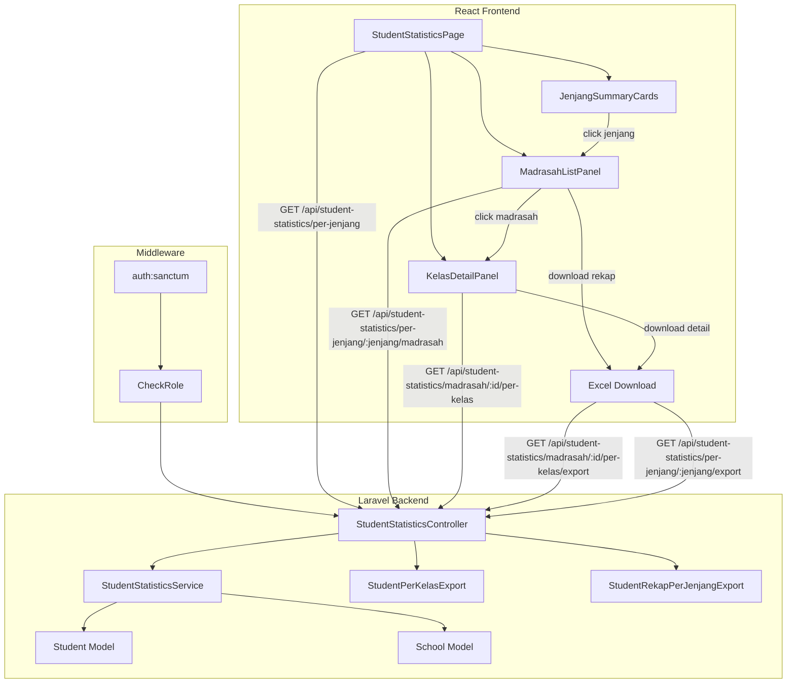

# Design Document: Student Statistics per Jenjang

## Overview

Fitur ini menyediakan statistik jumlah siswa aktif yang dikelompokkan berdasarkan jenjang pendidikan (RA, MI, MTs, MA) di SIMMACI. Fitur mencakup:

1. **API agregasi** — endpoint yang menghitung siswa aktif per jenjang menggunakan database-level GROUP BY
2. **Detail per madrasah** — drill-down dari jenjang ke daftar madrasah beserta jumlah siswanya
3. **Detail per kelas** — drill-down dari madrasah ke daftar kelas beserta jumlah siswanya
4. **Excel export** — download data per-kelas dan rekap per-madrasah dalam format .xlsx
5. **RBAC + tenant scoping** — operator hanya melihat data sekolahnya, super_admin/admin_yayasan melihat semua

Arsitektur mengikuti pola yang sudah ada di SIMMACI: Laravel controller + service layer di backend, React + TanStack Query di frontend, dengan Maatwebsite Excel untuk export.

## Architecture



### Design Decisions

1. **Service layer pattern** — Business logic (aggregation, categorization, sorting) lives in `StudentStatisticsService`, keeping the controller thin. This matches the existing pattern (e.g., `MeetingReportService`).

2. **Database-level aggregation** — All counting uses `GROUP BY` queries rather than loading models into memory. This ensures the 2-second response requirement is met even with large datasets.

3. **Inline Excel export classes** — Following the pattern in `MeetingReportService`, export classes are defined inline using anonymous classes implementing Maatwebsite Excel concerns. No separate Export class files needed for this simple use case.

4. **Jenjang categorization at query level** — The CASE WHEN logic for categorizing jenjang values (RA, MI, MTs, MA, Tidak Terdefinisi, Lainnya) is done in SQL for performance, matching the pattern in `DashboardController::getSchoolStatistics`.

5. **Tenant scoping via manual check** — Since the `Student` model uses `HasTenantScope` (auto-scoping for operators), the service will use `withoutTenantScope()` for super_admin/admin_yayasan queries and apply manual school_id filtering for operators, matching the `DashboardController::schoolStats` pattern.

## Components and Interfaces

### Backend Components

#### 1. StudentStatisticsController

```php
namespace App\Http\Controllers\Api;

class StudentStatisticsController extends Controller
{
    use ApiResponse;

    public function __construct(
        private StudentStatisticsService $service
    ) {}

    // GET /api/student-statistics/per-jenjang
    public function perJenjang(Request $request): JsonResponse;

    // GET /api/student-statistics/per-jenjang/{jenjang}/madrasah
    public function madrasahByJenjang(Request $request, string $jenjang): JsonResponse;

    // GET /api/student-statistics/madrasah/{id}/per-kelas
    public function perKelas(Request $request, int $id): JsonResponse;

    // GET /api/student-statistics/madrasah/{id}/per-kelas/export
    public function exportPerKelas(Request $request, int $id): BinaryFileResponse|JsonResponse;

    // GET /api/student-statistics/per-jenjang/{jenjang}/export
    public function exportRekapPerJenjang(Request $request, string $jenjang): BinaryFileResponse|JsonResponse;
}
```

#### 2. StudentStatisticsService

```php
namespace App\Services;

class StudentStatisticsService
{
    /**
     * Get aggregated student counts per jenjang category.
     * Categories: RA, MI, MTs, MA, Tidak Terdefinisi, Lainnya
     *
     * @param int|null $schoolId — if provided, scope to this school only
     * @return array{categories: array, total: int}
     */
    public function getPerJenjang(?int $schoolId = null): array;

    /**
     * Get list of madrasah with active student counts for a given jenjang category.
     * Sorted by student count descending.
     *
     * @param string $jenjangCategory — one of: RA, MI, MTs, MA, tidak_terdefinisi, lainnya
     * @param int|null $schoolId — if provided, scope to this school only
     * @return Collection<{id, nama, npsn, kecamatan, jumlah_siswa}>
     */
    public function getMadrasahByJenjang(string $jenjangCategory, ?int $schoolId = null): Collection;

    /**
     * Get student counts per kelas for a specific madrasah.
     * Sorted alphanumerically, "Belum Ditentukan" last.
     *
     * @param int $schoolId
     * @return Collection<{kelas, jumlah_siswa}>
     */
    public function getPerKelas(int $schoolId): Collection;

    /**
     * Categorize a jenjang value into one of the standard categories.
     * - NULL/empty → "Tidak Terdefinisi"
     * - RA, MI, MTs, MA (case-insensitive) → respective category
     * - anything else → "Lainnya"
     *
     * @param string|null $jenjang
     * @return string
     */
    public function categorizeJenjang(?string $jenjang): string;

    /**
     * Normalize kelas value.
     * - NULL/empty/whitespace-only → "Belum Ditentukan"
     * - otherwise → trimmed value
     *
     * @param string|null $kelas
     * @return string
     */
    public function normalizeKelas(?string $kelas): string;

    /**
     * Generate sanitized filename for export.
     * Replaces special characters with underscores.
     *
     * @param string $prefix — e.g., "Jumlah_Siswa" or "Rekap_Siswa"
     * @param string $identifier — e.g., madrasah name or jenjang
     * @return string — e.g., "Jumlah_Siswa_MI_Nurul_Huda_20250101_120000.xlsx"
     */
    public function generateExportFilename(string $prefix, string $identifier): string;
}
```

#### 3. API Routes

```php
// routes/api.php
Route::middleware(['auth:sanctum', 'role:super_admin,admin_yayasan,operator'])
    ->prefix('student-statistics')
    ->group(function () {
        Route::get('/per-jenjang', [StudentStatisticsController::class, 'perJenjang']);
        Route::get('/per-jenjang/{jenjang}/madrasah', [StudentStatisticsController::class, 'madrasahByJenjang']);
        Route::get('/per-jenjang/{jenjang}/export', [StudentStatisticsController::class, 'exportRekapPerJenjang']);
        Route::get('/madrasah/{id}/per-kelas', [StudentStatisticsController::class, 'perKelas']);
        Route::get('/madrasah/{id}/per-kelas/export', [StudentStatisticsController::class, 'exportPerKelas']);
    });
```

### Frontend Components

#### 4. studentStatisticsApi Service

```typescript
// src/services/studentStatisticsApi.ts

export interface JenjangStatItem {
  jenjang: string;        // "RA" | "MI" | "MTs" | "MA" | "Tidak Terdefinisi" | "Lainnya"
  jumlah_siswa: number;
  persentase: number;     // 0-100, rounded
}

export interface JenjangSummaryResponse {
  categories: JenjangStatItem[];
  total: number;
}

export interface MadrasahStatItem {
  id: number;
  nama: string;
  npsn: string;
  kecamatan: string;
  jumlah_siswa: number;
}

export interface KelasStatItem {
  kelas: string;
  jumlah_siswa: number;
}

export const studentStatisticsApi = {
  getPerJenjang(): Promise<JenjangSummaryResponse>;
  getMadrasahByJenjang(jenjang: string): Promise<MadrasahStatItem[]>;
  getPerKelas(madrasahId: number): Promise<KelasStatItem[]>;
  exportPerKelas(madrasahId: number): Promise<Blob>;
  exportRekapPerJenjang(jenjang: string): Promise<Blob>;
};
```

#### 5. React Components

```
src/features/student-statistics/
├── StudentStatisticsPage.tsx          # Main page with drill-down navigation
├── components/
│   ├── JenjangSummaryCards.tsx        # Cards showing per-jenjang totals + percentages
│   ├── MadrasahListPanel.tsx          # Table of madrasah for selected jenjang
│   ├── KelasDetailPanel.tsx           # Table of kelas for selected madrasah
│   ├── StatisticsSkeleton.tsx         # Loading skeleton component
│   └── ErrorFallback.tsx             # Error state with retry button
├── hooks/
│   ├── useJenjangStatistics.ts        # TanStack Query hook for per-jenjang data
│   ├── useMadrasahByJenjang.ts        # TanStack Query hook for madrasah list
│   └── useKelasStatistics.ts          # TanStack Query hook for per-kelas data
└── utils/
    └── downloadExcel.ts               # Utility for triggering blob downloads
```

#### 6. TanStack Query Hooks

```typescript
// useJenjangStatistics.ts
export function useJenjangStatistics() {
  return useQuery({
    queryKey: ['student-statistics', 'per-jenjang'],
    queryFn: () => studentStatisticsApi.getPerJenjang(),
    staleTime: 5 * 60 * 1000, // 5 minutes
    retry: 1,
  });
}

// useMadrasahByJenjang.ts
export function useMadrasahByJenjang(jenjang: string | null) {
  return useQuery({
    queryKey: ['student-statistics', 'madrasah', jenjang],
    queryFn: () => studentStatisticsApi.getMadrasahByJenjang(jenjang!),
    enabled: !!jenjang,
    retry: 1,
  });
}

// useKelasStatistics.ts
export function useKelasStatistics(madrasahId: number | null) {
  return useQuery({
    queryKey: ['student-statistics', 'kelas', madrasahId],
    queryFn: () => studentStatisticsApi.getPerKelas(madrasahId!),
    enabled: !!madrasahId,
    retry: 1,
  });
}
```

## Data Models

### Database Schema (existing tables, no migrations needed)

```
schools
├── id (PK)
├── nama (varchar)
├── npsn (varchar)
├── jenjang (varchar, nullable) — "RA", "MI", "MTs", "MA", or other values
├── kecamatan (varchar, nullable)
├── deleted_at (timestamp, nullable)
└── ...

students
├── id (PK)
├── school_id (FK → schools.id)
├── nama (varchar)
├── kelas (varchar, nullable) — e.g., "1A", "VII-A", "X IPA 1"
├── status (varchar) — "Aktif", "Lulus", "Pindah", etc.
├── deleted_at (timestamp, nullable)
└── ...
```

### API Response Shapes

**GET /api/student-statistics/per-jenjang**
```json
{
  "success": true,
  "message": "Berhasil.",
  "data": {
    "categories": [
      { "jenjang": "RA", "jumlah_siswa": 450, "persentase": 12 },
      { "jenjang": "MI", "jumlah_siswa": 1200, "persentase": 32 },
      { "jenjang": "MTs", "jumlah_siswa": 1100, "persentase": 29 },
      { "jenjang": "MA", "jumlah_siswa": 800, "persentase": 21 },
      { "jenjang": "Tidak Terdefinisi", "jumlah_siswa": 150, "persentase": 4 },
      { "jenjang": "Lainnya", "jumlah_siswa": 50, "persentase": 1 }
    ],
    "total": 3750
  }
}
```

**GET /api/student-statistics/per-jenjang/{jenjang}/madrasah**
```json
{
  "success": true,
  "message": "Berhasil.",
  "data": [
    { "id": 1, "nama": "MI Nurul Huda", "npsn": "60710001", "kecamatan": "Cilacap Selatan", "jumlah_siswa": 320 },
    { "id": 5, "nama": "MI Al-Ikhlas", "npsn": "60710005", "kecamatan": "Majenang", "jumlah_siswa": 280 }
  ]
}
```

**GET /api/student-statistics/madrasah/{id}/per-kelas**
```json
{
  "success": true,
  "message": "Berhasil.",
  "data": [
    { "kelas": "1A", "jumlah_siswa": 30 },
    { "kelas": "1B", "jumlah_siswa": 28 },
    { "kelas": "2A", "jumlah_siswa": 32 },
    { "kelas": "Belum Ditentukan", "jumlah_siswa": 5 }
  ]
}
```

### SQL Query Patterns

**Per-jenjang aggregation:**
```sql
SELECT
  CASE
    WHEN s.jenjang IS NULL OR TRIM(s.jenjang) = '' THEN 'Tidak Terdefinisi'
    WHEN LOWER(s.jenjang) IN ('ra') THEN 'RA'
    WHEN LOWER(s.jenjang) IN ('mi') THEN 'MI'
    WHEN LOWER(s.jenjang) IN ('mts') THEN 'MTs'
    WHEN LOWER(s.jenjang) IN ('ma') THEN 'MA'
    ELSE 'Lainnya'
  END AS jenjang_category,
  COUNT(st.id) AS jumlah_siswa
FROM students st
JOIN schools s ON st.school_id = s.id
WHERE st.status = 'Aktif'
  AND st.deleted_at IS NULL
  AND s.deleted_at IS NULL
GROUP BY jenjang_category;
```

**Per-kelas aggregation:**
```sql
SELECT
  CASE
    WHEN kelas IS NULL OR TRIM(kelas) = '' THEN 'Belum Ditentukan'
    ELSE TRIM(kelas)
  END AS kelas_normalized,
  COUNT(*) AS jumlah_siswa
FROM students
WHERE school_id = :school_id
  AND status = 'Aktif'
  AND deleted_at IS NULL
GROUP BY kelas_normalized
ORDER BY
  CASE WHEN kelas IS NULL OR TRIM(kelas) = '' THEN 1 ELSE 0 END,
  kelas_normalized ASC;
```

## Correctness Properties

*A property is a characteristic or behavior that should hold true across all valid executions of a system — essentially, a formal statement about what the system should do. Properties serve as the bridge between human-readable specifications and machine-verifiable correctness guarantees.*

### Property 1: Jenjang Categorization Correctness

*For any* school with a jenjang value, the `categorizeJenjang` function SHALL map NULL or empty string to "Tidak Terdefinisi", map "RA"/"MI"/"MTs"/"MA" (case-insensitive) to their respective canonical category, and map any other non-empty value to "Lainnya".

**Validates: Requirements 1.5, 1.6**

### Property 2: Aggregation Counts Only Active Students

*For any* set of students with mixed statuses (Aktif, Lulus, Pindah, etc.) associated with schools of various jenjang values, the per-jenjang aggregation SHALL count only students with status "Aktif" and the sum of all category counts SHALL equal the total number of active students.

**Validates: Requirements 1.1**

### Property 3: Operator Tenant Scoping

*For any* operator with a school_id, all student statistics queries (per-jenjang, per-madrasah, per-kelas) SHALL return data exclusively from that operator's associated school_id, returning zero results if no active students exist for that school.

**Validates: Requirements 1.3, 6.5**

### Property 4: Privileged Roles See All Data

*For any* super_admin or admin_yayasan user, all student statistics queries SHALL aggregate data across all madrasah without tenant scoping, and the total count SHALL equal the sum of active students across all schools.

**Validates: Requirements 1.2, 6.6**

### Property 5: Per-Madrasah Results Sorted Descending by Count

*For any* jenjang category with multiple madrasah, the madrasah list returned by the API SHALL be sorted in descending order by `jumlah_siswa`, such that for every consecutive pair (i, i+1), `jumlah_siswa[i] >= jumlah_siswa[i+1]`.

**Validates: Requirements 2.2**

### Property 6: Kelas Normalization

*For any* student with a kelas value that is NULL, empty string, or contains only whitespace characters, the `normalizeKelas` function SHALL return "Belum Ditentukan". For any non-whitespace-only kelas value, it SHALL return the trimmed value.

**Validates: Requirements 3.3**

### Property 7: Kelas Sorting with "Belum Ditentukan" Last

*For any* per-kelas result set, all entries SHALL be sorted in ascending alphanumeric order, with the exception that "Belum Ditentukan" SHALL always appear as the last entry regardless of its alphabetical position.

**Validates: Requirements 3.4**

### Property 8: Per-Kelas Export Sum Invariant

*For any* madrasah Excel export, the summary row total SHALL equal the sum of all individual kelas `jumlah_siswa` values in the export.

**Validates: Requirements 4.3**

### Property 9: Export Filename Sanitization

*For any* madrasah name containing special characters (spaces, apostrophes, slashes, etc.), the `generateExportFilename` function SHALL replace all non-alphanumeric characters (except underscores) with underscores, and the resulting filename SHALL match the pattern `{prefix}_{sanitized_name}_{YYYYMMdd_HHmmss}.xlsx`.

**Validates: Requirements 4.4**

### Property 10: Rekap Export Sum Invariant

*For any* jenjang rekap Excel export, the grand total row SHALL equal the sum of all individual madrasah `jumlah_siswa` values in the export.

**Validates: Requirements 5.3**

### Property 11: Rekap Export Sorted Alphabetically

*For any* jenjang rekap export with multiple madrasah, the madrasah rows SHALL be sorted in ascending alphabetical order by nama, such that for every consecutive pair (i, i+1), `nama[i] <= nama[i+1]` (locale-aware comparison).

**Validates: Requirements 5.4**

### Property 12: Role-Based Access Control

*For any* authenticated user, access to student statistics endpoints SHALL be granted if and only if the user's role is one of: super_admin, admin_yayasan, or operator. All other roles SHALL receive a 403 Forbidden response.

**Validates: Requirements 6.4**

### Property 13: Percentage Calculation

*For any* per-jenjang response where total > 0, each category's `persentase` SHALL equal `Math.round((jumlah_siswa / total) * 100)`, and when total = 0, all percentages SHALL be 0.

**Validates: Requirements 1.4**

## Error Handling

### Backend Error Handling

| Scenario | HTTP Status | Response |
|----------|-------------|----------|
| Unauthenticated request | 401 | `{ success: false, message: "Unauthorized." }` |
| Insufficient role | 403 | `{ success: false, message: "Akses ditolak. Role tidak memiliki izin." }` |
| Invalid jenjang parameter | 400 | `{ success: false, message: "Kategori jenjang tidak valid." }` |
| Madrasah not found | 404 | `{ success: false, message: "Madrasah tidak ditemukan." }` |
| Excel generation failure | 500 | `{ success: false, message: "Gagal menghasilkan file Excel." }` |
| Database/server error | 500 | `{ success: false, message: "Terjadi kesalahan server." }` |

### Frontend Error Handling

| Scenario | Behavior |
|----------|----------|
| API returns error | Display `ErrorFallback` component with error message and retry button |
| API timeout (10s) | Display timeout message with retry button |
| Network disconnected | Display network error message with retry button |
| Excel download fails | Show toast notification via Sonner with error message |
| Empty data (0 students) | Display categories with 0 count and 0% (not an error state) |

### Retry Strategy

- TanStack Query configured with `retry: 1` (one automatic retry)
- Manual retry via retry button triggers `queryClient.invalidateQueries()`
- Loading skeleton shown during both initial load and retry

## Testing Strategy

### Property-Based Tests (Backend — PHPUnit + custom generators)

Property-based testing is appropriate for this feature because:
- The categorization logic (`categorizeJenjang`, `normalizeKelas`) is a pure function with a large input space
- Sorting properties are universal invariants
- Sum invariants (export totals) should hold for any input data
- Tenant scoping rules are universal across all data combinations

**Library**: PHPUnit with custom data providers generating randomized inputs (PHP doesn't have a standard PBT library, so we'll use data providers with `Faker` to generate diverse inputs across 100+ iterations).

**Configuration**:
- Minimum 100 iterations per property test
- Each test tagged with: `Feature: student-statistics-per-jenjang, Property {N}: {description}`

### Unit Tests (Backend)

- `StudentStatisticsService::categorizeJenjang()` — specific examples for each category
- `StudentStatisticsService::normalizeKelas()` — NULL, empty, whitespace, valid values
- `StudentStatisticsService::generateExportFilename()` — special character handling
- Controller authorization — 401/403 responses for invalid access
- Export column structure verification

### Unit Tests (Frontend — Vitest)

- `JenjangSummaryCards` — renders all categories with correct counts and percentages
- `MadrasahListPanel` — renders madrasah list with nama, NPSN, count
- `KelasDetailPanel` — renders kelas list with counts
- `StatisticsSkeleton` — renders loading state
- `ErrorFallback` — renders error message and retry button
- Hook tests — verify query keys, enabled conditions, error handling

### Integration Tests (Backend — PHPUnit)

- Full request lifecycle: auth → controller → service → database → response
- Tenant scoping: operator sees only their school data
- Excel export: verify file is generated with correct structure
- Performance: response time under 2 seconds with seeded data

### E2E Tests (Playwright)

- Navigate to statistics page → verify cards load
- Click jenjang → verify madrasah list appears
- Click madrasah → verify kelas detail appears
- Download Excel → verify file downloads
- Error state → verify retry works
