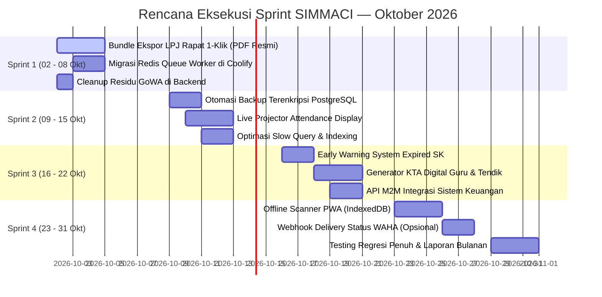

# ROADMAP & BACKLOG RENCANA PEKERJAAN SIMMACI
## Periode: Q4 2026 (Fokus Implementasi: Oktober 2026)

**Sistem:** SIMMACI (*Sistem Informasi Manajemen LP Ma'arif NU Cilacap*)  
**Domain URL:** `https://simmaci.com`  
**Repositori:** `ayebe51/simmaci` (Branch: `main`)  
**Penanggung Jawab:** Tim IT / Full-Stack Engineer LP Ma'arif NU Cilacap  
**Dokumen Pendukung:** [Laporan Kerja September 2026](file:///d:/apss-source/SIMMACI/laporan-kerja-ringkas-30-agustus-29-september-2026.md), [Panduan Deployment WAHA](file:///d:/apss-source/SIMMACI/PANDUAN_DEPLOYMENT_WAHA.md)

---

## 1. EKSEKUTIF SUMMARY & TUJUAN STRATEGIS

Memasuki bulan Oktober 2026, stabilitas fondasi teknis SIMMACI telah berada pada kondisi prima pasca penyelesaian modul PPDB, sukses penjurian Harlah ke-97, penutupan celah keamanan (*Zero-Leak*), perbaikan timeout 504, serta migrasi sukses WhatsApp Gateway dari GoWA ke **WAHA (*WhatsApp HTTP API*)**.

Fokus roadmap pekerjaan periode ini diarahkan pada:
1. **Otomasi Terintegrasi WhatsApp Gateway (WAHA):** Memanfaatkan engine WAHA baru untuk automasi notifikasi undangan rapat, penerbitan SK digital langsung ke kontak guru, dan status pengiriman pesan transaksional.
2. **Penyempurnaan Ekosistem Rapat & Presensi:** Pelaporan LPJ kegiatan 1-klik (PDF bundle), display layar proyektor *live attendance*, dan mitigasi offline scanner.
3. **Smart SK & Lifecycle Guru:** Peringatan dini masa berlaku SK (*early warning expiry*), KTA digital terverifikasi, dan tanda tangan digital terotentikasi.
4. **Interoperabilitas Ekosistem Keuangan:** Sinkronisasi API *Single Source of Truth* antara SIMMACI dan Sistem Keuangan LP Ma'arif (`ayebe51/Keuangan-Maarif`).
5. **Infrastruktur & DevSecOps Resilience:** Pengaktifan kembali Redis queue worker berkecepatan tinggi di Coolify dan pencadangan terenkripsi *offsite* harian.

---

## 2. MATRIKS PRIORITAS PEKERJAAN (MoSCoW METHOD)

```mermaid
quadrantChart
    title Prioritas Pekerjaan SIMMACI Q4 2026
    x-axis Urgensi Rendah --> Urgensi Sangat Tinggi
    y-axis Dampak Rendah --> Dampak Sangat Tinggi
    quadrant-1 Prioritas Utama (Sprint 1 & 2)
    quadrant-2 Rencana Strategis (Sprint 3)
    quadrant-3 Tugas Rutin / Pemeliharaan
    quadrant-4 Rencana Cadangan / Ditunda
    "Redis Queue Worker Coolify": [0.90, 0.88]
    "Backup Database Offsite S3": [0.88, 0.85]
    "Bundle LPJ Rapat 1-Klik": [0.82, 0.82]
    "Cleanup Legacy GoWA Code": [0.80, 0.50]
    "Early Warning Expired SK": [0.70, 0.82]
    "Integrasi API Sistem Keuangan": [0.65, 0.80]
    "Live Projector Board Rapat": [0.65, 0.68]
    "Optimasi Query & Indexing": [0.75, 0.70]
    "KTA Digital Guru & Tendik": [0.55, 0.72]
    "Offline Scanner PWA": [0.48, 0.60]
    "Sinkronisasi Format EMIS 4.0": [0.42, 0.65]
    "WA Blast Undangan Rapat": [0.20, 0.35]
    "Auto-Send SK PDF via WA": [0.18, 0.30]
```

### Kategori Prioritas:
* **Must Have (P0 - Kritis & Wajib Segera Dikerjakan):**
  - **Bundle Ekspor LPJ Rapat 1-Klik:** Menggabungkan Berita Acara, Daftar Hadir, Notulensi, dan Galeri Foto ke 1 PDF resmi ber-kop surat.
  - **Migrasi Antrean ke Redis Queue Worker di Coolify:** Mengembalikan antrean job dari polling database ke Redis performa tinggi pasca-pembenahan auth Redis.
  - **Otomasi Backup Harian Database PostgreSQL ke MinIO/Offsite S3:** Pencadangan terenkripsi otomatis harian terjadwal di VPS.
  - **Pembersihan Residu Kode Legacy GoWA:** Sanitasi import dan dependensi GoWA yang sudah digantikan WAHA.
* **Should Have (P1 - Nilai Tambah Tinggi):**
  - **Sistem Peringatan Dini (Early Warning System) Kedaluwarsa SK:** Alert monitoring H-90 & H-30 untuk SK Guru dan Kepala Madrasah.
  - **Tampilan Live Attendance Screen untuk Proyektor:** Layar monitor real-time kehadiran peserta saat rapat akbar/konfercab.
  - **API M2M Integrasi Sistem Keuangan LP Ma'arif:** Ekspos data master madrasah & siswa untuk sistem ERP Keuangan (`ayebe51/Keuangan-Maarif`).
  - **Optimasi Slow Query & Database Indexing:** Penyetelan komposit index untuk tabel besar.
* **Could Have (P2 - Peningkatan Lanjutan):**
  - **Generator KTA (Kartu Tanda Anggota) Digital Guru & Staf:** Format kartu CR80 ber-QR code dan lembar cetak A4.
  - **Mode Scanner PWA Offline-first:** Dukungan IndexedDB saat koneksi venue rapat terputus.
  - **Sinkronisasi Format EMIS 4.0 Kemenag:** Pemetaan kolom impor siswa/guru otomatis.
* **Won't Have / Deferred (Ditunda & Belum Diperlukan untuk Saat Ini):**
  - ⏸️ **Integrasi WA Blast Undangan Rapat dengan QR Link Personal:** *(Ditunda sesuai arahan pimpinan/kebutuhan saat ini)*.
  - ⏸️ **Pengiriman Otomatis Dokumen SK PDF/DOCX via WhatsApp:** *(Ditunda sesuai arahan pimpinan/kebutuhan saat ini)*.
  - ⏸️ **Integrasi Payment Gateway Bank Pihak Ketiga Berbayar:** *(Dialihkan ke domain Sistem Keuangan)*.
  - ⏸️ **Face Recognition Biometrik Lanjutan:** *(Cukup QR Code + PIN)*.

---

## 3. RINCIAN BREAKDOWN PEKERJAAN (WORK BREAKDOWN STRUCTURE)

### EPIC 1: WhatsApp Gateway (WAHA) Integration & Maintenance
*Tujuan: Memastikan infrastruktur container WAHA stabil, bersih dari residu GoWA legacy, serta mempersiapkan listener webhook status pengiriman.*

#### Task 1.1: [DITUNDA / ON-HOLD] Blast Undangan Rapat Otomatis dengan Link QR Personal
* **Status:** ⏸️ **Ditunda / Belum Diperlukan** *(Sesuai keputusan prioritas saat ini; dapat diaktifkan kembali jika dibutuhkan di masa mendatang)*.
* **Deskripsi Singkat:** Rencana integrasi modul Rapat dengan WAHA untuk kirim undangan massal ke WhatsApp Kepala Madrasah beserta tautan QR presensi personal.

#### Task 1.2: [DITUNDA / ON-HOLD] Otomasi Distribusi Dokumen SK Digital via WhatsApp
* **Status:** ⏸️ **Ditunda / Belum Diperlukan** *(Sesuai keputusan prioritas saat ini; penerbitan SK tetap difokuskan melalui unduh mandiri di portal SIMMACI)*.
* **Deskripsi Singkat:** Rencana pengiriman langsung berkas PDF/DOCX SK resmi ke WhatsApp guru/kamad pasca-approval.

#### Task 1.3: Webhook Delivery Status & Inbound Listener
* **Deskripsi:** Menangkap webhook event dari WAHA (`message.ack`: SENT, DELIVERED, READ, FAILED) untuk memperbarui status centang pengiriman di tabel `wa_blast_recipients`.
* **Target File:**
  - Backend: [backend/app/Http/Controllers/Api/WahaWebhookController.php](file:///d:/apss-source/SIMMACI/backend/app/Http/Controllers/Api/WahaWebhookController.php) *(Baru)*, [backend/routes/api.php](file:///d:/apss-source/SIMMACI/backend/routes/api.php).
* **Estimasi:** 1 Hari Kerja.

#### Task 1.4: Pembersihan Komprehensif Residu GoWA (Legacy Cleanup) — [P0 / Wajib]
* **Deskripsi:** Menghapus referensi kelas lama yang tidak terpakai, seperti unused import `use App\Services\GoWaGatewayService;` pada [WaBlastConfigController.php](file:///d:/apss-source/SIMMACI/backend/app/Http/Controllers/Api/WaBlastConfigController.php) dan membersihkan file konfigurasi/script setup lama yang redundan.
* **Target File:**
  - Backend: [backend/app/Http/Controllers/Api/WaBlastConfigController.php](file:///d:/apss-source/SIMMACI/backend/app/Http/Controllers/Api/WaBlastConfigController.php).
* **Estimasi:** 0.5 Hari Kerja.

---

### EPIC 2: Modernisasi Ekosistem Rapat, Presensi & Notulensi
*Tujuan: Memastikan alur administrasi pertemuan organisasi cabang dari persiapan hingga pelaporan selesai dalam hitungan detik.*

#### Task 2.1: Bundle Ekspor Laporan Pertanggungjawaban (LPJ) Rapat 1-Klik (PDF)
* **Deskripsi:** Menggabungkan Berita Acara Rapat, Daftar Hadir (termasuk tanda tangan/QR digital), Notulensi Rapat, dan Galeri Foto Kegiatan ke dalam 1 dokumen PDF resmi siap cetak/arsip ber-kop surat LP Ma'arif.
* **Fitur:**
  1. Header kop surat dinamis cabang Ma'arif NU Cilacap.
  2. Rekapitulasi kehadiran (Jumlah undangan, hadir tepat waktu, terlambat, perwakilan/walk-in).
  3. Transkrip notulensi terstruktur (Agenda, Pembahasan, Keputusan/Tindak Lanjut).
  4. Lampiran lembar foto dokumentasi (Grid 2x2 per halaman dengan keterangan waktu & tempat).
* **Target File:**
  - Backend: [backend/app/Http/Controllers/Api/MeetingReportController.php](file:///d:/apss-source/SIMMACI/backend/app/Http/Controllers/Api/MeetingReportController.php), [backend/resources/views/reports/meeting_lpj.blade.php](file:///d:/apss-source/SIMMACI/backend/resources/views/reports/meeting_lpj.blade.php) *(Baru)*.
  - Frontend: [src/features/meetings/MeetingDetailPage.tsx](file:///d:/apss-source/SIMMACI/src/features/meetings/MeetingDetailPage.tsx).
* **Estimasi:** 2 Hari Kerja.

#### Task 2.2: Live Presence Screen (Display Layar Proyektor)
* **Deskripsi:** Antarmuka khusus layar lebar (Full Screen TV / Proyektor) di lokasi rapat yang menampilkan nama madrasah dan kepala sekolah yang baru saja melakukan scan QR secara real-time dengan animasi elegan dan suara chime sukses.
* **Fitur:**
  - Tampilan live total hadir vs target undangan dalam chart progres interaktif.
  - Feed berjalan (*ticker*) 10 tamu terakhir yang hadir.
  - Mode privacy untuk menyembunyikan nomor telepon di layar publik.
* **Target File:**
  - Frontend: [src/features/meetings/MeetingLiveDisplayPage.tsx](file:///d:/apss-source/SIMMACI/src/features/meetings/MeetingLiveDisplayPage.tsx) *(Baru)*, [src/App.tsx](file:///d:/apss-source/SIMMACI/src/App.tsx).
* **Estimasi:** 1.5 Hari Kerja.

#### Task 2.3: Offline Scanner PWA Mode (Penyelamat Sinyal Lemah)
* **Deskripsi:** Memanfaatkan Service Worker & IndexedDB agar kamera pemindai presensi di pintu masuk tetap bisa membaca QR dan menyimpan data secara lokal saat koneksi internet gedung rapat terputus, lalu otomatis menyinkronkan data ke server saat sinyal pulih.
* **Target File:**
  - Frontend: [src/features/meetings/MeetingScannerPage.tsx](file:///d:/apss-source/SIMMACI/src/features/meetings/MeetingScannerPage.tsx), [src/lib/offlineQueue.ts](file:///d:/apss-source/SIMMACI/src/lib/offlineQueue.ts) *(Baru)*.
* **Estimasi:** 2 Hari Kerja.

---

### EPIC 3: Smart SK Generator & Kepegawaian (Digital Lifecycle)
*Tujuan: Meningkatkan kepatuhan masa kerja dan otomatisasi administrasi guru/kepala madrasah.*

#### Task 3.1: Sistem Peringatan Dini Masa Berlaku SK (Early Warning System)
* **Deskripsi:** Cronjob otomatis yang memeriksa SK Guru dan SK Kepala Madrasah yang akan habis masa berlakunya dalam waktu 90 hari, 60 hari, dan 30 hari ke depan.
* **Fitur:**
  - Dashboard widget khusus: *"Daftar SK Mendekati Kedaluwarsa"*.
  - Notifikasi otomatis via WhatsApp kepada Kepala Madrasah dan Operator Sekolah agar segera mengajukan perpanjangan/mutasi.
* **Target File:**
  - Backend: [backend/app/Console/Commands/CheckExpiringSksCommand.php](file:///d:/apss-source/SIMMACI/backend/app/Console/Commands/CheckExpiringSksCommand.php) *(Baru)*, [backend/app/Http/Controllers/Api/SkDocumentController.php](file:///d:/apss-source/SIMMACI/backend/app/Http/Controllers/Api/SkDocumentController.php), [backend/app/Models/SkDocument.php](file:///d:/apss-source/SIMMACI/backend/app/Models/SkDocument.php).
  - Frontend: [src/features/dashboard/DashboardPage.tsx](file:///d:/apss-source/SIMMACI/src/features/dashboard/DashboardPage.tsx), [src/features/sk-management/ExpiringSkTab.tsx](file:///d:/apss-source/SIMMACI/src/features/sk-management/ExpiringSkTab.tsx) *(Baru)*.
* **Estimasi:** 1.5 Hari Kerja.

#### Task 3.2: Generator KTA Digital Guru & Staf Berbasis QR Code
* **Deskripsi:** Pembuatan Kartu Tanda Anggota (KTA) resmi digital berukuran standar ID Card (CR80) lengkap dengan foto profil, barcode/QR NIM unik, identitas madrasah pangkal, dan stempel digital pengurus cabang.
* **Fitur:**
  - Desain kartu depan (identitas + foto) dan belakang (tata tertib + stempel cabang).
  - Opsi unduh format gambar (PNG 300 DPI) atau lembar cetak massal A4 (10 kartu per halaman).
* **Target File:**
  - Backend: [backend/app/Http/Controllers/Api/KtaController.php](file:///d:/apss-source/SIMMACI/backend/app/Http/Controllers/Api/KtaController.php) *(Baru)*.
  - Frontend: [src/features/kta/KtaCenterPage.tsx](file:///d:/apss-source/SIMMACI/src/features/kta/KtaCenterPage.tsx), [src/features/kta/components/KtaCardPreview.tsx](file:///d:/apss-source/SIMMACI/src/features/kta/components/KtaCardPreview.tsx).
* **Estimasi:** 2 Hari Kerja.

---

### EPIC 4: Interoperabilitas Sistem: SIMMACI x Sistem Keuangan LP Ma'arif
*Tujuan: Menjadikan SIMMACI sebagai Single Source of Truth bagi seluruh aplikasi turunan LP Ma'arif NU Cilacap.*

#### Task 4.1: API Machine-to-Machine Berkeamanan Tinggi untuk Sistem Keuangan
* **Deskripsi:** Membangun endpoint sinkronisasi data madrasah, rekap jumlah siswa per jenjang, dan data kepala sekolah dengan otentikasi token Sanctum khusus M2M (*machine-to-machine*).
* **Fitur:**
  - Endpoint `GET /api/v1/integrations/schools-summary`
  - Endpoint `GET /api/v1/integrations/students-billing-metrics`
  - Pembatasan IP Address (*IP Whitelisting*) pada middleware integrasi.
* **Target File:**
  - Backend: [backend/app/Http/Controllers/Api/IntegrationController.php](file:///d:/apss-source/SIMMACI/backend/app/Http/Controllers/Api/IntegrationController.php) *(Baru)*, [backend/routes/api.php](file:///d:/apss-source/SIMMACI/backend/routes/api.php).
* **Estimasi:** 1.5 Hari Kerja.

#### Task 4.2: Pemetaan ID Madrasah Terpadu (Canonical School Mapping)
* **Deskripsi:** Memastikan setiap madrasah di SIMMACI memiliki kode referensi unik yang terdaftar pada bagan akun dan buku pembantu di Sistem Keuangan LP Ma'arif.
* **Target File:**
  - Backend: [backend/database/migrations/2026_10_05_000001_add_integration_code_to_schools.php](file:///d:/apss-source/SIMMACI/backend/database/migrations/2026_10_05_000001_add_integration_code_to_schools.php) *(Baru)*.
* **Estimasi:** 1 Hari Kerja.

---

### EPIC 5: Infrastruktur, DevSecOps, & Resilience
*Tujuan: Memastikan operasional sistem kebal terhadap lonjakan beban, crash container, dan kehilangan data.*

#### Task 5.1: Migrasi Penuh Antrean ke Redis Queue Worker di Coolify
* **Deskripsi:** Mengaktifkan kembali antrean Redis performa tinggi (`QUEUE_CONNECTION=redis`) pasca remediasi kredensial Redis pada komit `d8def57b`.
* **Langkah:**
  1. Konfigurasi worker supervisor di kontainer `queue` agar mendengarkan antrean `default`, `wa_blast`, dan `sk_generation`.
  2. Uji coba pengiriman antrean 500 pesan secara serempak tanpa penurunan performa antarmuka web.
* **Target File:**
  - [backend/config/queue.php](file:///d:/apss-source/SIMMACI/backend/config/queue.php), [docker-compose.coolify.yml](file:///d:/apss-source/SIMMACI/docker-compose.coolify.yml).
* **Estimasi:** 1 Hari Kerja.

#### Task 5.2: Otomasi Backup Harian Database PostgreSQL ke MinIO/Offsite S3
* **Deskripsi:** Membangun skrip cron terjadwal di VPS/Coolify yang mengekspor dump PostgreSQL, mengenkripsi dengan GPG/AES-256, dan mengunggahnya ke bucket MinIO terisolasi atau bucket Cloud S3 terpisah.
* **Target File:**
  - [scripts/backup-db-offsite.sh](file:///d:/apss-source/SIMMACI/scripts/backup-db-offsite.sh) *(Baru)*.
* **Estimasi:** 1 Hari Kerja.

#### Task 5.3: Optimasi Slow Query & Indexing Skala Besar
* **Deskripsi:** Memperbaiki index pada tabel `meeting_attendances`, `sk_documents`, dan `activity_logs` guna mencegah timeout query saat data mencapai ratusan ribu baris.
* **Target File:**
  - [backend/database/migrations/2026_10_06_000001_optimize_performance_indexes.php](file:///d:/apss-source/SIMMACI/backend/database/migrations/2026_10_06_000001_optimize_performance_indexes.php) *(Baru)*.
* **Estimasi:** 1 Hari Kerja.

---

## 4. JADWAL SPRINT & TIMELINE EKSEKUSI (OKTOBER 2026)



| Sprint | Rentang Tanggal | Fokus Utama | Target Deliverables (Output) |
| :--- | :--- | :--- | :--- |
| **Sprint 1** | 02 – 08 Oktober 2026 | Dokumen LPJ Rapat & Infrastruktur Queue | • Ekspor LPJ Rapat 1-klik (PDF resmi ber-kop surat). <br> • Redis Queue aktif di container Coolify. <br> • Kode backend 100% bersih dari residu GoWA legacy. |
| **Sprint 2** | 09 – 15 Oktober 2026 | Ketahanan Data & Display Interaktif | • Skrip backup harian offsite PostgreSQL terenkripsi aktif. <br> • Display layar proyektor hadir real-time di venue rapat. <br> • Query indexing pada tabel data besar teroptimasi. |
| **Sprint 3** | 16 – 22 Oktober 2026 | Kepegawaian & Interoperabilitas | • Early warning kedaluwarsa SK aktif via cron/dashboard. <br> • Cetak KTA digital CR80 aktif. <br> • Endpoint data sharing ke Sistem Keuangan LP Ma'arif live. |
| **Sprint 4** | 23 – 31 Oktober 2026 | Offline Mode & Final Hardening | • PWA offline-first scanner aktif dengan IndexedDB. <br> • Webhook delivery status WAHA terintegrasi (opsional). <br> • Regresi 1.800+ automated test cases lulus 100%. |

---

## 5. MATRIKS RISIKO & MITIGASI TEKNIS

| Potensi Risiko | Tingkat Dampak | Probabilitas | Rencana Mitigasi Teknis |
| :--- | :---: | :---: | :--- |
| **Nomor WhatsApp Gateway Terblokir (WA Banned)** | Tinggi | Sedang | Terapkan random sleep (2–7 detik antar pesan), batasi maksimal 50 pesan per sesi blast, dan gunakan akun WhatsApp Bisnis resmi terverifikasi yayasan. |
| **Redis Queue Worker Crash di Coolify** | Tinggi | Rendah | Konfigurasi Supervisor dengan `autorestart=true`, memory limit 256MB, dan fallback otomatis ke `database` queue jika koneksi Redis terputus. |
| **Penyimpanan MinIO Penuh akibat Foto Rapat** | Sedang | Sedang | Kompresi otomatis gambar di client-side (maksimal 1200px lebar, WebP format kualitas 80%) sebelum unggah ke MinIO. |
| **Beban Puncak saat Presensi Massal (1.000+ Peserta)** | Sedang | Sedang | Manfaatkan query caching N-1 di frontend, relaksasi rate limiter IP venue bersama (`throttle:walkin`), dan gunakan lightweight JSON responses. |

---

## 6. DEFINITION OF DONE (DoD) & STANDAR MUTU

Setiap pekerjaan dalam backlog ini dinyatakan **Selesai (DONE)** hanya apabila memenuhi kriteria berikut:
1. **Kode Bersih & Bebas Eslint/Lint Error:** Berkas JavaScript/TypeScript dan PHP lolos uji sintaks tanpa peringatan (*zero lint errors*).
2. **Automated Testing:** Penambahan fitur baru wajib disertai Feature Test / Unit Test yang relevan. Seluruh test suite (1.800+ tests) tetap berstatus **100% PASS**.
3. **Audit Jejak Aktivitas:** Setiap mutasi data sensitif (SK, nilai, approval, dan user) tercatat otomatis di tabel `activity_logs`.
4. **Dokumentasi & Versi Terbarui:** Pembaruan nomor versi pada [version.json](file:///d:/apss-source/SIMMACI/public/version.json) dan penulisan catatan rilis singkat di repositori.
5. **Zero Hard Refresh:** Perubahan frontend tidak menyebabkan `ChunkLoadError` pada pengguna yang sedang aktif menggunakan browser.

---

*Dokumen roadmap pekerjaan ini menjadi panduan kerja terpadu bagi Tim Pengembang LP Ma'arif NU Cilacap dalam mengeksekusi proyek SIMMACI secara terarah, terukur, dan akuntabel.*
