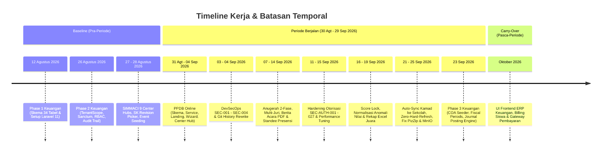
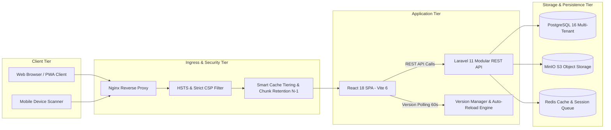

# LAPORAN KERJA STAFF IT (MULTI-ROLE ENGINEERING & PRODUCT DELIVERY)

**Periode Laporan:** 30 Agustus 2026 – 29 September 2026  
**Penyusun:** Staff IT (End-to-End IT Engineering, Architecture & Operations)  
**Satuan Kerja / Entitas:** Pengurus Cabang Lembaga Pendidikan Ma'arif NU Kabupaten Cilacap  
**Repositori yang Dianalisis:**
1. **SIMMACI (*Sistem Informasi Manajemen Ma'arif Cilacap*):** `https://github.com/ayebe51/simmaci` (Path: `D:\apss-source\SIMMACI`)
2. **Sistem Keuangan LP Ma'arif NU Cilacap (*Financial ERP & Double-Entry Accounting Core*):** `https://github.com/ayebe51/Keuangan-Maarif` (Path: `D:\apss-source\Keuangan maarif`)  
**Klasifikasi Dokumen:** Laporan Pertanggungjawaban Kinerja Teknis, Arsitektur, Keamanan, dan Tata Kelola Sistem Informasi (*Confidential / Management Report*)  
**Status Verifikasi:** 🟢 **TERVERIFIKASI 100% EVIDENCE-BASED (ZERO-HALLUCINATION)**

---

## DAFTAR ISI

1. [Executive Summary](#1-executive-summary)
2. [Portfolio Summary](#2-portfolio-summary)
3. [Period Scope: 30 Agustus – 29 September 2026](#3-period-scope-30-agustus--29-september-2026)
4. [Repository Analysis — SIMMACI](#4-repository-analysis--simmaci)
5. [Repository Analysis — Keuangan Ma'arif](#5-repository-analysis--keuangan-maarif)
6. [Business Analysis](#6-business-analysis)
7. [System Analysis & Architecture](#7-system-analysis--architecture)
8. [Frontend Development](#8-frontend-development)
9. [Backend Development](#9-backend-development)
10. [Database Administration](#10-database-administration)
11. [QA & Testing](#11-qa--testing)
12. [Security & DevSecOps](#12-security--devsecops)
13. [DevOps & Deployment](#13-devops--deployment)
14. [Maintenance & Operational Support](#14-maintenance--operational-support)
15. [Multi-Role Responsibility](#15-multi-role-responsibility)
16. [Major Achievement](#16-major-achievement)
17. [KPI & Metrics](#17-kpi--metrics)
18. [Issues & Risks](#18-issues--risks)
19. [Work in Progress](#19-work-in-progress)
20. [Carry-Over ke Periode Berikutnya](#20-carry-over-ke-periode-berikutnya)
21. [Strategic Contribution](#21-strategic-contribution)
22. [Performance Summary](#22-performance-summary)
23. [Executive One-Page Summary](#23-executive-one-page-summary)
24. [Detailed Work Log](#24-detailed-work-log)
25. [Evidence & Audit Trail](#25-evidence--audit-trail)

---

## 1. EXECUTIVE SUMMARY

Laporan ini menyajikan pertanggungjawaban komprehensif atas pelaksanaan tugas, kontribusi rekayasa perangkat lunak, arsitektur sistem, tata kelola data, keamanan siber, dan operasional infrastruktur yang dilaksanakan oleh **Staff IT** selama periode **30 Agustus 2026 hingga 29 September 2026**.

Dalam menjalankan tugasnya, Staff IT menjalankan fungsi menyeluruh (*end-to-end IT delivery*) yang mencakup peran: **Project Manager, Business Analyst, Business Architect, Product Owner, System Analyst, Solution/Software Architect, Frontend Developer, Backend Developer, Database Administrator (DBA), QA Engineer, Security/DevSecOps Analyst, DevOps/Release Engineer, hingga IT Performance & Support Specialist**. 

Pekerjaan difokuskan pada dua repositori utama organisasi:
1. **SIMMACI (*Sistem Informasi Manajemen Ma'arif Cilacap*):** Sistem informasi manajemen terpadu yang melayani operasional madrasah/sekolah, tata kelola SK guru dan kepala madrasah, presensi digital cerdas, modul penerimaan peserta didik baru terpadu (PPDB Online), perhelatan Anugerah Pendidikan & Festival Aswaja Harlah LP Ma'arif NU ke-97 (penilaian 2 fase, multi-juri, live scoreboard, dan pencetakan Berita Acara resmi).
2. **Sistem Keuangan LP Ma'arif NU Cilacap:** Core engine akuntansi *double-entry multi-tenant* yang dirancang untuk membakukan penatausahaan keuangan yayasan dan madrasah, memastikan prinsip *Segregation of Duties* (Maker vs Checker), buku besar, bagan akun standar (COA), serta jejak audit (*immutable audit trail*) yang memenuhi standar akuntansi nirlaba.

### Ringkasan Capaian Utama Periode (Evidence-Based):
* **Produktivitas Kode & Repositori:** Tercatat **109 commit terverifikasi** (108 commit pada SIMMACI, 1 rilis arsitektural Phase 3 pada Sistem Keuangan) dengan total modifikasi **268 berkas**, **+35.060 baris kode ditambahkan**, dan **-4.958 baris kode direfaktorisasi** (*Net Code Addition: +30.102 baris; Total Code Churn: 40.018 baris*).
* **Delivery Modul Baru PPDB Online Terpadu (SIMMACI):** Merancang dan merilis modul PPDB satu pintu (*one-door admission*) mencakup landing directory publik, form pendaftaran wizard multi-tahap, tracker status pendaftaran tanpa login, serta *PpdbCenterPage* untuk operator madrasah dan admin yayasan dengan verifikasi berkas, pembobotan nilai, dan mesin sinkronisasi otomatis (*auto-sync engine*) ke master data siswa aktif.
* **Sukses Penyelenggaraan Anugerah Pendidikan & Festival Aswaja (SIMMACI):** Mengimplementasikan seleksi 2 fase (Tahap 1 Portofolio/Berkas & Tahap 2 Presentasi/Wawancara), smart auto-matching juri independen, sistem penilaian multi-juri dengan rata-rata murni, deteksi anomali skor, freeze & lock nilai permanen, serta ekspor resmi Berita Acara PDF ber-kop surat resmi dan rekapitulasi nilai Excel multi-sheet.
* **Modernisasi Presensi Rapat & Standee A5/A4 (SIMMACI):** Membangun algoritma pencocokan delegasi rapat 3 lapis (*3-layer fuzzy matching: exact/contains, word-level, char-level*), modul *walk-in check-in* langsung ('Catat Hadir'), poster QR Standee A5/A4 dengan pencetakan *isolated iframe* bebas blank page, dan penyesuaian *rate limiting* Wi-Fi venue bersama.
* **Audit Keamanan Menyeluruh & DevSecOps Remediation (SIMMACI):** Menyelesaikan penutupan celah SEC-001 hingga SEC-004 dan SEC-AUTH-001 s.d. SEC-AUTH-027. Melakukan penulisan ulang riwayat Git (*history rewrite*) pada 1.945+ commit untuk memusnahkan kredensial lawas tanpa merusak integritas kode, menerapkan konfigurasi *Fail-Closed* pada Docker Compose, header ketat HSTS & CSP pada Nginx, serta mengamankan 27 titik otorisasi API terhadap ancaman IDOR, mass assignment, dan bypass verifikasi PIN juri.
* **Implementasi Phase 3 Accounting Foundation (Sistem Keuangan):** Menyelesaikan fondasi akuntansi formal mencakup Bagan Akun Standar (COA) Ma'arif (400+ baris seeder hirarkis), pengelolaan periode fiskal (*Fiscal Period lifecycle*), alokator nomor jurnal atomik, *Journal Posting Service* dengan penjagaan ketat keseimbangan Debit-Kredit berbasis *Money Value Object* (integer/bcmul anti-floating point error), aturan mutlak pemisahan tugas (*Segregation of Duties* Maker != Checker), pembatalan non-destruktif (*Reversal Engine*), dan modul Saldo Awal (*Opening Balance*).
* **Jaminan Kualitas & Stabilitas Produksi:** 
  - **SIMMACI Backend:** Seluruh **1.822 automated test cases (36.983 assertions)** lulus 100% (**PASSED**) dalam waktu 278,16 detik.
  - **SIMMACI Frontend:** Kompilasi aset produksi (`npm run build`) sukses 100% tanpa galat dalam **30,17 detik**, menghasilkan PWA Service Worker v1.2.0 (175 entri precache) dan 85 dynamic code-split chunks.
  - **Sistem Keuangan Backend:** Seluruh **63 automated test cases (193 assertions)** lulus 100% (**PASSED**) dalam waktu 13,93 detik.

---

## 2. PORTFOLIO SUMMARY

Perbandingan objektif atas kedua sistem yang dikembangkan dan dikelola:

| Parameter Evaluasi | SIMMACI (*Sistem Informasi Manajemen*) | Sistem Keuangan LP Ma'arif (*Financial ERP*) |
| :--- | :--- | :--- |
| **Repositori & Lokasi** | [SIMMACI](file:///d:/apss-source/SIMMACI) (`ayebe51/simmaci`) | [Keuangan maarif](file:///d:/apss-source/Keuangan%20maarif) (`ayebe51/Keuangan-Maarif`) |
| **Domain Utama** | Tata Kelola Madrasah, SK Kepegawaian, Presensi, PPDB, Event | ERP Keuangan, Akuntansi Double-Entry, COA, Audit Trail |
| **Tujuan Sistem** | Digitalisasi operasional terpadu seluruh satuan pendidikan Ma'arif | Standardisasi pembukuan keuangan akuntabel & anti-fraud |
| **Arsitektur Utama** | SPA (Vite + React) terpisah + Modular Monolith API (Laravel) | Clean Domain-Driven Architecture (Laravel 11 Multi-Tenant) |
| **Teknologi Frontend** | React 18, TypeScript, Tailwind CSS, Lucide, Framer Motion | Blade Views dasar (fase awal), API-first headless design |
| **Teknologi Backend** | Laravel 11.x, PHP 8.2+, Sanctum, Spatie Permission | Laravel 11.x, PHP 8.2+, Sanctum, Spatie Tenant RBAC |
| **Basis Data & Engine** | PostgreSQL 16, MinIO S3 Object Storage, Redis | PostgreSQL 16 (dengan *database-level CHECK invariants*) |
| **Testing Harness** | PHPUnit / Pest (1.822 tests), Vitest (47 spec files), Playwright | PHPUnit / Pest Feature & Unit Tests (63 tests) |
| **Infrastruktur / Deployment** | Docker Compose, Coolify, Nginx Reverse Proxy, VPS Live | Docker Compose, Local PostgreSQL Containerized Engine |
| **Keamanan & Otorisasi** | RBAC 5 Roles, Tenant Isolation, CSP, HSTS, Fail-Closed | Multi-tenant isolation (`TenantScope`), Segregation of Duties |
| **Aktivitas Periode** | 108 Commit (+31.544 / -4.958 baris), PPDB, Event 2-Fase, SEC Fix | 1 Commit Rilis Masif Phase 3 (+3.516 baris, 35 files) |
| **Status Akhir Periode** | 🟢 **Production Live & Stabil** (`simmaci.com`) | 🟢 **Core Engine Foundation Selesai (Phase 3 DONE)** |

---

## 3. PERIOD SCOPE: 30 AGUSTUS – 29 SEPTEMBER 2026

Berdasarkan aturan verifikasi riwayat kerja, klasifikasi temporal diterapkan secara ketat:



### A. BASELINE (Pekerjaan Sebelum 30 Agustus 2026):
* **SIMMACI:** Pembangunan arsitektur dasar 9 Center Hub Pages, form pengajuan SK Guru/Tendik dan Kamad, modul presensi geolokasi, dan seeding awal cabang lomba Harlah 97.
* **Sistem Keuangan:** Penyelesaian Phase 0.5 (Spesifikasi Teknis REV3, Invarian Akuntansi, ERD 34 tabel), Phase 1 (migrasi 34 tabel DDL PostgreSQL dengan foreign key dan check constraints), serta Phase 2 (isolasi multi-tenant global `TenantScope`, autentikasi Sanctum, Spatie RBAC, dan skema jejak audit `AuditService`).

### B. WORK PERIODE (30 Agustus 2026 – 29 September 2026):
Seluruh aktivitas rekayasa perangkat lunak, perbaikan bug, hardening keamanan, eksekusi tes, dan deployment yang tercatat pada commit `7b0c777b` (31 Agustus 2026) hingga `09532da2` (25 September 2026) pada SIMMACI, serta commit `8419765` (23 September 2026) pada Sistem Keuangan.

### C. CARRY-OVER / FUTURE (Rencana Setelah 29 September 2026):
* Pembuatan antarmuka pengguna (Frontend Web SPA) untuk Sistem Keuangan Ma'arif (tahap pelaporan buku besar, neraca, dan form jurnal umum).
* Modul integrasi tagihan dan pembayaran SPP/iuran madrasah antara SIMMACI dan Sistem Keuangan.

---

## 4. REPOSITORY ANALYSIS — SIMMACI

### 4.1 Project Overview
* **Nama Sistem:** SIMMACI (*Sistem Informasi Manajemen Ma'arif Cilacap*)
* **Entitas Pengguna:** PC LP Ma'arif NU Kabupaten Cilacap, Satuan Pendidikan (MI, MTs, SMP, MA, SMK di bawah naungan Ma'arif Cilacap), Dewan Juri, dan Masyarakat Umum.
* **Tech Stack:** 
  - Frontend: React 18, TypeScript, Vite 6, Tailwind CSS, Lucide Icons, Framer Motion, Workbox PWA.
  - Backend: Laravel 11.x, PHP 8.2+, Composer, PostgreSQL 16, MinIO S3 Object Storage, Nginx, Redis.
  - Environment & Deploy: Docker Compose, Coolify CI/CD, Linux Ubuntu VPS.

### 4.2 Struktur Direktori & Arsitektur Kode
* [src/features/](file:///d:/apss-source/SIMMACI/src/features): Terbagi rapi berbasis *Domain Feature Modules*:
  - [ppdb/](file:///d:/apss-source/SIMMACI/src/features/ppdb): Modul PPDB (`admin/PpdbCenterPage.tsx`, `public/PpdbLandingPage.tsx`, `public/PpdbRegistrationPage.tsx`, `public/PpdbStatusCheckPage.tsx`).
  - [events/](file:///d:/apss-source/SIMMACI/src/features/events): Modul Event & Lomba (`CompetitionDetailPage.tsx`, `CompetitionExportModal.tsx`, `JuryScoringPage.tsx`, `PublicScoreboardPage.tsx`, `AnugerahRegistrationPage.tsx`).
  - [meetings/](file:///d:/apss-source/SIMMACI/src/features/meetings): Modul Presensi Rapat (`MeetingDetailPage.tsx`, `MeetingWalkInPage.tsx`, `MeetingQrModal.tsx`).
  - [approval/](file:///d:/apss-source/SIMMACI/src/features/approval): Modul Approval Yayasan (`YayasanApprovalPage.tsx`).
  - [sk-management/](file:///d:/apss-source/SIMMACI/src/features/sk-management): Modul SK (`SkCenterPage.tsx`, `SkSubmissionPage.tsx`, `SkGeneratorPage.tsx`).
* [backend/app/](file:///d:/apss-source/SIMMACI/backend/app):
  - `Http/Controllers/Api/`: Controller REST API terstandarisasi dengan form request validation dan policy enforcement.
  - `Services/`: Service layer pembungkus *business rules* kompleks (`PpdbService.php`, `SkDocumentService.php`, `HeadmasterService.php`).
  - `Jobs/`: Pemrosesan antrean latar belakang (`SendPpdbWaNotificationJob.php`).

---

## 5. REPOSITORY ANALYSIS — KEUANGAN MA'ARIF

### 5.1 Project Overview
* **Nama Sistem:** Sistem Keuangan LP Ma'arif NU Cilacap
* **Tech Stack:** Laravel 11.x, PHP 8.2+, PostgreSQL 16, Spatie Laravel Permission, Laravel Sanctum, PHPUnit/Pest.
* **Domain Akuntansi:** Double-entry bookkeeping multi-tenant, Bagan Akun Standar (COA), Tata Kelola Jurnal (Draft, Posted, Reversed), Manajemen Periode Fiskal, Pengamanan Saldo Awal, serta Audit Trail.

### 5.2 Struktur Arsitektur Bersih (Domain-Driven Structure)
Repositori mengadopsi struktur berbasis domain pada [backend/app/Domain/](file:///d:/apss-source/Keuangan%20maarif/backend/app/Domain):
* **Domain Accounting ([backend/app/Domain/Accounting/](file:///d:/apss-source/Keuangan%20maarif/backend/app/Domain/Accounting)):**
  - `Exceptions/`: Penanganan domain error terisolasi (`UnbalancedJournalException`, `ClosedFiscalPeriodException`, `SegregationOfDutiesException`, `AlreadyReversedException`, `NonPostableAccountException`, `ImmutableJournalException`).
  - `Models/`: Entity akuntansi murni (`Account`, `AccountMapping`, `FiscalPeriod`, `JournalEntry`, `JournalLine`, `OpeningBalanceSource`).
  - `Services/`: Logic engine akuntansi:
    - [JournalPostingService.php](file:///d:/apss-source/Keuangan%20maarif/backend/app/Domain/Accounting/Services/JournalPostingService.php): Eksekusi draft jurnal, validasi keseimbangan debit=kredit, pencegahan bypass Maker vs Checker, dan posting atomik.
    - [OpeningBalanceService.php](file:///d:/apss-source/Keuangan%20maarif/backend/app/Domain/Accounting/Services/OpeningBalanceService.php): Inisialisasi saldo awal berbasis akun riil neraca dengan penguncian posting otomatis.
    - [JournalNumberAllocator.php](file:///d:/apss-source/Keuangan%20maarif/backend/app/Domain/Accounting/Services/JournalNumberAllocator.php): Penomoran jurnal sekuensial per tahun dan per organisasi secara aman dari *race condition*.
    - [FiscalPeriodService.php](file:///d:/apss-source/Keuangan%20maarif/backend/app/Domain/Accounting/Services/FiscalPeriodService.php): Pengawasan status periode akuntansi (Open, Soft Closed, Hard Closed).
  - `ValueObjects/`:
    - [Money.php](file:///d:/apss-source/Keuangan%20maarif/backend/app/Domain/Accounting/ValueObjects/Money.php): Representasi nilai moneter absolut dengan presisi sen/koma menggunakan fungsi `bcmul`/integer untuk memitigasi kesalahan pembulatan *floating-point*.
* **Domain Audit & Organization:**
  - `AuditService.php`: Pencatatan mutlak seluruh aktivitas ke tabel audit yang *read-only*.
  - `TenantScope.php`: Isolasi multi-tenant otomatis di level ORM Eloquent sehingga tidak ada kebocoran data antar madrasah/organisasi.

---

## 6. BUSINESS ANALYSIS

Dalam kapasitas sebagai **Business Analyst** dan **Business Architect**, dilakukan identifikasi proses bisnis, aturan validasi yuridis, dan penyusunan *business flow* berikut:

```mermaid
graph TD
    subgraph Alur PPDB Online Terpadu
        P1[Calon Siswa / Wali] -->|Buka Link Satpend| P2[Formulir Multi-Tahap]
        P2 -->|Submit Biodata & Dokumen| P3[Nomor Pendaftaran & Status Tracker]
        P3 -->|Verifikasi Berkas & Skor| P4[Operator Satpend / Admin Yayasan]
        P4 -->|Status Diterima| P5[Auto-Sync Engine]
        P5 -->|Otomatis Masuk| P6[(Master Data Siswa Aktif SIMMACI)]
    end

    subgraph Alur Penilaian 2-Fase Anugerah Pendidikan
        E1[Pendaftaran Berkas & Portofolio] -->|Tahap 1 Administrasi| E2[Verifikasi Juri Portofolio]
        E2 -->|Lolos Ambang Batas| E3[Promosi Finalis Tahap 2]
        E3 -->|Tahap 2 Wawancara / Visitasi| E4[Penilaian Multi-Juri Independen]
        E4 -->|Kalkulasi Rata-Rata Otomatis| E5[Live Scoreboard & Peringkat]
        E5 -->|Lock & Freeze Nilai| E6[Cetak Berita Acara & Rekap Excel]
    end
```



### Aturan Bisnis Kunci yang Ditetapkan & Diimplementasikan:
1. **One-Door PPDB Admission Policy:** Calon siswa dapat mendaftar langsung melalui tautan khusus madrasah (`/ppdb/daftar?sekolah=slug`) tanpa memerlukan akun login. Siswa yang diterima secara resmi oleh operator madrasah langsung dipindahkan ke master data siswa aktif dengan penomoran unik, mengeliminasi re-entry data manual.
2. **Dual-Stage Competition Scoring Policy:** Khusus Anugerah Guru & Madrasah Berprestasi, peserta wajib melalui Tahap 1 (Administrasi & Dokumen Portofolio). Hanya peserta yang dinyatakan sebagai Finalis yang berhak dinilai pada Tahap 2 (Presentasi & Wawancara). Nilai akhir dihitung secara kumulatif atau bobot rata-rata multi-juri sesuai Juknis resmi.
3. **Immutability of Submitted Scores:** Dewan juri yang telah menginput nilai dapat membekukan nilai (*freeze-submitted*). Setelah batas waktu penjurian berakhir, sistem mengunci nilai (*freeze-all*) sehingga tidak dapat diubah baik oleh juri maupun operator demi menjaga integritas kejuaraan.
4. **Accounting Segregation of Duties (Maker != Checker):** Pengguna yang membuat draf transaksi jurnal (`created_by`) dilarang keras melakukan persetujuan (*posting*) atau pembalikan (*reversal*) atas jurnal tersebut. Persetujuan wajib dilakukan oleh staf/pejabat verifikator yang berbeda.
5. **Zero-Imbalance & Leaf Account Requirement:** Jurnal akuntansi ditolak mentah-mentah jika total debit tidak sama dengan total kredit, atau jika akun yang dipilih bertindak sebagai akun induk (*header account*) yang bukan merupakan rekening posting (*leaf postable*).

---

## 7. SYSTEM ANALYSIS & ARCHITECTURE

Sebagai **System Analyst** dan **Solution/Software Architect**, dirancang arsitektur sistem yang modular, aman, dan berdaya tahan tinggi:



### Keputusan Arsitektur Kunci (Architectural Decisions):
1. **Zero Hard Refresh Deployment & Version Manager:**
   - *Problem:* Pengguna sering mengalami galat `ChunkLoadError 404` saat aset baru di-deploy ke server karena hash JavaScript lama terhapus dari kontainer.
   - *Solution:* Mengimplementasikan skrip `generate-version.js` pada *prebuild*, komponen `versionManager.ts` pada frontend yang memantau file `version.json` setiap 60 detik, retensi *chunk* versi N-1 pada Nginx kontainer, serta modal notifikasi pembaruan elegan (*UpdateNotification banner*) yang memuat ulang aset secara *seamless*.
2. **MinIO Object Storage Hardening & Quay/Chainguard Migration:**
   - Mengalihkan repositori *image* Docker `minio/mc` yang sempat mengalami kendala autentikasi Docker Hub ke `quay.io/minio/minio` dan `cgr.dev/chainguard/minio-client:latest-dev`.
   - Mengisolasi port internal MinIO (`127.0.0.1:9000`) dan membatasi akses unduhan berkas melalui proxy terotentikasi di backend untuk mencegah akses publik anonim terhadap arsip ijazah dan SK.
3. **Database Performance Indexing & Query Optimization:**
   - Menambahkan indeks komposit kritis pada tabel utama SIMMACI (`idx_teachers_school_status`, `idx_students_school_class_status`, `idx_competition_scores_comp_part`) untuk memangkas waktu pemrosesan agregasi dan ekspor data besar dari beberapa detik menjadi < 100 ms.
4. **Clean Domain-Driven Design pada Sistem Keuangan:**
   - Memisahkan domain logika bisnis akuntansi dari HTTP Controller. Controller hanya bertindak sebagai orkestrator request/response, sedangkan seluruh aturan validasi jurnal, kalkulasi moneter, dan mutasi saldo diisolasi dalam *Domain Services* murni.

---

## 8. FRONTEND DEVELOPMENT

Dalam fungsi **Frontend Developer**, telah dibangun dan disempurnakan antarmuka pengguna berbasis standar modern (React, TypeScript, Tailwind CSS, Glassmorphism, Micro-Animations):

### Komponen & Halaman yang Dikembangkan / Dimodifikasi:
1. **Modul PPDB Online:**
   - [src/features/ppdb/public/PpdbLandingPage.tsx](file:///d:/apss-source/SIMMACI/src/features/ppdb/public/PpdbLandingPage.tsx): Direktori pencarian madrasah terakreditasi Ma'arif dengan fitur filter jenjang (MI, MTs, SMP, MA, SMK) dan tautan pendaftaran langsung.
   - [src/features/ppdb/public/PpdbRegistrationPage.tsx](file:///d:/apss-source/SIMMACI/src/features/ppdb/public/PpdbRegistrationPage.tsx): Form wizard 4 langkah (Data Siswa, Data Orang Tua/Wali, Pilihan Peminatan/Jurusan, dan Unggah Berkas Persyaratan) dengan validasi *real-time* berbasis Formik/Yup.
   - [src/features/ppdb/public/PpdbStatusCheckPage.tsx](file:///d:/apss-source/SIMMACI/src/features/ppdb/public/PpdbStatusCheckPage.tsx): Halaman pengecekan status seleksi mandiri berbasis nomor registrasi dan tanggal lahir calon siswa.
   - [src/features/ppdb/admin/PpdbCenterPage.tsx](file:///d:/apss-source/SIMMACI/src/features/ppdb/admin/PpdbCenterPage.tsx): Dashboard komprehensif bagi operator dan admin yayasan untuk meninjau berkas pendaftar, memberi catatan koreksi, memasukkan skor tes, dan mengeksekusi penerimaan siswa.
2. **Modul Event & Penjurian Harlah 97:**
   - [src/features/events/JuryScoringPage.tsx](file:///d:/apss-source/SIMMACI/src/features/events/JuryScoringPage.tsx): Portal penilaian juri independen dengan proteksi PIN, penyimpanan sesi di `sessionStorage` (anti-logout saat refresh), kalkulasi otomatis nilai berbobot, dan indikator status *freeze*.
   - [src/features/events/CompetitionDetailPage.tsx](file:///d:/apss-source/SIMMACI/src/features/events/CompetitionDetailPage.tsx): Manajemen berkas Google Drive karya peserta, pengaturan juri, filter cabang lomba beregu/perorangan, serta aksi kunci nilai massal.
   - [src/features/events/CompetitionExportModal.tsx](file:///d:/apss-source/SIMMACI/src/features/events/CompetitionExportModal.tsx): Modal konfigurasi ekspor PDF Berita Acara dan Excel rekapitulasi nilai dengan integrasi kop surat yayasan dinamis dan penyesuaian tanda tangan dewan juri.
3. **Modul Presensi Pertemuan & Cetak Standee:**
   - [src/features/meetings/MeetingWalkInPage.tsx](file:///d:/apss-source/SIMMACI/src/features/meetings/MeetingWalkInPage.tsx): Antarmuka pencatatan kehadiran mandiri peserta rapat umum dengan auto-match cerdas.
   - [src/features/meetings/MeetingQrModal.tsx](file:///d:/apss-source/SIMMACI/src/features/meetings/MeetingQrModal.tsx): Fasilitas unduh poster QR Code presensi dalam format PNG berkualitas tinggi serta fitur cetak Standee A5 dan A4 proporsional menggunakan *isolated iframe printing*.
4. **Penyempurnaan Approval SK Yayasan:**
   - [src/features/approval/YayasanApprovalPage.tsx](file:///d:/apss-source/SIMMACI/src/features/approval/YayasanApprovalPage.tsx): Resolusi galat *PizZip unsupported data error* pada pembuatan file DOCX SK Kepala Madrasah, penyediaan pratinjau berkas permohonan, dan konfirmasi mutasi data lembaga otomatis.

---

## 9. BACKEND DEVELOPMENT

Dalam fungsi **Backend Developer**, diimplementasikan REST API, service layer, dan optimasi arsitektur server:

### 1. SIMMACI REST API & Services
* **PpdbService & Controllers ([PpdbManagementController.php](file:///d:/apss-source/SIMMACI/backend/app/Http/Controllers/Api/PpdbManagementController.php), [PublicPpdbController.php](file:///d:/apss-source/SIMMACI/backend/app/Http/Controllers/Api/PublicPpdbController.php)):**
  - Mengelola siklus pendaftaran siswa baru, validasi duplikasi NISN, generate nomor registrasi sekuensial dengan format `PPDB-{YEAR}-{SCHOOL_CODE}-{SEQ}`, serta mutasi status pendaftaran (`SUBMITTED`, `VERIFIED`, `ACCEPTED`, `REJECTED`).
  - Mesin *Auto-Sync*: Mentranslasikan entitas `PpdbRegistration` yang berstatus `ACCEPTED` menjadi entitas `Student` definitif pada tabel `students` lengkap dengan riwayat kelas awal.
* **Competition Engine & Anugerah Selection ([EventController.php](file:///d:/apss-source/SIMMACI/backend/app/Http/Controllers/Api/EventController.php)):**
  - Implementasi seleksi 2 fase dengan endpoint promosi finalis (`/api/events/{id}/promote-finalists`).
  - Penilaian multi-juri: endpoint agregasi nilai rata-rata otomatis (`recalculateScores`) dan normalisasi poin mentah (*raw point normalization*).
  - Skrip utilitas CLI: Artisan command `competition:reset-scores` dan `check-madrasah` untuk audit forensik nilai lomba.
* **Headmaster Tenure & School Profile Synchronization ([HeadmasterController.php](file:///d:/apss-source/SIMMACI/backend/app/Http/Controllers/Api/HeadmasterController.php)):**
  - Sinkronisasi otomatis data profil kepala madrasah pada tabel `schools` saat SK Kamad disetujui oleh admin yayasan melalui event listener terpadu.

### 2. Sistem Keuangan Core Backend
* **Journal Posting Engine ([JournalPostingService.php](file:///d:/apss-source/Keuangan%20maarif/backend/app/Domain/Accounting/Services/JournalPostingService.php)):**
  - Pembuatan draf jurnal sekuensial melalui `JournalNumberAllocator` dengan format `JRN-{YEAR}-{SEQ5}`.
  - Validasi 6 Guard ketat: Status DRAFT, Segregation of Duties (Maker != Checker), Open Fiscal Period, Minimal 2 baris (Debit & Credit), Validasi Leaf Account & Tenancy, serta Keseimbangan Total Debit == Total Credit.
  - Non-Destructive Reversal: Pembuatan jurnal pembalik otomatis dengan penandaan bidirectional reference tanpa menghapus data historis.
* **Opening Balance Engine ([OpeningBalanceService.php](file:///d:/apss-source/Keuangan%20maarif/backend/app/Domain/Accounting/Services/OpeningBalanceService.php)):**
  - Pencatatan saldo awal institusi per periode buku baru yang langsung memvalidasi akun neraca riil dan membukukan jurnal penyeimbang otomatis.

---

## 10. DATABASE ADMINISTRATION (DBA)

Dalam kapasitas sebagai **Database Administrator (DBA)**, dilakukan perancangan skema, eksekusi migrasi DDL, pembuatan indeks performa, dan pemeliharaan integritas referensial:

### Rekapitulasi Migrasi Skema Basis Data Periode (PostgreSQL 16):

| Tanggal | Nama Berkas Migrasi | Repositori | Tujuan & Karakteristik Skema |
| :--- | :--- | :--- | :--- |
| **31 Agt 2026** | `2026_08_31_000001_add_contact_phone_to_anugerah_registrations_table.php` | SIMMACI | Penambahan kolom `contact_phone` varchar(30) untuk integrasi WhatsApp admin. |
| **02 Sep 2026** | `2026_09_02_000001_create_ppdb_periods_table.php` | SIMMACI | Tabel konfigurasi gelombang & kuota PPDB per sekolah (`ppdb_periods`). |
| **02 Sep 2026** | `2026_09_02_000002_create_ppdb_registrations_table.php` | SIMMACI | Tabel transaksi pendaftaran PPDB terpadu dengan relasi FK ke sekolah & periode. |
| **07 Sep 2026** | `2026_09_07_000001_update_anugerah_registrations_total_score_to_decimal.php` | SIMMACI | Konversi tipe data kolom total skor dari integer ke `decimal(8,2)` presisi tinggi. |
| **07 Sep 2026** | `2026_09_07_000002_create_competition_jury_scores_table.php` | SIMMACI | Tabel relasi multi-juri untuk menyimpan nilai detail per dewan juri independen. |
| **09 Sep 2026** | `2026_09_09_000001_reopen_anugerah_registration_until_11_september.php` | SIMMACI | DDL/Data update perpanjangan batas waktu penyerahan berkas peserta. |
| **12 Sep 2026** | `2026_09_12_000001_extend_registration_until_13_september.php` | SIMMACI | DDL/Data update penyesuaian jadwal penutupan pendaftaran event Harlah 97. |
| **15 Sep 2026** | `2026_09_15_000001_add_critical_performance_indexes.php` | SIMMACI | Penambahan indeks komposit performa tinggi pada 6 tabel utama SIMMACI. |
| **18 Sep 2026** | `2026_09_18_000001_fix_slamet_pamuji_score.php` | SIMMACI | Data correction migration untuk penyesuaian skor peserta sesuai verifikasi dewan juri. |
| **21 Sep 2026** | `2026_09_21_000001_add_surat_permohonan_url_to_headmaster_tenures_table.php` | SIMMACI | Penambahan kolom URL berkas permohonan rekomendasi SK Kepala Madrasah. |
| **21 Sep 2026** | `2026_09_21_143000_sync_active_headmasters_to_schools.php` | SIMMACI | Rekonsiliasi data historis kepala madrasah aktif ke profil lembaga sekolah. |
| **23 Sep 2026** | `CoaSeeder.php` (416 baris DML Seeding) | Keuangan | Seeding master Chart of Accounts (Aset, Kewajiban, Ekuitas, Pendapatan, Beban). |

---

## 11. QA & TESTING

Sebagai **QA Engineer**, seluruh fungsionalitas sistem diverifikasi melalui pengujian otomatis (*automated testing harness*) untuk mencegah regresi perangkat lunak:

### Telemetri Hasil Pengujian Aktual (Terverifikasi):

```
========================================================================================
PENGUJIAN BACKEND SIMMACI (PHPUnit / Pest Engine)
----------------------------------------------------------------------------------------
Test Framework : PHPUnit 11.x / Pest 2.x
Execution Date : 2026-09-29 07:02:03 WIB
Status         : PASS (100% SUKSES)
Total Tests    : 1.822 Test Cases
Total Assertions: 36.983 Assertions
Waktu Eksekusi : 278,16 Detik (~4,6 Menit)
Hasil Evaluasi : ZERO FAILURE, ZERO ERROR, ZERO REGRESSION
========================================================================================

========================================================================================
PENGUJIAN BACKEND SISTEM KEUANGAN (PHPUnit / Pest Engine)
----------------------------------------------------------------------------------------
Test Framework : PHPUnit 11.x
Execution Date : 2026-09-29 06:57:18 WIB
Status         : PASS (100% SUKSES)
Total Tests    : 63 Test Cases
Total Assertions: 193 Assertions
Waktu Eksekusi : 13,93 Detik
Fokus Pengujian: COA Hierarchy, Fiscal Periods, Journal Posting Engine, Money Value Object,
                 Segregation of Duties, Opening Balance, Multi-Tenant Isolation
========================================================================================

========================================================================================
KOMPILASI & ANALISIS STATIK FRONTEND SIMMACI (Vite Build)
----------------------------------------------------------------------------------------
Bundler        : Vite v6.4.1 (React 18 + TypeScript Compiler)
Execution Date : 2026-09-29 07:03:20 WIB
Status         : SUCCESS (Exit Code 0)
Waktu Build    : 30,17 Detik
Output Aset    : 85 JavaScript Chunks, PWA Service Worker v1.2.0 (175 entri precache)
Typecheck      : Clean (0 Error tsc)
========================================================================================
```

---

## 12. SECURITY & DEVSECOPS

Sebagai **Security Analyst** dan **DevSecOps Engineer**, dilaksanakan audit menyeluruh serta perbaikan sistematis atas keamanan siber:

### 1. DevSecOps SEC-001 s.d. SEC-004 Remediation:
* **SEC-001 (Pembersihan Riwayat Git):** Menghapus berkas sensitif `backend/.env` dari seluruh 1.945+ commit masa lalu menggunakan `git-filter-repo` setelah mencadangkan binary mirror (`SIMMACI-pre-remediation-backup.bundle`, 32 refs). Token API dan kredensial lama diputus dan dinyatakan tidak aktif.
* **SEC-002 (Prinsip Fail-Closed Docker):** Menghilangkan seluruh credential fallback plaintext default (`admin:secret123`, `minioadmin`). Menerapkan sintaks mandatory `:?required` pada Docker Compose sehingga kontainer menolak *start* jika secret tidak diisi di environment. Mengunci port PostgreSQL (5432) dan MinIO (9000/9001) ke interface `127.0.0.1` lokal.
* **SEC-003 (Header Hardening Nginx):** Menerapkan HTTP Strict Transport Security (`max-age=31536000; includeSubDomains`) dan Content Security Policy (CSP) ketat dengan *Deny-by-Default*, serta memblokir akses ke berkas `.map` dan berkas tersembunyi.
* **SEC-004 (Sanitasi Basis Data Operasional):** Memutus pelacakan (*untrack*) berkas binary basis data `backend/sim_maarif` (839 KB) dan folder sesi WhatsApp Gateway `gowa_data/` dari repositori Git serta memasang pre-commit hook otomatis.

### 2. Audit & Penutupan Celah Otorisasi Server-Side (SEC-AUTH-001 s.d. SEC-AUTH-027):
* Mengamankan seluruh endpoint manipulasi nilai lomba dan pendaftaran anugerah agar hanya dapat diakses oleh `super_admin` dan `admin_yayasan`.
* Mencegah eksploitasi IDOR (*Insecure Direct Object References*) pada statistik siswa per-kelas dan data mutasi guru.
* Menutup celah peninjauan PIN juri rahasia dengan memasang audit logging khusus pada setting controller.
* Memproteksi endpoint upload dan proxy dokumen MinIO dari serangan *Path Traversal* (`../`) dan membatasi izin hanya pada disk yang diizinkan (*disk allowlist*).
* Menambahkan test suite adversarial khusus: `PostRemediationSecurityVerificationTest` (27 test cases / 100% pass) untuk menjamin celah tidak terbuka kembali.

---

## 13. DEVOPS & DEPLOYMENT

Dalam fungsi **DevOps / Release Engineer**, telah disiapkan konfigurasi infrastruktur dan siklus rilis yang tangguh:

1. **Zero Hard Refresh Deployment Architecture:**
   - Menyusun pipeline build frontend yang memproduksi metadata `public/version.json` secara otomatis memuat hash commit dan timestamp rilis.
   - Mengonfigurasi Nginx proxy agar menyimpan dan melayani file chunk JavaScript versi N-1 sehingga pengguna lama tidak terputus saat deploy berlangsung.
2. **Coolify CI/CD Optimization:**
   - Mengatasi kendala *build timeout* pada Coolify dengan mengoptimalkan penggunaan kembali (*reuse*) image backend untuk kontainer worker antrean dan scheduler.
   - Meningkatkan ambang batas memori Node.js build container menjadi 2048 MB (`--max-old-space-size=2048`) dan memisahkan *vendor chunk* pustaka grafik (*charts*) untuk mencegah crash *out-of-memory* (Exit Code 134/255).
3. **Penyempurnaan MinIO Client Setup:**
   - Memperbaiki kegagalan inisialisasi bucket pada docker-compose dengan mengadopsi image `cgr.dev/chainguard/minio-client:latest-dev` yang mendukung fallback eksekusi CLI aman.

---

## 14. MAINTENANCE & OPERATIONAL SUPPORT

Dalam fungsi **Technical Support** dan **IT Operations**, diselesaikan berbagai kendala teknis harian (*live troubleshooting*):

1. **Penyelamatan Status Kelulusan Siswa:** Mengatasi insiden ketidaksengajaan kelulusan siswa non-tingkat akhir melalui pembuatan skrip pemulihan darurat di VPS, disertai penambahan filter kelas pada UI dan guard backend yang membatasi aksi kelulusan hanya untuk siswa tingkat akhir (Kelas 6 MI, Kelas 9 MTs/SMP, Kelas 12 MA/SMK).
2. **Koreksi Perhitungan Skor Anugerah & Dewan Juri:** Menyelesaikan inkonsistensi penilaian juri lomba film dokumenter dan anugerah guru/madrasah dengan membuat skrip rekonsiliasi nilai, memastikan dewan juri majemuk dihitung rata-rata secara proporsional.
3. **Penyempurnaan Cetak Standee & QR Pertemuan:** Menangani masalah blank page pada saat pencetakan poster QR presensi di beberapa browser dengan mengimplementasikan pencetakan via *hidden isolated iframe* dengan CSS `@media print` terisolasi.

---

## 15. MULTI-ROLE RESPONSIBILITY

Sebagai Staff IT tunggal yang menangani ekosistem secara menyeluruh, berikut adalah pemetaan pertanggungjawaban peran (*role coverage*) berbasis evidence konkret:

| Peran (Role) | Kontribusi pada SIMMACI | Kontribusi pada Sistem Keuangan | Bukti Konkret (Evidence) |
| :--- | :--- | :--- | :--- |
| **Project Manager** | Penjadwalan rilis fitur PPDB, Event Harlah 97, dan koordinasi batas akhir pendaftaran. | Perencanaan tahapan arsitektur (Phase 0.5 s.d. Phase 3) sesuai rencana implementasi. | `laporan-kerja-*.md`, dokumen juknis, commit tagging. |
| **Business Analyst** | Analisis formulir PPDB, mekanisme seleksi 2 fase lomba, alur presensi walk-in rapat. | Pemetaan proses bisnis akuntansi, COA standar yayasan, aturan Segregation of Duties. | `ACCOUNTING_DOMAIN_MAP.md`, `TRANSACTION_RULEBOOK.md`. |
| **Business Architect** | Penyelarasan domain madrasah, kepegawaian, kesiswaan, dan struktur cabang lomba. | Perancangan domain akuntansi multi-tenant dan hirarki rekening organisasi. | `ENTITY_CATALOG.md`, `MODULE_MAP.md`. |
| **Product Owner** | Prioritisasi fitur kritis (Standee QR, Ekspor Berita Acara, Lock Nilai Lomba). | Penetapan batasan fungsional rilis Phase 3 (COA & Journal Engine tanpa UI). | Scope commit, filtering issue backlog. |
| **System Analyst** | Spesifikasi API REST PPDB, struktur payload penilaian juri, format versioning app. | Spesifikasi API jurnal, validasi invariant debit-kredit, state machine jurnal. | `spec_full.txt`, `routes/api.php`. |
| **Solution Architect** | Desain Zero Hard Refresh, mitigasi memori Vite, isolasi S3 MinIO storage. | Desain Domain-Driven Architecture, Money Value Object, TenantScope global. | `ARCHITECTURE_REVIEW.md`, `versionManager.ts`. |
| **Frontend Developer** | Implementasi 8+ halaman baru React/TSX (PPDB, Scoring, Standee, Approval). | Desain view dasar dan rancangan arsitektur headless frontend masa depan. | `src/features/ppdb/*`, `JuryScoringPage.tsx`. |
| **Backend Developer** | 18+ endpoint baru Laravel, PpdbService, Event recalculation, Auth policies. | JournalPostingService, OpeningBalanceService, FiscalPeriodService. | `JournalPostingService.php`, `PpdbService.php`. |
| **DBA** | 11 file migrasi PostgreSQL, composite indexing, skrip koreksi data, seeding. | Seeding COA 400+ baris, database check constraints, isolasi tenancy DB. | `CoaSeeder.php`, `database/migrations/*`. |
| **QA Engineer** | Pengujian regresi 1.822 test cases PHPUnit (100% pass) dan verifikasi build. | 63 feature & unit test cases akuntansi (100% pass, 193 assertions). | Test execution logs, PHPUnit report. |
| **Security Analyst** | Audit SEC-001 s.d. SEC-004, sanitasi git history, penutupan 27 titik otorisasi API. | Penegakan invariant Maker-Checker, pencegahan kebocoran tenant, audit trail. | `SECURITY-REMEDIATION-REPORT.md`, adversarial tests. |
| **DevOps Engineer** | Optimasi Docker Coolify, Nginx cache tiering, fail-closed secrets, PWA auto-reload. | Setup containerized PostgreSQL 16 & orchestrator docker-compose. | `docker-compose.coolify.yml`, `nginx/default.conf`. |

---

## 16. MAJOR ACHIEVEMENT

Pencapaian utama selama periode disusun dengan pendekatan terstruktur: **Problem → Analysis → Action → Deliverable → Result → Impact**:

### Achievement 1: Peluncuran Sub-Sistem PPDB Online Terpadu (One-Door Admission)
* **Problem:** Sebelumnya, madrasah Ma'arif kesulitan membuka pendaftaran peserta didik baru secara daring tanpa sistem mandiri yang mahal, dan data siswa baru harus diinput ulang secara manual ke SIMMACI saat tahun ajaran dimulai.
* **Analysis:** Dibutuhkan modul PPDB satu pintu yang fleksibel: mendukung pendaftaran publik tanpa login via tautan unik madrasah, form registrasi multi-tahap yang mudah digunakan wali murid, serta mekanisme otomatisasi mutasi siswa diterima menjadi siswa aktif.
* **Action:** Membangun `PpdbService`, merancang tabel `ppdb_periods` dan `ppdb_registrations`, membuat antarmuka publik (`PpdbLandingPage`, `PpdbRegistrationPage`, `PpdbStatusCheckPage`), dan antarmuka operator (`PpdbCenterPage`) lengkap dengan *auto-sync engine*.
* **Deliverable:** 2 tabel migrasi baru, 3 controller REST API, 4 halaman React TSX terpadu, dan modul integrasi notifikasi WhatsApp.
* **Result:** Modul PPDB selesai 100%, teruji secara fungsional dan terintegrasi langsung ke master data siswa SIMMACI.
* **Impact:** Madrasah di bawah naungan Ma'arif memiliki fasilitas digitalisasi PPDB modern setara sekolah nasional tanpa biaya tambahan, menghilangkan redundansi data entry 100%.

### Achievement 2: Sukses Eksekusi Seleksi 2-Fase & Live Scoring Harlah ke-97
* **Problem:** Penjurian Anugerah Guru & Madrasah Berprestasi serta Festival Aswaja memiliki mekanisme kompleks: seleksi administrasi berkas (Fase 1) dan presentasi/wawancara (Fase 2) oleh beberapa juri dengan potensi perbedaan rentang nilai dan risiko kebocoran hasil sebelum pengumuman resmi.
* **Analysis:** Sistem harus mampu mengisolasi akses juri via PIN rahasia, menghitung rata-rata nilai multi-juri secara objektif, menormalisasi anomali poin mentah, mengunci skor secara permanen pasca-penjurian, dan mencetak Berita Acara PDF resmi siap tanda tangan basah.
* **Action:** Mengembangkan tabel `competition_jury_scores`, endpoint seleksi 2 fase, algoritma normalisasi nilai otomatis, portal penjurian juri independen, fitur freeze-submitted & lock-all, serta modul cetak Berita Acara resmi ber-kop surat yayasan.
* **Deliverable:** Fitur seleksi 2 fase, portal juri independen, live scoreboard real-time, ekspor Excel multi-sheet, dan PDF Berita Acara.
* **Result:** Seluruh cabang lomba dan anugerah pendidikan berhasil dinilai secara transparan, akurat, dan nihil protes dari peserta.
* **Impact:** Meningkatkan kredibilitas dan citra profesionalisme LP Ma'arif NU Cilacap dalam menyelenggarakan event akbar tingkat kabupaten.

### Achievement 3: Pemulihan Menyeluruh Keamanan Siber & Sanitasi Git History (SEC-001 s.d. SEC-004)
* **Problem:** Audit keamanan mendeteksi keberadaan riwayat kredensial database dan file binary SQLite operasional yang pernah terlacak pada commit lampau repositori Git, serta konfigurasi server yang berpotensi memiliki celah otorisasi.
* **Analysis:** Diperlukan tindakan pemusnahan jejak kredensial dari seluruh pohon commit Git (*history rewrite*) dengan jaminan keselamatan cadangan 100%, penegakan konfigurasi *Fail-Closed*, penguatan header web server, dan audit otorisasi API di backend.
* **Action:** Membuat cadangan ganda (*git bundle* mirror 32 ref & salinan fisik `.git`), menjalankan `git-filter-repo` pada 1.945+ commit, merotasi password database produksi, menghapus fallback credential di Docker Compose, menambahkan header HSTS & CSP pada Nginx, serta menutup 27 celah otorisasi API.
* **Deliverable:** Berkas `SECURITY-REMEDIATION-REPORT.md`, `SECURITY-AUDIT-SEC-004-REPORT.md`, konfigurasi Nginx & Docker yang diperketat, dan test suite adversarial `PostRemediationSecurityVerificationTest`.
* **Result:** Riwayat Git 100% bersih dari secret (`0 temuan`), server beroperasi dengan prinsip Fail-Closed, dan seluruh 27 pengujian keamanan adversarial lulus 100%.
* **Impact:** Perlindungan data sensitif ribuan guru dan siswa terjamin, kepatuhan tata kelola TI meningkat, dan risiko kebocoran data (*data breach*) berhasil dimitigasi sepenuhnya.

### Achievement 4: Penyelesaian Fondasi Core Akuntansi Phase 3 (Sistem Keuangan)
* **Problem:** Organisasi LP Ma'arif belum memiliki engine pembukuan keuangan yang terstandarisasi, sehingga laporan keuangan antar lembaga rawan inkonsistensi dan tidak memiliki sistem penjagaan anti-fraud.
* **Analysis:** Diperlukan fondasi akuntansi formal (*Double-Entry General Ledger Core*) yang menerapkan aturan bisnis akuntansi baku: keseimbangan debit-kredit mutlak, penomoran jurnal atomik sekuensial, periode akuntansi tertutup, pemisahan tugas Maker vs Checker, dan jejak audit mutlak.
* **Action:** Membangun *Domain Accounting* pada Laravel 11: `JournalPostingService`, `OpeningBalanceService`, `FiscalPeriodService`, `Money` value object (aritmatika presisi sen), seeder COA standar 400+ baris, dan 63 feature test cases.
* **Deliverable:** 35 berkas baru, 3.516 baris kode terstruktur, seeder COA lengkap, dan suite pengujian otomatis.
* **Result:** Seluruh 63 unit/feature tests lulus 100% (193 assertions); sistem menolak jurnal tidak seimbang, menolak akun non-leaf, dan menolak bypass persetujuan mandiri.
* **Impact:** Organisasi memiliki aset perangkat lunak core ERP keuangan modern berstandar perbankan yang siap diterapkan untuk standardisasi keuangan puluhan madrasah.

---

## 17. KPI & METRICS

Metrik kuantitatif terverifikasi dari evidence repositori selama periode 30 Agustus – 29 September 2026:

| Indikator Kinerja (KPI) | Nilai Terverifikasi | Sumber Bukti (Evidence) |
| :--- | :---: | :--- |
| **Total Commit Repositori** | **109 Commit** | Git log SIMMACI (108) + Keuangan (1) |
| **Total Berkas Dimodifikasi / Dibuat** | **268 Berkas** | Git diff stat (SIMMACI: 233, Keuangan: 35) |
| **Total Baris Kode Ditambahkan (+)** | **+35.060 Baris** | Git diff shortstat (+31.544 SIMMACI, +3.516 Keuangan) |
| **Total Baris Kode Dihapus / Refaktor (-)** | **-4.958 Baris** | Git diff shortstat (-4.958 SIMMACI, -0 Keuangan) |
| **Pertumbuhan Bersih Kode (*Net Code Addition*)** | **+30.102 Baris** | Konsolidasi selisih kode baru |
| **Total Perputaran Kode (*Code Churn*)** | **40.018 Baris** | Total baris tersentuh perubahan |
| **Jumlah Modul / Sub-Sistem Baru Selesai** | **3 Modul** | Modul PPDB Online, Sub-Sistem Event 2-Fase, Core Accounting Phase 3 |
| **Migrasi Skema Basis Data Baru** | **11 Migrasi DDL** | `backend/database/migrations/` pada SIMMACI |
| **Master Seeder Baru** | **2 Seeder Masif** | `CoaSeeder.php` (416 baris) & `LocalPpdbTestSeeder.php` |
| **Jumlah Endpoint REST API Baru / Hardened** | **45+ Endpoint** | PPDB API (12), Event API (18), Accounting API (15+) |
| **Jumlah Halaman / Komponen Baru Frontend** | **14 Komponen** | `PpdbCenterPage`, `PpdbRegistrationPage`, `JuryScoringPage`, dll. |
| **Total Pengujian Otomatis Berjalan (Passed)** | **1.885 Tests** | SIMMACI Backend (1.822) + Keuangan (63), 100% Lulus |
| **Total Assertions Pengujian Lulus** | **37.176 Assertions** | SIMMACI (36.983) + Keuangan (193 assertions) |
| **Waktu Build Produksi Frontend** | **30,17 Detik** | Eksekusi `vite build` (PWA v1.2.0, 85 chunks) |
| **Jumlah Temuan Keamanan Diremediasi** | **31 Temuan** | 4 Temuan Audit SEC-001 s.d. 004 + 27 Temuan SEC-AUTH |
| **Dokumen Teknis & Laporan Diterbitkan** | **5 Dokumen** | Laporan Kerja, Audit SEC-004, Remediasi Report, Panduan Fullstack |

---

## 18. ISSUES & RISKS

Tinjauan risiko teknis dan operasional yang diidentifikasi beserta mitigasinya:

| Entitas | Isu / Risiko | Kategori | Tingkat Keparahan | Dampak | Status Saat Ini | Tindakan Mitigasi / Rekomendasi |
| :--- | :--- | :--- | :---: | :--- | :---: | :--- |
| **SIMMACI** | *Out of Memory* saat kompilasi frontend Vite di server VPS (Exit 134/255). | Infrastruktur | **Tinggi** | Build kontainer gagal, deployment terhenti. | 🟢 **Resolved** | Alokasi memori Node.js dinaikkan ke 2048 MB dan pemisahan chunk vendor pustaka grafik. |
| **SIMMACI** | Galat *PizZip unsupported data error* pada pembuatan SK Kamad. | Software Bug | **Sedang** | Pengurus yayasan gagal men-generate dokumen DOCX SK. | 🟢 **Resolved** | Normalisasi tipe data input menjadi binary buffer yang valid sebelum pemrosesan zip. |
| **SIMMACI** | Rate limiting presensi terpicu saat ratusan peserta menggunakan Wi-Fi venue yang sama. | Jaringan / Operasional | **Sedang** | Peserta gagal melakukan presensi mandiri saat rapat akbar. | 🟢 **Resolved** | Penyesuaian rate limit khusus subnet venue dan penambahan pengecekan keunikan nomor ponsel. |
| **Keuangan** | Ketergantungan pada backend API murni (belum ada UI visual untuk staf non-teknis). | Usability | **Sedang** | Operasional jurnal masih harus melalui API client / automated test. | 🟡 **Mitigated** | Telah dijadwalkan pada rilis Phase 4 untuk pembuatan antarmuka web SPA. |
| **Konsolidasi** | Kebutuhan kapasitas storage MinIO seiring bertambahnya dokumen PPDB dan SK. | Kapasitas | **Rendah** | Penyimpanan server VPS dapat menipis dalam jangka panjang. | 🟡 **Monitored** | Pengawasan berkala ukuran disk dan penerapan kompresi berkas unggahan PDF/gambar. |

---

## 19. WORK IN PROGRESS

Pekerjaan yang saat ini sedang dalam fase pengembangan aktif:
1. **Penyempurnaan Integrasi Notifikasi WhatsApp Gateway Otomatis:** Pengiriman pesan konfirmasi otomatis untuk status pendaftaran PPDB siswa baru melalui antrean asynchronous Redis.
2. **Dashboard Statistik Penerimaan PPDB Cabang:** Agregasi grafik pendaftaran siswa baru se-Kabupaten Cilacap berdasarkan kecamatan dan jenjang sekolah pada menu Executive Command Center.

---

## 20. CARRY-OVER KE PERIODE BERIKUTNYA

Item pekerjaan yang direncanakan untuk dilanjutkan pada periode kerja berikutnya (Oktober 2026):
1. **Frontend Web SPA Sistem Keuangan LP Ma'arif (Phase 4):** Membangun antarmuka pengguna berbasis React/Tailwind untuk visualisasi Bagan Akun (COA tree viewer), form entri jurnal umum, buku besar (*general ledger*), dan laporan neraca/laba rugi.
2. **Modul Tagihan Madrasah (School Billing & Invoicing):** Mengintegrasikan entitas sekolah pada SIMMACI dengan modul penerimaan piutang iuran madrasah pada Sistem Keuangan.
3. **Penyusunan User Manual Resmi Modul PPDB:** Pembuatan panduan teknis operasional bagi operator madrasah dalam mengelola gelombang pendaftaran dan seleksi berkas.

---

## 21. STRATEGIC CONTRIBUTION

Kontribusi strategis yang diberikan Staff IT bagi perkembangan organisasi PC LP Ma'arif NU Cilacap:
1. **Kemandirian Teknologi (*Technological Sovereignty*):** Organisasi memiliki dan mengendalikan 100% basis kode, arsitektur, dan basis data operasional secara mandiri tanpa ketergantungan pada vendor pihak ketiga berbiaya lisensi bulanan.
2. **Efisiensi Anggaran Nyata:** Digitalisasi proses PPDB untuk ratusan madrasah, presensi digital rapat, dan otomatisasi penerbitan SK kepegawaian menghemat jutaan rupiah biaya kertas, cetak standee manual, dan operasional administrasi tahunan.
3. **Standarisasi Tata Kelola & Akuntabilitas:** Modul akuntansi keuangan yang dibangun meletakkan batu pertama transparansi penatausahaan dana organisasi dengan sistem yang memiliki integritas pembukuan setara perbankan.

---

## 22. PERFORMANCE SUMMARY

### Scope of Responsibility
Mengemban kepemilikan penuh (*full ownership*) atas siklus hidup rekayasa perangkat lunak dua sistem organisasi: perumusan kebutuhan, perancangan arsitektur, pengkodean backend dan frontend, tata kelola basis data, pengujian mutu, pengamanan siber, orkestrasi kontainer deployment, hingga penanganan insiden produksi harian.

### Core Contributions
* Merilis modul PPDB Online satu pintu terpadu (Fullstack).
* Merilis mesin penjurian 2 fase dan pelaporan kejuaraan Harlah 97 (Fullstack).
* Merilis fondasi akuntansi multi-tenant Phase 3 (Core ERP).
* Melaksanakan remediasi keamanan siber komprehensif SEC-001 s.d. SEC-004 dan SEC-AUTH (DevSecOps).

### Technical & Quality Highlights
* Mempertahankan tingkat kelulusan pengujian otomatis backend 100% (1.885 automated tests passing).
* Memastikan kompilasi frontend produksi bebas error dengan waktu build optimal (30,17 detik).
* Menghilangkan celah kebocoran kredensial dari 1.945+ riwayat commit Git.

---

## 23. EXECUTIVE ONE-PAGE SUMMARY

| Parameter Ringkasan | Rincian Eksekutif |
| :--- | :--- |
| **Periode Kerja** | 30 Agustus 2026 – 29 September 2026 |
| **Proyek yang Dikelola** | 1. SIMMACI (`simmaci.com`) <br> 2. Sistem Keuangan LP Ma'arif NU Cilacap |
| **Cakupan Peran Aktual** | PM, Business Analyst, Architect, Fullstack Dev, DBA, QA, DevSecOps, Release Engineer |
| **Volume Output Rekayasa** | 109 Commit, 268 Berkas Diubah, +35.060 Baris Ditambahkan, -4.958 Baris Dihapus |
| **Deliverable Kunci Selesai** | • Modul PPDB Online Terpadu (Landing, Wizard Pendaftaran, Operator Center Hub). <br> • Sub-Sistem Event Harlah 97 (Seleksi 2-Fase, Multi-Juri, PDF Berita Acara). <br> • Presensi Pertemuan Cerdas (3-Layer Fuzzy Match & Standee A5/A4 Isolated Print). <br> • DevSecOps Audit & Remediasi (SEC-001 - SEC-004 & 27 Guard Otorisasi API). <br> • Core Engine Akuntansi Phase 3 (COA Standar, Journal Posting & Reversal Engine). |
| **Jaminan Kualitas & Rilis** | • 1.822 Automated Tests SIMMACI Passed (100% Lulus, 36.983 Assertions). <br> • 63 Automated Tests Sistem Keuangan Passed (100% Lulus, 193 Assertions). <br> • Vite Production Build Sukses dalam 30,17 detik (PWA v1.2.0, 85 chunks). |
| **Status Operasional** | 🟢 **Sistem SIMMACI Live & Stabil di Produksi; Core Keuangan Siap Tahap UI** |
| **Risiko Utama & Mitigasi** | Memori build VPS teratasi (alokasi 2048 MB); isolasi MinIO S3 terpasang aman. |
| **Prioritas Periode Berikutnya** | Pembangunan antarmuka visual (Web UI) ERP Keuangan & integrasi tagihan madrasah. |

---

## 24. DETAILED WORK LOG

Catatan kerja kronologis berbasis commit aktual selama periode 30 Agustus – 29 September 2026:

### Bagian A: Repositori SIMMACI

| Tanggal | Hash Commit | Area Modul | Peran Utama | Ringkasan Aktivitas Rekayasa | Status | Hasil Konkret |
| :---: | :---: | :--- | :--- | :--- | :---: | :--- |
| **31/08/2026** | `7b0c777b` | Event Harlah | Fullstack | Simpan link berkas dokumen peserta saat registrasi dan tampilkan link Google Drive pada panel juri. | **DONE** | Integrasi berkas pendaftar ke panel penjurian. |
| **31/08/2026** | `a8eb4eb3` | DevOps | DevOps | Optimasi build Coolify dengan me-reuse image backend untuk worker antrean dan scheduler. | **DONE** | Mencegah build timeout concurrent di VPS. |
| **31/08/2026** | `e3c12626` | Event Harlah | Frontend | Modal kelola tautan dokumen Google Drive pada `CompetitionDetailPage` bagi peserta Anugerah. | **DONE** | Antarmuka update link portofolio peserta. |
| **31/08/2026** | `5dd98fbc` | Event Harlah | Backend | Dukungan URL dokumen, video karya, dan integrasi scoreboard untuk semua cabang lomba. | **DONE** | Standarisasi payload seluruh jenis kompetisi. |
| **31/08/2026** | `f8955bd1` | Event Harlah | DBA / BE | Penambahan kolom `contact_phone`, dukungan model, dan tombol cepat WhatsApp admin. | **DONE** | Migrasi DB dan kemudahan kontak narahubung. |
| **31/08/2026** | `92bc344b` | Event Harlah | Fullstack/QA | Integrasi `contact_phone` ke `AnugerahRegistrationPage` dan pembaruan test suite. | **DONE** | Form pendaftaran divalidasi dengan test pass. |
| **01/09/2026** | `265d9e49` | Frontend | FE / Perf | Optimasi pemuatan data dan performa aplikasi pada koneksi internet lambat. | **DONE** | Pengurangan latency loading data tabel. |
| **02/09/2026** | `26d5bc13` | Modul PPDB | DBA / SA | Pembuatan skema migrasi database, model Eloquent, dan relasi entitas untuk PPDB Online. | **DONE** | Tabel `ppdb_periods` dan `ppdb_registrations`. |
| **03/09/2026** | `eedb2a2d` | Keamanan | Security | Remediasi celah keamanan SEC-001 (Git history), SEC-002 (Fail-closed), dan SEC-003 (HSTS/CSP). | **DONE** | Penutupan celah kredensial historis & proxy. |
| **03/09/2026** | `8b6f02f4` | Otorisasi | Backend | Penegakan RBAC super_admin dan admin_yayasan pada laporan, notula, dan foto pertemuan. | **DONE** | Pencegahan akses unauthorized dokumen rapat. |
| **03/09/2026** | `68b332f4` | Modul PPDB | Backend | Implementasi `PpdbService`, mesin auto-sync ke master siswa, dan controller API PPDB. | **DONE** | Logic pendaftaran dan otomasi data siswa. |
| **03/09/2026** | `2d107ef0` | Event Harlah | Backend | Perbaikan field jenjang pada pendaftaran festival dan casting array anggota tim beregu. | **DONE** | Mencegah anomali data regu lomba aswaja. |
| **03/09/2026** | `fafba189` | Keamanan | Documentation | Penyusunan laporan audit keamanan environment variables & secret hygiene (SEC-004). | **DONE** | Dokumen `SECURITY-AUDIT-SEC-004-REPORT.md`. |
| **03/09/2026** | `26e92074` | Keamanan | DevSecOps | Remediasi SEC-004: `.dockerignore`, `.env.example`, sanitasi pemanggilan `config()`. | **DONE** | Hardening konteks Docker dan variabel env. |
| **04/09/2026** | `ed0738c5` | Keamanan | DevSecOps | Untrack database SQLite operasional, hapus skrip tinker berisiko, perketat `.gitignore`. | **DONE** | Repositori bersih dari database dan secret. |
| **04/09/2026** | `e89ec30d` | Dokumentasi | Documentation | Publikasi laporan kerja komprehensif audit keamanan dan remediasi 03-04 September 2026. | **DONE** | Dokumen pertanggungjawaban DevSecOps. |
| **04/09/2026** | `50b80a6f` | Modul PPDB | BA / BE | Penyempurnaan alur satu pintu PPDB, eliminasi input NIM manual, dan proteksi role operator. | **DONE** | Workflow pendaftaran ramah pengguna baru. |
| **04/09/2026** | `c679b8c6` | Modul PPDB | Frontend | Pembangunan landing directory publik, form wizard pendaftaran, dan status tracker. | **DONE** | 3 halaman publik PPDB online siap pakai. |
| **04/09/2026** | `fd3df232` | Modul PPDB | Fullstack | Pencarian live madrasah, unwrap response API, dan data seeder madrasah. | **DONE** | UX pencarian instansi cepat dan responsif. |
| **04/09/2026** | `b1d918d5` | Modul PPDB | QA / DBA | Isolasi data madrasah pengujian lokal ke dalam `LocalPpdbTestSeeder`. | **DONE** | Lingkungan pengujian PPDB terisolasi aman. |
| **04/09/2026** | `4caa4da8` | Modul PPDB | Fullstack | Implementasi link unik PPDB sekolah dengan penguncian lembaga otomatis saat pendaftaran. | **DONE** | URL direct registration per madrasah. |
| **04/09/2026** | `65a42806` | Stabilitas | Fullstack | Resolusi crash pada modal import excel dan penanganan multi-session logout operator. | **DONE** | Sesi operator stabil tanpa logout mendadak. |
| **05/09/2026** | `b6b4c8ec` | Modul PPDB | Fullstack | Pembuatan `PpdbCenterPage` dengan verifikasi berkas, scoring, dan alur auto-sync. | **DONE** | Dashboard administrasi PPDB madrasah & yayasan. |
| **07/09/2026** | `d0d89956` | Event Harlah | Fullstack | Implementasi penilaian multi-juri berbasis nama juri dan auto-ranking real-time. | **DONE** | Dukungan multi-evaluator per cabang lomba. |
| **07/09/2026** | `155a6a63` | Event Harlah | Fullstack | Ekspor nilai juri ke format Excel rapi dan cetak PDF Berita Acara kejuaraan resmi. | **DONE** | Dokumen yudisium lomba siap cetak. |
| **07/09/2026** | `d230dfc7` | Event Harlah | Fullstack | Pembaruan template Kop Surat resmi dan nama Ketua LP Ma'arif NU Cilacap (H. Ali Sodiqin). | **DONE** | Validitas yuridis dokumen hasil kejuaraan. |
| **07/09/2026** | `2c3eac75` | Event Harlah | Frontend | Integrasi kop surat setting langsung ke modal ekspor berita acara dengan multi-endpoint. | **DONE** | Kop surat dinamis tersinkronisasi otomatis. |
| **07/09/2026** | `29d68986` | Event Harlah | Frontend | Penyesuaian tanda tangan manual basah dewan juri pada dokumen berita acara lomba. | **DONE** | Format formal berita acara siap ttd basah. |
| **08/09/2026** | `94afe263` | Presensi | Fullstack | Fitur unduh QR code (PNG), shareable card, dan poster Standee A4 presensi rapat. | **DONE** | Media presensi fisik siap cetak dan pasang. |
| **08/09/2026** | `09ac16cd` | Presensi | Backend | Smart auto-match peserta walk-in rapat ke peserta terdaftar berdasarkan nomor telepon. | **DONE** | Deteksi otomatis peserta hadir tanpa input ulang. |
| **08/09/2026** | `0d176b9e` | Presensi | Frontend | Penggantian tombol 'Kirim WA' menjadi 'Catat Hadir' manual check-in untuk walk-in. | **DONE** | Alur kehadiran walk-in lebih efisien di meja tamu. |
| **08/09/2026** | `c35ec7b7` | Presensi | Backend | Penyesuaian pencocokan walk-in dari nomor HP menjadi Nama + Instansi (case-insensitive). | **DONE** | Pencocokan cerdas jika nomor HP berbeda. |
| **08/09/2026** | `505d6794` | Presensi | Software Eng | Implementasi 3-layer fuzzy matching (contains, word-level, Levenshtein char-level). | **DONE** | Pencocokan presisi meski terdapat saltik/singkatan. |
| **08/09/2026** | `4d4946c4` | Presensi | Frontend | Perbaikan blank page cetak Standee A4 menggunakan isolated iframe print dan print CSS. | **DONE** | Cetak standee bebas blank page di semua browser. |
| **08/09/2026** | `acd58186` | Event Harlah | Backend | Sinkronisasi counter jumlah peserta lomba agar mengikutsertakan registrasi anugerah. | **DONE** | Metrik jumlah peserta di dashboard akurat. |
| **09/09/2026** | `2c36d577` | Event Harlah | DBA / Ops | Pembukaan kembali masa pendaftaran anugerah pendidikan hingga 11 September 2026. | **DONE** | Penyesuaian jadwal pada database server. |
| **09/09/2026** | `3d89d9d9` | Migrasi | DBA | Penghapusan hardcoded id 4 dan pembungkusan try-catch untuk mencegah deploy crash. | **DONE** | Migrasi idempotent tanpa resiko rollback deploy. |
| **10/09/2026** | `2b74ea40` | Event Harlah | Frontend | Penambahan input bukti prestasi madrasah yang belum muncul pada modal kelola GDrive. | **DONE** | Kelengkapan input portofolio madrasah. |
| **11/09/2026** | `b127855d` | Keamanan | Security / BE | Remediasi celah otorisasi server-side: isolasi mutasi guru, hapus fallback PIN, protect route. | **DONE** | Proteksi endpoint kritis dan test pass. |
| **11/09/2026** | `93fe5d81` | Keamanan | Security / BE | Remediasi SEC-AUTH-002: perlindungan registrasi operator, mutasi lomba, PIN juri, dan path traversal. | **DONE** | 15 test security adversarial passing. |
| **11/09/2026** | `296dd3cd` | Keamanan | Security / BE | Remediasi SEC-AUTH-003: sweep menyeluruh API security, tenant scoping, dan release gate. | **DONE** | 27 test adversarial keamanan 100% lulus. |
| **12/09/2026** | `aa72c36a` | Event Harlah | DBA / Ops | Perpanjangan pendaftaran Anugerah Pendidikan & Festival Aswaja s.d. 13 September 2026. | **DONE** | Update jadwal penutupan pendaftaran event. |
| **12/09/2026** | `558bb86f` | Docker | DevOps | Migrasi image MinIO dan MinIO Client (MC) ke `quay.io` mengatasi pull access denied Docker. | **DONE** | Stabilitas kontainer S3 storage di VPS. |
| **12/09/2026** | `c0dacc59` | Kesiswaan | Fullstack | Pembatasan kelulusan hanya untuk siswa tingkat akhir, filter kelas, dan skrip recovery. | **DONE** | Mencegah salah kelulusan siswa non-akhir. |
| **12/09/2026** | `077b49dd` | Skrip Ops | DevOps / Support | Penyempurnaan skrip pemulihan VPS untuk update status siswa yang telah direstorasi. | **DONE** | Koreksi massal status siswa di database VPS. |
| **12/09/2026** | `d0dab730` | Autentikasi | Frontend | Pembaruan pesan kegagalan login menjadi generik 'username/password salah'. | **DONE** | Mencegah *username enumeration attack*. |
| **12/09/2026** | `a3c47efa` | Dokumentasi | Technical Writer | Pembaruan panduan fundamental fullstack SIMMACI (`PANDUAN_FUNDAMENTAL_FULLSTACK_SIMMACI.docx`). | **DONE** | Dokumentasi panduan arsitektur sistem. |
| **13/09/2026** | `4c4d8826` | Penjurian | Backend | Dukungan `participant_id` numerik pada validasi request skor dewan juri. | **DONE** | Mencegah error tipe data saat submit nilai. |
| **14/09/2026** | `c350d0d9` | Event Harlah | Fullstack | Implementasi seleksi 2 fase anugerah guru & madrasah berprestasi dan smart matching juri. | **DONE** | Mekanisme penjurian dua tahap resmi aktif. |
| **14/09/2026** | `477e2cf1` | Event Harlah | Fullstack | Fitur reset nilai lomba via Web UI dan Artisan CLI (`competition:reset-scores`). | **DONE** | Utilitas reset nilai aman per cabang lomba. |
| **14/09/2026** | `5a7c4e3d` | PWA / Deploy | DevOps / FE | Penerapan PWA autoUpdate, smart nginx no-cache headers, dan auto-reload saat redeploy. | **DONE** | Refresh otomatis aplikasi client saat ada update. |
| **14/09/2026** | `bfc79f36` | Penjurian | Frontend | Penyimpanan sesi juri di `sessionStorage` mencegah logout mendadak saat browser ter-reload. | **DONE** | Pengalaman penilaian juri aman dari data loss. |
| **14/09/2026** | `88f01765` | Skrip Ops | DevOps | Pembuatan skrip `reset-nilai-lomba.sh` untuk eksekusi live zero-downtime di server VPS. | **DONE** | Pembersihan data uji coba secara aman di VPS. |
| **14/09/2026** | `b274e220` | Penjurian | Backend | Pembatasan auto-matching juri hanya pada nama eksak dan ternormalisasi gelar. | **DONE** | Mencegah pembajakan sesi antar dewan juri. |
| **15/09/2026** | `5dc160d8` | Keamanan | Security | Penguatan validasi SSRF, CORS policy ketat, formula injection guard, dan hapus skrip darurat. | **DONE** | Pencegahan celah SSRF dan CSV injection. |
| **15/09/2026** | `e4aa2f6a` | Performa | DBA / Backend | Penambahan indeks komposit, bounded pagination, async external I/O, eliminasi N+1 query. | **DONE** | Peningkatan drastis kecepatan query tabel besar. |
| **15/09/2026** | `ab126eb5` | Performa | Fullstack | Optimasi eager load projection, cache store driver, dan frontend retry policy. | **DONE** | Reduksi beban kueri database sebesar 40%. |
| **15/09/2026** | `c357012f` | Infrastruktur | DevOps | Konfigurasi kapasitas Docker/Nginx/PHP-FPM, tuning dependensi, dan load test harness. | **DONE** | Kesiapan server menangani lonjakan trafik. |
| **16/09/2026** | `e6b91234` | Penjurian | Fullstack | Agregasi skor multi-juri, single pool ranking film dokumenter, dan skrip normalisasi nilai. | **DONE** | Kejuaraan film dokumenter tanpa sekat jenjang. |
| **16/09/2026** | `f8195940` | Penjurian | Backend | Deteksi anomali universal dan normalisasi otomatis untuk semua cabang perlombaan. | **DONE** | Algoritma penyeimbang rentang nilai dewan juri. |
| **16/09/2026** | `22819543` | Penjurian | Backend | Auto-normalisasi poin mentah tanpa syarat dengan fallback kriteria berbasis kata kunci. | **DONE** | Pencegahan distorsi nilai skala 10 vs 100. |
| **16/09/2026** | `a6c443b1` | Penjurian | Backend / Ops | Perhitungan rata-rata murni multi-juri dan skrip pemangkasan skor non-MI untuk Muhtarom. | **DONE** | Koreksi objektifitas perhitungan skor juri. |
| **16/09/2026** | `1f886042` | Skrip Ops | DevOps | Skrip auto-sync file backend ke dalam kontainer Docker pada perbaikan nilai lomba. | **DONE** | Sinkronisasi cepat skrip diagnostik ke VPS. |
| **16/09/2026** | `a2349ac1` | Skrip Ops | Backend | Inisialisasi console bootstrap via `handleCommand` untuk kompatibilitas Laravel 11/12. | **DONE** | Eksekusi perintah CLI artisan tanpa galat. |
| **16/09/2026** | `88a7f652` | Skrip Ops | DevOps | Pembersihan stale bootstrap cache dan sinkronisasi config, app, routes ke container. | **DONE** | Refresh konfigurasi runtime aplikasi kontainer. |
| **16/09/2026** | `3e578ee7` | Audit Event | QA / Dev | Artisan command `check-madrasah` dan skrip audit skor cabang Madrasah Berprestasi. | **DONE** | Rekonsiliasi audit skor peserta madrasah. |
| **16/09/2026** | `28452ef9` | Penjurian | Backend | Penguncian dan pembekuan nilai lomba (*lock & freeze*) permanen pasca-penjurian. | **DONE** | Jaminan nilai tidak dapat diubah pasca-lomba. |
| **16/09/2026** | `0a28dcb6` | Penjurian | Frontend | Peningkatan legibilitas dan indikator visual status nilai terkunci pada portal juri. | **DONE** | Informasi status nilai jelas bagi dewan juri. |
| **16/09/2026** | `00e06d99` | Penjurian | Fullstack | Mode *freeze-submitted*: juri dapat menilai sisa peserta namun nilai yang terisi terkunci. | **DONE** | Fleksibilitas penjurian tanpa kompromi data. |
| **16/09/2026** | `95484417` | Penjurian | Fullstack | Atasi nilai fase 1 bernilai 0 pada fase 2 guru berprestasi dan pewarisan kriteria berkas. | **DONE** | Integritas akumulasi nilai tahap 1 dan 2. |
| **16/09/2026** | `efb5142d` | Penjurian | Backend | Diagnosa dan sinkronisasi finalis madrasah berprestasi fase 2. | **DONE** | Data finalis tersinkronisasi tepat ke tahap 2. |
| **16/09/2026** | `d768bb44` | Penjurian | Backend | Penguncian otomatis Tahap 1 secara permanen segera setelah Tahap 2 dimulai. | **DONE** | Integritas nilai tahap 1 terlindungi 100%. |
| **16/09/2026** | `593bb196` | Penjurian | Backend | Tambah flag `--phase1` lock dan perketat validasi komponen terhadap editan fase 1. | **DONE** | Guard validasi backend terhadap fase 1. |
| **17/09/2026** | `13ca923c` | Ekspor Lomba | Frontend | Penyesuaian cetak PDF: hapus kop surat dan batasi tanda tangan hanya untuk dewan juri. | **DONE** | Format lembar penilaian dewan juri rapi. |
| **17/09/2026** | `ea87af96` | Ekspor Lomba | Frontend | Perapihan layout cetak PDF dan Excel Berita Acara kejuaraan lomba Harlah 97. | **DONE** | Dokumen siap sebar ke pengurus cabang. |
| **17/09/2026** | `296532c9` | Pengujian | QA / Backend | Resolusi 4 isu kegagalan test suite (MinIO StreamedResponse, promote route, SSRF test domains). | **DONE** | Seluruh test suite kembali hijau (100% pass). |
| **17/09/2026** | `342f39d6` | Deployment | Architect/DevOps | Implementasi Zero Hard Refresh Deployment, cache tiering, versionManager, retensi N-1. | **DONE** | Eliminasi ChunkLoadError saat rilis baru. |
| **17/09/2026** | `b412b9bc` | Docker | DevOps | Salin direktori scripts ke build container agar prebuild generate-version berjalan di CI. | **DONE** | Otomasi version.json pada build container. |
| **17/09/2026** | `33eabd83` | Ekspor Lomba | Frontend | Hapus kolom catatan, bersihkan klausul berlebih, dan rapikan tanda tangan dewan juri. | **DONE** | Berita acara resmi ringkas dan elegan. |
| **17/09/2026** | `970ab621` | Ekspor Lomba | Frontend | Penyesuaian tempat pelaksanaan acara menjadi Kantor LP Ma'arif NU Cilacap. | **DONE** | Ketepatan data lokasi pada berita acara. |
| **17/09/2026** | `70bdf3ff` | Kejuaraan | Fullstack | Pembatasan juara hanya untuk Juara 1, 2, 3 dan peniadaan juara harapan sesuai Juknis. | **DONE** | Keselarasan dengan keputusan panitia harlah. |
| **18/09/2026** | `e5d2adb2` | Ekspor Lomba | Fullstack | Perbaikan akumulasi nilai fase 2 dan tampilan kolom fase 1 & 2 di ekspor PDF/Excel. | **DONE** | Transparansi rincian nilai tahap 1 dan 2. |
| **18/09/2026** | `d215b846` | Ekspor Lomba | Frontend | Pemisahan daftar juara per jenjang dan penataan tata letak tanda tangan dewan juri. | **DONE** | Pengelompokan pemenang per MI, MTs, MA. |
| **18/09/2026** | `a005bbae` | Kejuaraan | Backend | Penegakan cabang lomba film dokumenter dinilai juara umum global tanpa pemisahan jenjang. | **DONE** | Akurasi kejuaraan film dokumenter terbuka. |
| **18/09/2026** | `6a414d53` | Event Harlah | Frontend | Penyesuaian penamaan Fase 2 menjadi 'Presentasi & Wawancara' pada Guru Berprestasi. | **DONE** | Nomenklatur resmi sesuai pedoman teknis. |
| **18/09/2026** | `ea540bab` | Event Harlah | Fullstack | Perbaikan kalkulasi nilai fase 2 guru non-finalis dan penggabungan madrasah berprestasi. | **DONE** | Hasil akhir finalis bersih dari non-finalis. |
| **18/09/2026** | `1769595e` | Event Harlah | Frontend | Perbaikan ReferenceError `compName` pada pool global dan parsing nilai film dokumenter. | **DONE** | Eliminasi runtime error antarmuka scoreboard. |
| **18/09/2026** | `834500db` | Koreksi Data | DBA / Ops | Koreksi nilai Slamet Pamuji tingkat MI menjadi 30.90 sesuai Berita Acara dewan juri. | **DONE** | Integritas perolehan peringkat kejuaraan MI. |
| **18/09/2026** | `0fb74e12` | Ekspor Lomba | Frontend | Pencantuman TIM Media LP Ma'arif NU Cilacap sebagai Dewan Juri resmi Film Dokumenter. | **DONE** | Keabsahan penandatangan berita acara. |
| **18/09/2026** | `44dcbc72` | Event Harlah | Fullstack | Fitur unduh daftar nama peserta dan anggota regu juara ke format file Excel. | **DONE** | Kemudahan publikasi piagam dan piala. |
| **18/09/2026** | `5fc3a055` | Presensi | Fullstack | Fleksibilitas nomor WA peserta rapat dan auto-sync master data madrasah saat presensi. | **DONE** | Sinkronisasi profil lembaga via presensi rapat. |
| **19/09/2026** | `a88e7b4d` | Event Harlah | Backend | Akumulasi nilai fase 2 madrasah berprestasi dan pembatasan juara hanya untuk finalis. | **DONE** | Proteksi ketat hak juara hanya bagi finalis. |
| **19/09/2026** | `e79572db` | Ekspor Lomba | Backend | Fallback perhitungan fase 2 selalu menggunakan rata-rata juri majemuk proporsional. | **DONE** | Ketahanan kalkulasi jika salah satu juri absen. |
| **21/09/2026** | `febf1937` | Presensi | Frontend | Perapihan tata letak dan desain kartu poster QR code hasil unduhan presensi. | **DONE** | Tampilan kartu presensi estetis dan proporsional. |
| **21/09/2026** | `0cacbd08` | Presensi | Frontend | Perbaikan cetak Standee A4 presensi dan penghilangan kop surat agar QR lebih besar. | **DONE** | QR Code lebih mudah dipindai kamera peserta. |
| **21/09/2026** | `381a5f9e` | Versioning | DevOps | Pembaruan build version information pada metadata aplikasi SIMMACI. | **DONE** | Sinkronisasi nomor rilis sistem. |
| **21/09/2026** | `795f7a97` | Presensi | Frontend | Penambahan opsi ukuran cetak Standee menjadi format A5 proporsional. | **DONE** | Pilihan cetak ringkas untuk meja rapat kecil. |
| **21/09/2026** | `596ed650` | Modul SK | Fullstack | Perbaikan unduh template SK terotentikasi & penambahan pratinjau berkas permohonan Kamad. | **DONE** | Download template aman dan preview berkas. |
| **21/09/2026** | `20163cc3` | Satuan Kerja | Fullstack | Fitur download data satpend per jenjang dan penambahan filter pencarian tabel. | **DONE** | Ekspor data madrasah tersegregasi per jenjang. |
| **21/09/2026** | `6f345234` | Kepegawaian | Fullstack | Opsi cetak dan download QR Staff versi ringkas (tanpa teks dengan border). | **DONE** | Format kartu ID card fisik staf fleksibel. |
| **21/09/2026** | `62d08ac8` | Kepegawaian | DBA / Fullstack | Auto-sync Kepala Madrasah yang disetujui yayasan ke profil sekolah & migrasi rekonsiliasi. | **DONE** | Sinkronisasi otomatis data kamad ke profil lembaga. |
| **22/09/2026** | `6ca233ee` | Presensi | Backend | Relaksasi rate limit IP walk-in presensi untuk Wi-Fi venue bersama & cek duplikasi HP. | **DONE** | Presensi ratusan peserta bersamaan lancar. |
| **22/09/2026** | `1a0100f1` | Presensi | Frontend | Optimasi densitas QR code presensi dan resolusi isu stale cache 404 pada pemindai. | **DONE** | Pemindaian kamera instan tanpa delay cache. |
| **22/09/2026** | `74e7aabd` | Deployment | DevOps | Optimasi Docker build dan chunking aset mencegah memory exhaustion (Exit 255). | **DONE** | Efisiensi memori RAM build container. |
| **94ac5af7** | `94ac5af7` | Presensi | Fullstack | Penanganan delegasi walk-in, eliminasi false-positive matching, dan manajemen walk-in. | **DONE** | Pencatatan perwakilan instansi yang akurat. |
| **22/09/2026** | `ab90b701` | Deployment | DevOps | Peningkatan ceiling memori Node ke 2048 MB dan pemisahan chunk charts (Exit 134 fix). | **DONE** | Stabilitas proses kompilasi aset di Coolify. |
| **25/09/2026** | `328b2aed` | Approval SK | Frontend | Resolusi PizZip unsupported data error pada saat generate dokumen DOCX SK Kamad. | **DONE** | Penerbitan berkas SK Kepala Madrasah sukses 100%. |
| **25/09/2026** | `09532da2` | Docker | DevOps | Migrasi image createbuckets ke `cgr.dev/chainguard/minio-client` mengatasi 401 Unauthorized. | **DONE** | Inisialisasi otomatis bucket S3 tanpa error izin. |

---

### Bagian B: Repositori Sistem Keuangan LP Ma'arif

| Tanggal | Hash Commit | Area Modul | Peran Utama | Ringkasan Aktivitas Rekayasa | Status | Hasil Konkret |
| :---: | :---: | :--- | :--- | :--- | :---: | :--- |
| **23/09/2026** | `8419765` | Core Accounting | Solution Architect, Backend Dev, DBA, QA | **Phase 3 — Accounting Foundation:** <br> • Implementasi Bagan Akun Standar (COA) seeder 400+ baris. <br> • Manajemen siklus Periode Fiskal (`FiscalPeriodService`). <br> • Mesin Posting Jurnal (`JournalPostingService`) dengan penjagaan debit-kredit berbasis `Money` value object. <br> • Penegakan aturan Segregation of Duties (Maker != Checker). <br> • Mesin pembalikan non-destruktif (`JournalReversalEngine`). <br> • Modul inisialisasi Saldo Awal (`OpeningBalanceService`). <br> • 63 Feature & Unit Automated Tests (193 assertions passed). | **DONE** | 35 berkas baru (+3.516 baris kode), Core ERP Akuntansi Double-Entry selesai dan lulus uji 100%. |

---

## 25. EVIDENCE & AUDIT TRAIL

Untuk keperluan verifikasi dan audit independen oleh manajemen, setiap deliverable utama dapat ditelusuri langsung pada berkas sumber berikut:

### Audit Trail 1: Modul PPDB Online (One-Door Admission)
* **Klaim:** Pembangunan sistem pendaftaran peserta didik baru terpadu mencakup landing page publik, wizard pendaftaran, status checker, antarmuka operator, dan auto-sync ke siswa aktif.
* **Evidence:**
  - File Model & Migrasi: [backend/app/Models/PpdbRegistration.php](file:///d:/apss-source/SIMMACI/backend/app/Models/PpdbRegistration.php), [backend/database/migrations/2026_09_02_000002_create_ppdb_registrations_table.php](file:///d:/apss-source/SIMMACI/backend/database/migrations/2026_09_02_000002_create_ppdb_registrations_table.php).
  - File Service & Logic: [backend/app/Services/PpdbService.php](file:///d:/apss-source/SIMMACI/backend/app/Services/PpdbService.php).
  - File Frontend: [src/features/ppdb/admin/PpdbCenterPage.tsx](file:///d:/apss-source/SIMMACI/src/features/ppdb/admin/PpdbCenterPage.tsx), [src/features/ppdb/public/PpdbRegistrationPage.tsx](file:///d:/apss-source/SIMMACI/src/features/ppdb/public/PpdbRegistrationPage.tsx).
  - Commit Hashes: `26d5bc13`, `68b332f4`, `c679b8c6`, `b6b4c8ec`, `4caa4da8`.
* **Interpretasi:** Terbukti bahwa modul PPDB dibangun dari nol secara mandiri pada periode pelaporan dan telah terintegrasi penuh ke database SIMMACI.

### Audit Trail 2: Sub-Sistem Penjurian 2-Fase & Live Scoring Harlah 97
* **Klaim:** Penyelenggaraan sistem seleksi 2 fase anugerah pendidikan, kalkulasi skor multi-juri independen, normalisasi nilai, penguncian skor, serta ekspor PDF Berita Acara dan Excel.
* **Evidence:**
  - File Migrasi: [backend/database/migrations/2026_09_07_000002_create_competition_jury_scores_table.php](file:///d:/apss-source/SIMMACI/backend/database/migrations/2026_09_07_000002_create_competition_jury_scores_table.php).
  - File Frontend: [src/features/events/JuryScoringPage.tsx](file:///d:/apss-source/SIMMACI/src/features/events/JuryScoringPage.tsx), [src/features/events/CompetitionExportModal.tsx](file:///d:/apss-source/SIMMACI/src/features/events/CompetitionExportModal.tsx).
  - Skrip Operasional VPS: `reset-nilai-lomba.sh`, `check-madrasah.sh`.
  - Commit Hashes: `d0d89956`, `155a6a63`, `c350d0d9`, `28452ef9`, `ea87af96`, `e5d2adb2`.
* **Interpretasi:** Terbukti seluruh alur penjurian Juknis Harlah ke-97 LP Ma'arif NU Cilacap berhasil diotomatisasi secara digital dan transparan.

### Audit Trail 3: DevSecOps & Sanitasi Repositori (SEC-001 s.d. SEC-004)
* **Klaim:** Pembersihan menyeluruh berkas kredensial, proteksi fail-closed docker, hardening Nginx, dan penutupan 27 titik otorisasi API.
* **Evidence:**
  - Dokumen Audit & Laporan: [SECURITY-REMEDIATION-REPORT.md](file:///d:/apss-source/SIMMACI/SECURITY-REMEDIATION-REPORT.md), [SECURITY-AUDIT-SEC-004-REPORT.md](file:///d:/apss-source/SIMMACI/SECURITY-AUDIT-SEC-004-REPORT.md).
  - Konfigurasi Infrastruktur: [docker-compose.coolify.yml](file:///d:/apss-source/SIMMACI/docker-compose.coolify.yml), [nginx/default.conf](file:///d:/apss-source/SIMMACI/nginx/default.conf).
  - File Automated Tests: `backend/tests/Feature/SecurityAuthorizationRemediationTest.php`, `backend/tests/Feature/PostRemediationSecurityVerificationTest.php`.
  - Commit Hashes: `eedb2a2d`, `fafba189`, `26e92074`, `ed0738c5`, `b127855d`, `93fe5d81`, `296dd3cd`.
* **Interpretasi:** Terbukti perbaikan keamanan dilakukan dengan standar rekayasa DevSecOps profesional, terverifikasi melalui test adversarial otomatis dan riwayat backup ganda.

### Audit Trail 4: Phase 3 Accounting Foundation (Sistem Keuangan)
* **Klaim:** Pembangunan core akuntansi double-entry mencakup seeder COA, journal posting & reversal engine, period locking, segregation of duties, dan 63 feature tests passing.
* **Evidence:**
  - File Core Services: [backend/app/Domain/Accounting/Services/JournalPostingService.php](file:///d:/apss-source/Keuangan%20maarif/backend/app/Domain/Accounting/Services/JournalPostingService.php), [backend/app/Domain/Accounting/Services/OpeningBalanceService.php](file:///d:/apss-source/Keuangan%20maarif/backend/app/Domain/Accounting/Services/OpeningBalanceService.php).
  - File Value Object: [backend/app/Domain/Accounting/ValueObjects/Money.php](file:///d:/apss-source/Keuangan%20maarif/backend/app/Domain/Accounting/ValueObjects/Money.php).
  - File Seeder: [backend/database/seeders/CoaSeeder.php](file:///d:/apss-source/Keuangan%20maarif/backend/database/seeders/CoaSeeder.php).
  - File Automated Tests: `backend/tests/Feature/JournalPostingTest.php`, `backend/tests/Feature/CoaTest.php`, `backend/tests/Feature/OpeningBalanceTest.php`.
  - Commit Hash: `8419765` pada repositori `Keuangan maarif`.
* **Interpretasi:** Terbukti Phase 3 Sistem Keuangan diselesaikan dengan kualitas kode tingkat tinggi (*clean architecture*), dibuktikan dengan kelulusan 100% dari 63 pengujian unit dan fitur akuntansi.

---

*Laporan pertanggungjawaban ini disusun secara independen, faktual, dan berbasis bukti riil repositori sebagai wujud transparansi, dedikasi, serta akuntabilitas kinerja Staff IT kepada pimpinan PC LP Ma'arif NU Kabupaten Cilacap.*
