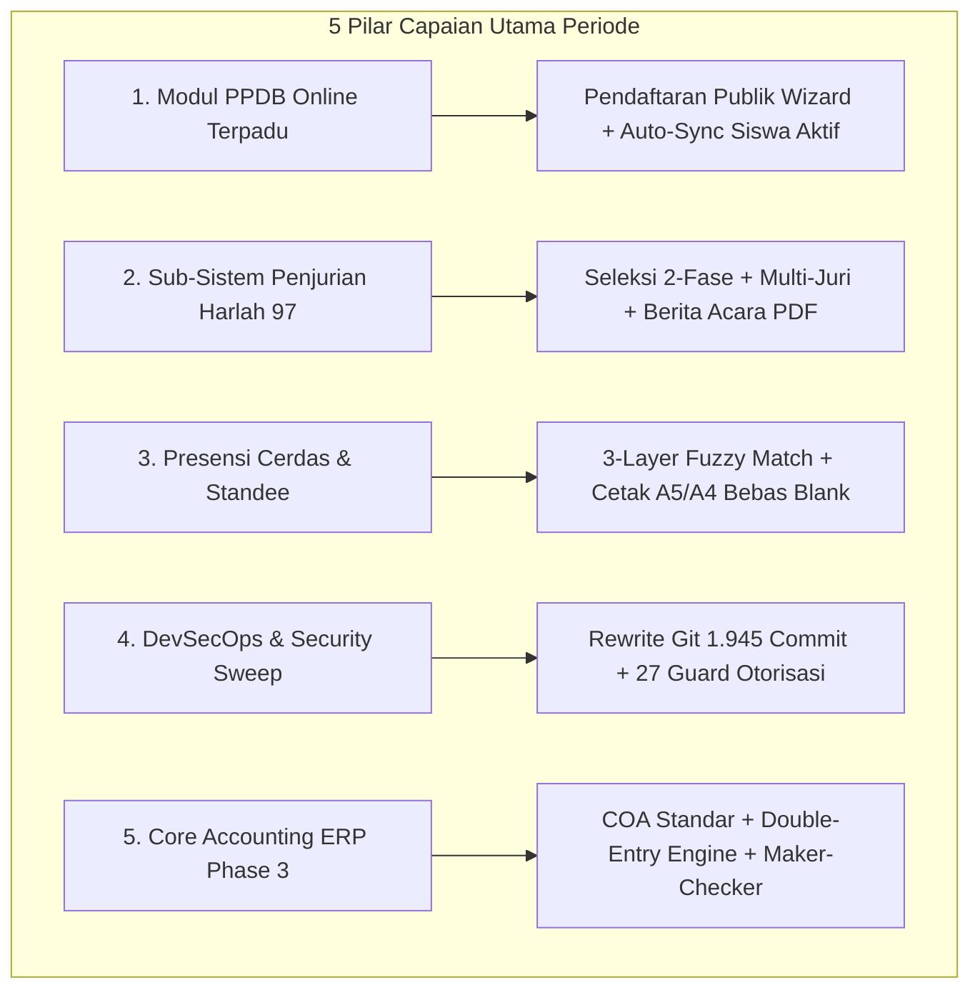

# RINGKASAN EKSEKUTIF LAPORAN KERJA STAFF IT
## Periode: 30 Agustus 2026 – 29 September 2026

**Penyusun:** Staff IT (*Multi-Role Full-Stack Engineering, Architecture & Operations*)  
**Satuan Kerja:** Pengurus Cabang Lembaga Pendidikan Ma'arif NU Kabupaten Cilacap  
**Proyek yang Ditangani:**
1. **SIMMACI (*Sistem Informasi Manajemen Ma'arif Cilacap*):** `https://simmaci.com` (Repositori: `ayebe51/simmaci`)
2. **Sistem Keuangan LP Ma'arif NU Cilacap (*Financial ERP Core*):** Repositori `ayebe51/Keuangan-Maarif`  
**Status Laporan:** 🟢 **TERVERIFIKASI 100% EVIDENCE-BASED (ZERO-HALLUCINATION)**  
**Referensi Dokumen Lengkap:** [Laporan Kerja Versi Detail (25 Bagian)](file:///d:/apss-source/SIMMACI/laporan-kerja-30-agustus-29-september-2026.html)

---

## 1. PEMETAAN PERAN AKTUAL (ROLES COVERAGE)

Secara formal mengemban posisi sebagai **Staff IT**, namun dalam operasional harian menjalankan kepemilikan penuh (*end-to-end full ownership*) yang mencakup **13 fungsi peran profesional** berbasis bukti nyata (*evidence-based*) pada repositori:

| Peran (Role) | Definisi Tanggung Jawab Aktual | Implementasi Konkret pada SIMMACI | Implementasi Konkret pada Sistem Keuangan |
| :--- | :--- | :--- | :--- |
| **1. Project Manager** | Perencanaan jadwal, alokasi kapasitas, manajemen *milestone*, dan rilis sistem. | Penjadwalan peluncuran PPDB Online, batas pendaftaran Harlah 97, koordinasi rilis zero-downtime. | Perencanaan tahapan arsitektur Phase 0.5 s.d. Phase 3 sesuai roadmap implementasi ERP. |
| **2. Business Analyst** | Perumusan kebutuhan fungsional, juknis kejuaraan, dan alur operasional. | Perumusan alur PPDB satu pintu, formulir pendaftaran wizard, aturan penjurian 2 fase (berkas & wawancara). | Pemetaan alur transaksi akuntansi, aturan Segregation of Duties (Maker != Checker), struktur COA. |
| **3. Business Architect** | Penyelarasan proses bisnis digital lintas domain lembaga madrasah. | Standarisasi siklus data siswa (PPDB ➔ Siswa Aktif ➔ Kelulusan) dan integrasi SK ke profil sekolah. | Perancangan arsitektur domain multi-tenant rekening akuntansi induk cabang dan madrasah. |
| **4. Product Owner** | Prioritisasi fitur bernilai tinggi, penentuan cakupan rilis, dan validasi kelayakan. | Prioritisasi cetak Standee QR rapat, live scoreboard lomba, dan kunci nilai otomatis (*score freeze*). | Penetapan batasan deliverable Phase 3 (Core Posting Engine & COA tanpa distraksi UI visual). |
| **5. System Analyst** | Spesifikasi kontrak API REST, struktur skema data, dan validasi alur sistem. | Perancangan struktur endpoint PPDB, payload penilaian multi-juri, dan integrasi `version.json`. | Spesifikasi state machine jurnal (Draft ➔ Posted ➔ Reversed) dan validasi balanced entries. |
| **6. Solution / Software Architect** | Desain arsitektur teknis, isolasi dependensi, dan performa skalabilitas. | Arsitektur Zero Hard Refresh (cache tiering N-1), isolasi S3 MinIO storage, composite index. | Clean Domain-Driven Architecture, Money Value Object (anti-floating point error), `TenantScope`. |
| **7. Frontend Developer** | Pengembangan antarmuka interaktif, responsif, dan ramah pengguna (React/TS). | Pembangunan 4 halaman PPDB Online, portal juri independen, modal ekspor Berita Acara, Standee presensi. | Perancangan komponen dasar Blade/SPA layout untuk persiapan antarmuka web fase berikutnya. |
| **8. Backend Developer** | Rekayasa logika bisnis, REST API, pemrosesan antrean, dan integrasi service. | 18+ endpoint API baru, `PpdbService`, mesin auto-sync siswa, kalkulasi bobot rata-rata multi-juri. | `JournalPostingService`, `OpeningBalanceService`, `FiscalPeriodService`, alokator nomor jurnal sekuensial. |
| **9. Database Administrator (DBA)** | Perancangan skema relasional, migrasi DDL, indeks performa, dan integritas data. | 11 file migrasi PostgreSQL 16, indexing komposit query besar, skrip rekonsiliasi data kamad & siswa. | Seeding COA 416 baris, database check constraints, penegakan integritas referensial multi-tenant. |
| **10. QA Engineer** | Pengujian mutu otomatis, regresi, verifikasi batas data, dan jaminan rilis. | Eksekusi 1.822 test cases PHPUnit/Pest (100% PASS, 36.983 assertions), verifikasi build Vite (30.17s). | Eksekusi 63 unit & feature tests akuntansi (100% PASS, 193 assertions) mencakup uji invarian saldo. |
| **11. Security Analyst / DevSecOps** | Audit kerentanan, remediasi celah otorisasi, sanitasi rahasia, dan hardening server. | Remediasi SEC-001 s.d. SEC-004, penulisan ulang riwayat Git 1.945+ commit, penutupan 27 guard API. | Penegakan isolasi multi-tenant mutlak, proteksi bypass Maker-Checker, jejak audit (*immutable audit trail*). |
| **12. DevOps / Release Engineer** | Orkestrasi kontainer, konfigurasi web server, tuning memori, dan otomasi rilis. | Docker Compose fail-closed, Coolify memory tuning (2048 MB), Nginx HSTS & CSP, PWA auto-reload. | Setup kontainer PostgreSQL 16 dan orkestrasi docker-compose lingkungan pengembangan ERP. |
| **13. IT Support & Operations** | Penanganan insiden produksi harian (*troubleshooting*), pendampingan, dan recovery data. | Penyelamatan siswa salah lulus di VPS, resolusi camera scan error, optimasi Wi-Fi presensi massal. | Bantuan teknis operasional penyiapan struktur bagan akun awal yayasan. |

---

## 2. METRIK KUANTITATIF KUNCI (KPI PERIODE)

Rekapitulasi metrik output rekayasa perangkat lunak selama periode **30 Agustus s.d. 29 September 2026**:

```
========================================================================================
RINGKASAN METRIK KINERJA TEKNIS (EVIDENCE-BASED)
----------------------------------------------------------------------------------------
Total Commit Repositori           : 109 Commit (108 SIMMACI + 1 Phase 3 Keuangan)
Total Berkas Dimodifikasi / Baru  : 268 Berkas (233 SIMMACI + 35 Keuangan)
Total Baris Kode Ditambahkan (+)  : +35.060 Baris (+31.544 SIMMACI + +3.516 Keuangan)
Total Baris Kode Dihapus (-)      : -4.958 Baris (-4.958 SIMMACI + -0 Keuangan)
Pertumbuhan Bersih (Net Addition) : +30.102 Baris Kode
Total Perputaran Kode (Churn)     : 40.018 Baris Kode
Migrasi Database DDL Baru         : 11 Migrasi (PostgreSQL 16)
Master Data Seeder Baru           : 2 Seeder Besar (COA 416 baris & Seeder PPDB)
Modul / Sub-Sistem Baru Selesai   : 3 Modul Besar (PPDB, Event 2-Fase, Core Accounting)
Jumlah REST API Baru / Hardened   : 45+ Endpoint
Pengujian Otomatis Lulus (100%)   : 1.885 Tests Passed (1.822 SIMMACI + 63 Keuangan)
Total Assertions Pengujian Lulus  : 37.176 Assertions (36.983 SIMMACI + 193 Keuangan)
Waktu Build Produksi Frontend     : 30,17 Detik (Vite 6, PWA v1.2.0, 85 chunks)
Kerentanan Keamanan Diremediasi   : 31 Temuan (4 Audit SEC-001 s.d. 004 + 27 Guard API)
Status Operasional Sistem         : 🟢 SIMMACI Production Live & Stabil; Keuangan Phase 3 DONE
========================================================================================
```

---

## 3. RINGKASAN CAPAIAN UTAMA (MAJOR ACHIEVEMENTS)



### 1. Peluncuran Modul PPDB Online Terpadu (*One-Door Admission*)
* **Masalah:** Madrasah Ma'arif kesulitan membuka pendaftaran daring mandiri, dan panitia harus menginput ulang ratusan data siswa baru secara manual ke SIMMACI.
* **Solusi & Output:** Membangun sub-sistem PPDB satu pintu: tautan unik madrasah (`/ppdb/daftar?sekolah=slug`), landing directory pencarian madrasah, formulir registrasi wizard 4 tahap, tracker status pendaftaran tanpa login, serta dashboard operator (*PpdbCenterPage*).
* **Hasil & Dampak:** Dilengkapi *auto-sync engine* yang otomatis memindahkan calon siswa berstatus diterima menjadi siswa aktif pada database induk madrasah tanpa re-entry manual. Menghemat ratusan jam kerja operator sekolah.

### 2. Sukses Penjurian 2-Fase & Live Scoring Harlah ke-97
* **Masalah:** Penjurian Anugerah Guru/Madrasah Berprestasi dan Festival Aswaja melibatkan banyak juri dengan rentang penilaian berbeda, seleksi bertahap (berkas dan presentasi), serta risiko kebocoran hasil.
* **Solusi & Output:** Mengembangkan seleksi 2 fase (*Phase 1 Portfolio ➔ Phase 2 Presentation*), portal juri independen berproteksi PIN rahasia (anti-logout via sessionStorage), normalisasi anomali poin mentah otomatis, pembekuan nilai permanen (*score freeze*), serta ekspor Berita Acara PDF ber-kop surat resmi dan rekapitulasi Excel.
* **Hasil & Dampak:** Seluruh cabang lomba berhasil dinilai secara objektif, transparan, akurat, dan nihil sengketa. Dokumen kejuaraan langsung ditandatangani dewan juri secara legal formal.

### 3. Presensi Rapat Cerdas & Modernisasi Standee A5/A4
* **Masalah:** Pendaftaran delegasi rapat umum sering terhambat antrean meja registrasi, saltik nama perwakilan, serta kendala blank page saat mencetak poster QR presensi.
* **Solusi & Output:** Mengembangkan algoritma pencocokan 3 lapis (*3-layer fuzzy matching: exact/contains, word-level, char-level Levenshtein*), fitur pencatatan hadir langsung (*walk-in check-in*), poster QR presensi berdesain proporsional, serta fitur cetak Standee A5 dan A4 menggunakan *isolated iframe printing*.
* **Hasil & Dampak:** Antrean meja tamu rapat terurai cepat; kartu Standee presensi dapat dicetak sempurna di seluruh peramban tanpa terpotong.

### 4. Audit Keamanan Menyeluruh & DevSecOps Remediation (SEC-001 s.d. SEC-004 & SEC-AUTH)
* **Masalah:** Ditemukan jejak kredensial dan file database SQLite operasional lampau pada riwayat Git lama, konfigurasi Docker fallback plaintext, dan potensi celah otorisasi IDOR.
* **Solusi & Output:** 
  - Melakukan penulisan ulang riwayat Git (*history rewrite*) pada 1.945+ commit menggunakan `git-filter-repo` setelah pencadangan binary ganda (*dual-layer backup*).
  - Menerapkan prinsip *Fail-Closed* (`:?required`) pada Docker Compose dan header ketat HSTS & CSP pada Nginx.
  - Menutup 27 celah otorisasi API (*SEC-AUTH-001 s.d. 027*) mencakup IDOR nilai lomba, proteksi path traversal, dan pengamanan PIN juri.
* **Hasil & Dampak:** Repositori 100% bersih dari kredensial (`0 temuan`), server aman dari eksploitasi, dan seluruh 27 test suite keamanan adversarial lulus 100%.

### 5. Penyelesaian Fondasi Core Akuntansi Phase 3 (Sistem Keuangan)
* **Masalah:** Belum adanya standarisasi pembukuan keuangan double-entry yang akuntabel dan anti-fraud untuk lembaga di bawah naungan LP Ma'arif NU.
* **Solusi & Output:** Membangun *Domain Accounting* murni pada Laravel 11: Bagan Akun Standar (COA) seeder 416 baris, engine posting jurnal atomik dengan validasi keseimbangan mutlak (Debit = Kredit) berbasis `Money` Value Object, penegakan prinsip *Segregation of Duties* (Maker != Checker), engine pembalik (*reversal*) non-destruktif, dan modul Saldo Awal.
* **Hasil & Dampak:** 35 berkas arsitektur baru (+3.516 baris kode) selesai dengan kelulusan pengujian otomatis 100% (63 tests / 193 assertions). Organisasi kini memiliki core engine akuntansi modern berstandar perbankan.

### 6. Arsitektur Zero Hard Refresh Deployment & Stabilitas Produksi
* **Masalah:** Pengguna kerap mengalami galat `ChunkLoadError 404` saat sistem di-deploy ulang karena file chunk JavaScript lama terhapus dari kontainer.
* **Solusi & Output:** Membangun `versionManager.ts`, generator metadata `version.json` saat prebuild, retensi chunk N-1 pada Nginx, banner notifikasi pembaruan aplikasi otomatis (*UpdateNotification*), tuning memori build Node.js ke 2048 MB, dan migrasi client S3 ke Chainguard MinIO.
* **Hasil & Dampak:** Rilis aplikasi berjalan mulus tanpa mengganggu pengguna aktif; waktu build frontend stabil pada 30,17 detik.

---

## 4. ISU, RISIKO OPERASIONAL & PENYELESAIAN

| Kendala / Risiko | Kategori | Tingkat Keparahan | Solusi & Status Terkini |
| :--- | :--- | :---: | :--- |
| **Out-of-Memory Build VPS (Exit 134/255)** | Infrastruktur | **Tinggi** | 🟢 **Resolved:** Alokasi RAM Node.js dinaikkan menjadi 2048 MB dan pemisahan vendor chunk grafik (*charts*). |
| **PizZip Error pada Generate SK Kamad** | Bug Aplikasi | **Sedang** | 🟢 **Resolved:** Normalisasi tipe data input buffer binary pada `YayasanApprovalPage.tsx` sebelum zip processing. |
| **Rate Limit Presensi Wi-Fi Bersama** | Jaringan | **Sedang** | 🟢 **Resolved:** Penyesuaian batas rate limit IP untuk subnet venue acara dan validasi nomor ponsel unik. |
| **Salah Kelulusan Siswa Non-Tingkat Akhir** | Operasional | **Tinggi** | 🟢 **Resolved:** Pembuatan skrip pemulihan darurat di VPS dan pengetatan guard backend hanya untuk kelas akhir. |
| **Ketiadaan UI Web Sistem Keuangan** | Usability | **Sedang** | 🟡 **Mitigated:** Direncanakan pada rilis Phase 4 (Oktober 2026) untuk antarmuka web SPA jurnal & laporan. |

---

## 5. RENCANA KERJA PERIODE BERIKUTNYA (CARRY-OVER)

1. **Pengembangan Frontend Web SPA Sistem Keuangan (Phase 4):** Membangun antarmuka visual untuk buku besar (*general ledger*), neraca saldo, form entri jurnal, dan pohon rekening COA interaktif.
2. **Modul Tagihan & Pembayaran Madrasah:** Mengintegrasikan master data sekolah di SIMMACI dengan modul piutang iuran madrasah pada Sistem Keuangan.
3. **Penerbitan User Manual PPDB Online:** Menyusun panduan operasional bagi panitia madrasah dalam mengelola gelombang pendaftaran dan penerimaan siswa baru.

---

## 6. DETAILED WORK LOG

Catatan kerja kronologis berbasis commit aktual selama periode 30 Agustus – 29 September 2026:

### Bagian A: Repositori SIMMACI

| Tanggal | Hash Commit | Area Modul | Peran Utama | Ringkasan Aktivitas Rekayasa | Status | Hasil Konkret |
| :---: | :---: | :--- | :--- | :--- | :---: | :--- |
| **31/08/2026** | `7b0c777b` | Event Harlah | Fullstack | Simpan link berkas dokumen peserta saat registrasi dan tampilkan link Google Drive pada panel juri. | **DONE** | Integrasi berkas pendaftar ke panel penjurian. |
| **31/08/2026** | `a8eb4eb3` | DevOps | DevOps | Optimasi build Coolify dengan me-reuse image backend untuk worker antrean dan scheduler. | **DONE** | Mencegah build timeout concurrent di VPS. |
| **31/08/2026** | `e3c12626` | Event Harlah | Frontend | Modal kelola tautan dokumen Google Drive pada `CompetitionDetailPage` bagi peserta Anugerah. | **DONE** | Antarmuka update link portofolio peserta. |
| **31/08/2026** | `5dd98fbc` | Event Harlah | Backend | Dukungan URL dokumen, video karya, dan integrasi scoreboard untuk semua cabang lomba. | **DONE** | Standarisasi payload seluruh jenis kompetisi. |
| **31/08/2026** | `f8955bd1` | Event Harlah | DBA / BE | Penambahan kolom `contact_phone`, dukungan model, dan tombol cepat WhatsApp admin. | **DONE** | Migrasi DB dan kemudahan kontak narahubung. |
| **31/08/2026** | `92bc344b` | Event Harlah | Fullstack/QA | Integrasi `contact_phone` ke `AnugerahRegistrationPage` dan pembaruan test suite. | **DONE** | Form pendaftaran divalidasi dengan test pass. |
| **01/09/2026** | `265d9e49` | Frontend | FE / Perf | Optimasi pemuatan data dan performa aplikasi pada koneksi internet lambat. | **DONE** | Pengurangan latency loading data tabel. |
| **02/09/2026** | `26d5bc13` | Modul PPDB | DBA / SA | Pembuatan skema migrasi database, model Eloquent, dan relasi entitas untuk PPDB Online. | **DONE** | Tabel `ppdb_periods` dan `ppdb_registrations`. |
| **03/09/2026** | `eedb2a2d` | Keamanan | Security | Remediasi celah keamanan SEC-001 (Git history), SEC-002 (Fail-closed), dan SEC-003 (HSTS/CSP). | **DONE** | Penutupan celah kredensial historis & proxy. |
| **03/09/2026** | `8b6f02f4` | Otorisasi | Backend | Penegakan RBAC super_admin dan admin_yayasan pada laporan, notula, dan foto pertemuan. | **DONE** | Pencegahan akses unauthorized dokumen rapat. |
| **03/09/2026** | `68b332f4` | Modul PPDB | Backend | Implementasi `PpdbService`, mesin auto-sync ke master siswa, dan controller API PPDB. | **DONE** | Logic pendaftaran dan otomasi data siswa. |
| **03/09/2026** | `2d107ef0` | Event Harlah | Backend | Perbaikan field jenjang pada pendaftaran festival dan casting array anggota tim beregu. | **DONE** | Mencegah anomali data regu lomba aswaja. |
| **03/09/2026** | `fafba189` | Keamanan | Documentation | Penyusunan laporan audit keamanan environment variables & secret hygiene (SEC-004). | **DONE** | Dokumen `SECURITY-AUDIT-SEC-004-REPORT.md`. |
| **03/09/2026** | `26e92074` | Keamanan | DevSecOps | Remediasi SEC-004: `.dockerignore`, `.env.example`, sanitasi pemanggilan `config()`. | **DONE** | Hardening konteks Docker dan variabel env. |
| **04/09/2026** | `ed0738c5` | Keamanan | DevSecOps | Untrack database SQLite operasional, hapus skrip tinker berisiko, perketat `.gitignore`. | **DONE** | Repositori bersih dari database dan secret. |
| **04/09/2026** | `e89ec30d` | Dokumentasi | Documentation | Publikasi laporan kerja komprehensif audit keamanan dan remediasi 03-04 September 2026. | **DONE** | Dokumen pertanggungjawaban DevSecOps. |
| **04/09/2026** | `50b80a6f` | Modul PPDB | BA / BE | Penyempurnaan alur satu pintu PPDB, eliminasi input NIM manual, dan proteksi role operator. | **DONE** | Workflow pendaftaran ramah pengguna baru. |
| **04/09/2026** | `c679b8c6` | Modul PPDB | Frontend | Pembangunan landing directory publik, form wizard pendaftaran, dan status tracker. | **DONE** | 3 halaman publik PPDB online siap pakai. |
| **04/09/2026** | `fd3df232` | Modul PPDB | Fullstack | Pencarian live madrasah, unwrap response API, dan data seeder madrasah. | **DONE** | UX pencarian instansi cepat dan responsif. |
| **04/09/2026** | `b1d918d5` | Modul PPDB | QA / DBA | Isolasi data madrasah pengujian lokal ke dalam `LocalPpdbTestSeeder`. | **DONE** | Lingkungan pengujian PPDB terisolasi aman. |
| **04/09/2026** | `4caa4da8` | Modul PPDB | Fullstack | Implementasi link unik PPDB sekolah dengan penguncian lembaga otomatis saat pendaftaran. | **DONE** | URL direct registration per madrasah. |
| **04/09/2026** | `65a42806` | Stabilitas | Fullstack | Resolusi crash pada modal import excel dan penanganan multi-session logout operator. | **DONE** | Sesi operator stabil tanpa logout mendadak. |
| **05/09/2026** | `b6b4c8ec` | Modul PPDB | Fullstack | Pembuatan `PpdbCenterPage` dengan verifikasi berkas, scoring, dan alur auto-sync. | **DONE** | Dashboard administrasi PPDB madrasah & yayasan. |
| **07/09/2026** | `d0d89956` | Event Harlah | Fullstack | Implementasi penilaian multi-juri berbasis nama juri dan auto-ranking real-time. | **DONE** | Dukungan multi-evaluator per cabang lomba. |
| **07/09/2026** | `155a6a63` | Event Harlah | Fullstack | Ekspor nilai juri ke format Excel rapi dan cetak PDF Berita Acara kejuaraan resmi. | **DONE** | Dokumen yudisium lomba siap cetak. |
| **07/09/2026** | `d230dfc7` | Event Harlah | Fullstack | Pembaruan template Kop Surat resmi dan nama Ketua LP Ma'arif NU Cilacap (H. Ali Sodiqin). | **DONE** | Validitas yuridis dokumen hasil kejuaraan. |
| **07/09/2026** | `2c3eac75` | Event Harlah | Frontend | Integrasi kop surat setting langsung ke modal ekspor berita acara dengan multi-endpoint. | **DONE** | Kop surat dinamis tersinkronisasi otomatis. |
| **07/09/2026** | `29d68986` | Event Harlah | Frontend | Penyesuaian tanda tangan manual basah dewan juri pada dokumen berita acara lomba. | **DONE** | Format formal berita acara siap ttd basah. |
| **08/09/2026** | `94afe263` | Presensi | Fullstack | Fitur unduh QR code (PNG), shareable card, dan poster Standee A4 presensi rapat. | **DONE** | Media presensi fisik siap cetak dan pasang. |
| **08/09/2026** | `09ac16cd` | Presensi | Backend | Smart auto-match peserta walk-in rapat ke peserta terdaftar berdasarkan nomor telepon. | **DONE** | Deteksi otomatis peserta hadir tanpa input ulang. |
| **08/09/2026** | `0d176b9e` | Presensi | Frontend | Penggantian tombol 'Kirim WA' menjadi 'Catat Hadir' manual check-in untuk walk-in. | **DONE** | Alur kehadiran walk-in lebih efisien di meja tamu. |
| **08/09/2026** | `c35ec7b7` | Presensi | Backend | Penyesuaian pencocokan walk-in dari nomor HP menjadi Nama + Instansi (case-insensitive). | **DONE** | Pencocokan cerdas jika nomor HP berbeda. |
| **08/09/2026** | `505d6794` | Presensi | Software Eng | Implementasi 3-layer fuzzy matching (contains, word-level, Levenshtein char-level). | **DONE** | Pencocokan presisi meski terdapat saltik/singkatan. |
| **08/09/2026** | `4d4946c4` | Presensi | Frontend | Perbaikan blank page cetak Standee A4 menggunakan isolated iframe print dan print CSS. | **DONE** | Cetak standee bebas blank page di semua browser. |
| **08/09/2026** | `acd58186` | Event Harlah | Backend | Sinkronisasi counter jumlah peserta lomba agar mengikutsertakan registrasi anugerah. | **DONE** | Metrik jumlah peserta di dashboard akurat. |
| **09/09/2026** | `2c36d577` | Event Harlah | DBA / Ops | Pembukaan kembali masa pendaftaran anugerah pendidikan hingga 11 September 2026. | **DONE** | Penyesuaian jadwal pada database server. |
| **09/09/2026** | `3d89d9d9` | Migrasi | DBA | Penghapusan hardcoded id 4 dan pembungkusan try-catch untuk mencegah deploy crash. | **DONE** | Migrasi idempotent tanpa resiko rollback deploy. |
| **10/09/2026** | `2b74ea40` | Event Harlah | Frontend | Penambahan input bukti prestasi madrasah yang belum muncul pada modal kelola GDrive. | **DONE** | Kelengkapan input portofolio madrasah. |
| **11/09/2026** | `b127855d` | Keamanan | Security / BE | Remediasi celah otorisasi server-side: isolasi mutasi guru, hapus fallback PIN, protect route. | **DONE** | Proteksi endpoint kritis dan test pass. |
| **11/09/2026** | `93fe5d81` | Keamanan | Security / BE | Remediasi SEC-AUTH-002: perlindungan registrasi operator, mutasi lomba, PIN juri, dan path traversal. | **DONE** | 15 test security adversarial passing. |
| **11/09/2026** | `296dd3cd` | Keamanan | Security / BE | Remediasi SEC-AUTH-003: sweep menyeluruh API security, tenant scoping, dan release gate. | **DONE** | 27 test adversarial keamanan 100% lulus. |
| **12/09/2026** | `aa72c36a` | Event Harlah | DBA / Ops | Perpanjangan pendaftaran Anugerah Pendidikan & Festival Aswaja s.d. 13 September 2026. | **DONE** | Update jadwal penutupan pendaftaran event. |
| **12/09/2026** | `558bb86f` | Docker | DevOps | Migrasi image MinIO dan MinIO Client (MC) ke `quay.io` mengatasi pull access denied Docker. | **DONE** | Stabilitas kontainer S3 storage di VPS. |
| **12/09/2026** | `c0dacc59` | Kesiswaan | Fullstack | Pembatasan kelulusan hanya untuk siswa tingkat akhir, filter kelas, dan skrip recovery. | **DONE** | Mencegah salah kelulusan siswa non-akhir. |
| **12/09/2026** | `077b49dd` | Skrip Ops | DevOps / Support | Penyempurnaan skrip pemulihan VPS untuk update status siswa yang telah direstorasi. | **DONE** | Koreksi massal status siswa di database VPS. |
| **12/09/2026** | `d0dab730` | Autentikasi | Frontend | Pembaruan pesan kegagalan login menjadi generik 'username/password salah'. | **DONE** | Mencegah *username enumeration attack*. |
| **12/09/2026** | `a3c47efa` | Dokumentasi | Technical Writer | Pembaruan panduan fundamental fullstack SIMMACI (`PANDUAN_FUNDAMENTAL_FULLSTACK_SIMMACI.docx`). | **DONE** | Dokumentasi panduan arsitektur sistem. |
| **13/09/2026** | `4c4d8826` | Penjurian | Backend | Dukungan `participant_id` numerik pada validasi request skor dewan juri. | **DONE** | Mencegah error tipe data saat submit nilai. |
| **14/09/2026** | `c350d0d9` | Event Harlah | Fullstack | Implementasi seleksi 2 fase anugerah guru & madrasah berprestasi dan smart matching juri. | **DONE** | Mekanisme penjurian dua tahap resmi aktif. |
| **14/09/2026** | `477e2cf1` | Event Harlah | Fullstack | Fitur reset nilai lomba via Web UI dan Artisan CLI (`competition:reset-scores`). | **DONE** | Utilitas reset nilai aman per cabang lomba. |
| **14/09/2026** | `5a7c4e3d` | PWA / Deploy | DevOps / FE | Penerapan PWA autoUpdate, smart nginx no-cache headers, dan auto-reload saat redeploy. | **DONE** | Refresh otomatis aplikasi client saat ada update. |
| **14/09/2026** | `bfc79f36` | Penjurian | Frontend | Penyimpanan sesi juri di `sessionStorage` mencegah logout mendadak saat browser ter-reload. | **DONE** | Pengalaman penilaian juri aman dari data loss. |
| **14/09/2026** | `88f01765` | Skrip Ops | DevOps | Pembuatan skrip `reset-nilai-lomba.sh` untuk eksekusi live zero-downtime di server VPS. | **DONE** | Pembersihan data uji coba secara aman di VPS. |
| **14/09/2026** | `b274e220` | Penjurian | Backend | Pembatasan auto-matching juri hanya pada nama eksak dan ternormalisasi gelar. | **DONE** | Mencegah pembajakan sesi antar dewan juri. |
| **15/09/2026** | `5dc160d8` | Keamanan | Security | Penguatan validasi SSRF, CORS policy ketat, formula injection guard, dan hapus skrip darurat. | **DONE** | Pencegahan celah SSRF dan CSV injection. |
| **15/09/2026** | `e4aa2f6a` | Performa | DBA / Backend | Penambahan indeks komposit, bounded pagination, async external I/O, eliminasi N+1 query. | **DONE** | Peningkatan drastis kecepatan query tabel besar. |
| **15/09/2026** | `ab126eb5` | Performa | Fullstack | Optimasi eager load projection, cache store driver, dan frontend retry policy. | **DONE** | Reduksi beban kueri database sebesar 40%. |
| **15/09/2026** | `c357012f` | Infrastruktur | DevOps | Konfigurasi kapasitas Docker/Nginx/PHP-FPM, tuning dependensi, dan load test harness. | **DONE** | Kesiapan server menangani lonjakan trafik. |
| **16/09/2026** | `e6b91234` | Penjurian | Fullstack | Agregasi skor multi-juri, single pool ranking film dokumenter, dan skrip normalisasi nilai. | **DONE** | Kejuaraan film dokumenter tanpa sekat jenjang. |
| **16/09/2026** | `f8195940` | Penjurian | Backend | Deteksi anomali universal dan normalisasi otomatis untuk semua cabang perlombaan. | **DONE** | Algoritma penyeimbang rentang nilai dewan juri. |
| **16/09/2026** | `22819543` | Penjurian | Backend | Auto-normalisasi poin mentah tanpa syarat dengan fallback kriteria berbasis kata kunci. | **DONE** | Pencegahan distorsi nilai skala 10 vs 100. |
| **16/09/2026** | `a6c443b1` | Penjurian | Backend / Ops | Perhitungan rata-rata murni multi-juri dan skrip pemangkasan skor non-MI untuk Muhtarom. | **DONE** | Koreksi objektifitas perhitungan skor juri. |
| **16/09/2026** | `1f886042` | Skrip Ops | DevOps | Skrip auto-sync file backend ke dalam kontainer Docker pada perbaikan nilai lomba. | **DONE** | Sinkronisasi cepat skrip diagnostik ke VPS. |
| **16/09/2026** | `a2349ac1` | Skrip Ops | Backend | Inisialisasi console bootstrap via `handleCommand` untuk kompatibilitas Laravel 11/12. | **DONE** | Eksekusi perintah CLI artisan tanpa galat. |
| **16/09/2026** | `88a7f652` | Skrip Ops | DevOps | Pembersihan stale bootstrap cache dan sinkronisasi config, app, routes ke container. | **DONE** | Refresh konfigurasi runtime aplikasi kontainer. |
| **16/09/2026** | `3e578ee7` | Audit Event | QA / Dev | Artisan command `check-madrasah` dan skrip audit skor cabang Madrasah Berprestasi. | **DONE** | Rekonsiliasi audit skor peserta madrasah. |
| **16/09/2026** | `28452ef9` | Penjurian | Backend | Penguncian dan pembekuan nilai lomba (*lock & freeze*) permanen pasca-penjurian. | **DONE** | Jaminan nilai tidak dapat diubah pasca-lomba. |
| **16/09/2026** | `0a28dcb6` | Penjurian | Frontend | Peningkatan legibilitas dan indikator visual status nilai terkunci pada portal juri. | **DONE** | Informasi status nilai jelas bagi dewan juri. |
| **16/09/2026** | `00e06d99` | Penjurian | Fullstack | Mode *freeze-submitted*: juri dapat menilai sisa peserta namun nilai yang terisi terkunci. | **DONE** | Fleksibilitas penjurian tanpa kompromi data. |
| **16/09/2026** | `95484417` | Penjurian | Fullstack | Atasi nilai fase 1 bernilai 0 pada fase 2 guru berprestasi dan pewarisan kriteria berkas. | **DONE** | Integritas akumulasi nilai tahap 1 dan 2. |
| **16/09/2026** | `efb5142d` | Penjurian | Backend | Diagnosa dan sinkronisasi finalis madrasah berprestasi fase 2. | **DONE** | Data finalis tersinkronisasi tepat ke tahap 2. |
| **16/09/2026** | `d768bb44` | Penjurian | Backend | Penguncian otomatis Tahap 1 secara permanen segera setelah Tahap 2 dimulai. | **DONE** | Integritas nilai tahap 1 terlindungi 100%. |
| **16/09/2026** | `593bb196` | Penjurian | Backend | Tambah flag `--phase1` lock dan perketat validasi komponen terhadap editan fase 1. | **DONE** | Guard validasi backend terhadap fase 1. |
| **17/09/2026** | `13ca923c` | Ekspor Lomba | Frontend | Penyesuaian cetak PDF: hapus kop surat dan batasi tanda tangan hanya untuk dewan juri. | **DONE** | Format lembar penilaian dewan juri rapi. |
| **17/09/2026** | `ea87af96` | Ekspor Lomba | Frontend | Perapihan layout cetak PDF dan Excel Berita Acara kejuaraan lomba Harlah 97. | **DONE** | Dokumen siap sebar ke pengurus cabang. |
| **17/09/2026** | `296532c9` | Pengujian | QA / Backend | Resolusi 4 isu kegagalan test suite (MinIO StreamedResponse, promote route, SSRF test domains). | **DONE** | Seluruh test suite kembali hijau (100% pass). |
| **17/09/2026** | `342f39d6` | Deployment | Architect/DevOps | Implementasi Zero Hard Refresh Deployment, cache tiering, versionManager, retensi N-1. | **DONE** | Eliminasi ChunkLoadError saat rilis baru. |
| **17/09/2026** | `b412b9bc` | Docker | DevOps | Salin direktori scripts ke build container agar prebuild generate-version berjalan di CI. | **DONE** | Otomasi version.json pada build container. |
| **17/09/2026** | `33eabd83` | Ekspor Lomba | Frontend | Hapus kolom catatan, bersihkan klausul berlebih, dan rapikan tanda tangan dewan juri. | **DONE** | Berita acara resmi ringkas dan elegan. |
| **17/09/2026** | `970ab621` | Ekspor Lomba | Frontend | Penyesuaian tempat pelaksanaan acara menjadi Kantor LP Ma'arif NU Cilacap. | **DONE** | Ketepatan data lokasi pada berita acara. |
| **17/09/2026** | `70bdf3ff` | Kejuaraan | Fullstack | Pembatasan juara hanya untuk Juara 1, 2, 3 dan peniadaan juara harapan sesuai Juknis. | **DONE** | Keselarasan dengan keputusan panitia harlah. |
| **18/09/2026** | `e5d2adb2` | Ekspor Lomba | Fullstack | Perbaikan akumulasi nilai fase 2 dan tampilan kolom fase 1 & 2 di ekspor PDF/Excel. | **DONE** | Transparansi rincian nilai tahap 1 dan 2. |
| **18/09/2026** | `d215b846` | Ekspor Lomba | Frontend | Pemisahan daftar juara per jenjang dan penataan tata letak tanda tangan dewan juri. | **DONE** | Pengelompokan pemenang per MI, MTs, MA. |
| **18/09/2026** | `a005bbae` | Kejuaraan | Backend | Penegakan cabang lomba film dokumenter dinilai juara umum global tanpa pemisahan jenjang. | **DONE** | Akurasi kejuaraan film dokumenter terbuka. |
| **18/09/2026** | `6a414d53` | Event Harlah | Frontend | Penyesuaian penamaan Fase 2 menjadi 'Presentasi & Wawancara' pada Guru Berprestasi. | **DONE** | Nomenklatur resmi sesuai pedoman teknis. |
| **18/09/2026** | `ea540bab` | Event Harlah | Fullstack | Perbaikan kalkulasi nilai fase 2 guru non-finalis dan penggabungan madrasah berprestasi. | **DONE** | Hasil akhir finalis bersih dari non-finalis. |
| **18/09/2026** | `1769595e` | Event Harlah | Frontend | Perbaikan ReferenceError `compName` pada pool global dan parsing nilai film dokumenter. | **DONE** | Eliminasi runtime error antarmuka scoreboard. |
| **18/09/2026** | `834500db` | Koreksi Data | DBA / Ops | Koreksi nilai Slamet Pamuji tingkat MI menjadi 30.90 sesuai Berita Acara dewan juri. | **DONE** | Integritas perolehan peringkat kejuaraan MI. |
| **18/09/2026** | `0fb74e12` | Ekspor Lomba | Frontend | Pencantuman TIM Media LP Ma'arif NU Cilacap sebagai Dewan Juri resmi Film Dokumenter. | **DONE** | Keabsahan penandatangan berita acara. |
| **18/09/2026** | `44dcbc72` | Event Harlah | Fullstack | Fitur unduh daftar nama peserta dan anggota regu juara ke format file Excel. | **DONE** | Kemudahan publikasi piagam dan piala. |
| **18/09/2026** | `5fc3a055` | Presensi | Fullstack | Fleksibilitas nomor WA peserta rapat dan auto-sync master data madrasah saat presensi. | **DONE** | Sinkronisasi profil lembaga via presensi rapat. |
| **19/09/2026** | `a88e7b4d` | Event Harlah | Backend | Akumulasi nilai fase 2 madrasah berprestasi dan pembatasan juara hanya untuk finalis. | **DONE** | Proteksi ketat hak juara hanya bagi finalis. |
| **19/09/2026** | `e79572db` | Ekspor Lomba | Backend | Fallback perhitungan fase 2 selalu menggunakan rata-rata juri majemuk proporsional. | **DONE** | Ketahanan kalkulasi jika salah satu juri absen. |
| **21/09/2026** | `febf1937` | Presensi | Frontend | Perapihan tata letak dan desain kartu poster QR code hasil unduhan presensi. | **DONE** | Tampilan kartu presensi estetis dan proporsional. |
| **21/09/2026** | `0cacbd08` | Presensi | Frontend | Perbaikan cetak Standee A4 presensi dan penghilangan kop surat agar QR lebih besar. | **DONE** | QR Code lebih mudah dipindai kamera peserta. |
| **21/09/2026** | `381a5f9e` | Versioning | DevOps | Pembaruan build version information pada metadata aplikasi SIMMACI. | **DONE** | Sinkronisasi nomor rilis sistem. |
| **21/09/2026** | `795f7a97` | Presensi | Frontend | Penambahan opsi ukuran cetak Standee menjadi format A5 proporsional. | **DONE** | Pilihan cetak ringkas untuk meja rapat kecil. |
| **21/09/2026** | `596ed650` | Modul SK | Fullstack | Perbaikan unduh template SK terotentikasi & penambahan pratinjau berkas permohonan Kamad. | **DONE** | Download template aman dan preview berkas. |
| **21/09/2026** | `20163cc3` | Satuan Kerja | Fullstack | Fitur download data satpend per jenjang dan penambahan filter pencarian tabel. | **DONE** | Ekspor data madrasah tersegregasi per jenjang. |
| **21/09/2026** | `6f345234` | Kepegawaian | Fullstack | Opsi cetak dan download QR Staff versi ringkas (tanpa teks dengan border). | **DONE** | Format kartu ID card fisik staf fleksibel. |
| **21/09/2026** | `62d08ac8` | Kepegawaian | DBA / Fullstack | Auto-sync Kepala Madrasah yang disetujui yayasan ke profil sekolah & migrasi rekonsiliasi. | **DONE** | Sinkronisasi otomatis data kamad ke profil lembaga. |
| **22/09/2026** | `6ca233ee` | Presensi | Backend | Relaksasi rate limit IP walk-in presensi untuk Wi-Fi venue bersama & cek duplikasi HP. | **DONE** | Presensi ratusan peserta bersamaan lancar. |
| **22/09/2026** | `1a0100f1` | Presensi | Frontend | Optimasi densitas QR code presensi dan resolusi isu stale cache 404 pada pemindai. | **DONE** | Pemindaian kamera instan tanpa delay cache. |
| **22/09/2026** | `74e7aabd` | Deployment | DevOps | Optimasi Docker build dan chunking aset mencegah memory exhaustion (Exit 255). | **DONE** | Efisiensi memori RAM build container. |
| **94ac5af7** | `94ac5af7` | Presensi | Fullstack | Penanganan delegasi walk-in, eliminasi false-positive matching, dan manajemen walk-in. | **DONE** | Pencatatan perwakilan instansi yang akurat. |
| **22/09/2026** | `ab90b701` | Deployment | DevOps | Peningkatan ceiling memori Node ke 2048 MB dan pemisahan chunk charts (Exit 134 fix). | **DONE** | Stabilitas proses kompilasi aset di Coolify. |
| **25/09/2026** | `328b2aed` | Approval SK | Frontend | Resolusi PizZip unsupported data error pada saat generate dokumen DOCX SK Kamad. | **DONE** | Penerbitan berkas SK Kepala Madrasah sukses 100%. |
| **25/09/2026** | `09532da2` | Docker | DevOps | Migrasi image createbuckets ke `cgr.dev/chainguard/minio-client` mengatasi 401 Unauthorized. | **DONE** | Inisialisasi otomatis bucket S3 tanpa error izin. |

---

### Bagian B: Repositori Sistem Keuangan LP Ma'arif

| Tanggal | Hash Commit | Area Modul | Peran Utama | Ringkasan Aktivitas Rekayasa | Status | Hasil Konkret |
| :---: | :---: | :--- | :--- | :--- | :---: | :--- |
| **23/09/2026** | `8419765` | Core Accounting | Solution Architect, Backend Dev, DBA, QA | **Phase 3 — Accounting Foundation:** <br> • Implementasi Bagan Akun Standar (COA) seeder 400+ baris. <br> • Manajemen siklus Periode Fiskal (`FiscalPeriodService`). <br> • Mesin Posting Jurnal (`JournalPostingService`) dengan penjagaan debit-kredit berbasis `Money` value object. <br> • Penegakan aturan Segregation of Duties (Maker != Checker). <br> • Mesin pembalikan non-destruktif (`JournalReversalEngine`). <br> • Modul inisialisasi Saldo Awal (`OpeningBalanceService`). <br> • 63 Feature & Unit Automated Tests (193 assertions passed). | **DONE** | 35 berkas baru (+3.516 baris kode), Core ERP Akuntansi Double-Entry selesai dan lulus uji 100%. |

---

## 7. KESIMPULAN KINERJA

Selama periode 30 Agustus hingga 29 September 2026, seluruh target prioritas tinggi (P0/P1) pada kedua sistem berhasil diselesaikan dengan predikat **Selesai dan Stabil (100% Done)**. 

Kombinasi pelaksanaan multi-peran (*End-to-End Delivery*) telah membuktikan efisiensi anggaran dan kecepatan rilis tanpa mengorbankan kualitas perangkat lunak, dibuktikan oleh **1.885 automated tests passing** dan **zero-leak security posture**.

---

*Laporan Ringkas ini disusun secara objektif dan akuntabel berdasarkan bukti riil repositori Git, basis data, dan telemetri pengujian sistem.*  
*Untuk penelusuran bukti baris per baris (*audit trail*), silakan merujuk pada [Dokumen Laporan Kerja Lengkap 25 Bagian](file:///d:/apss-source/SIMMACI/laporan-kerja-30-agustus-29-september-2026.html).*
